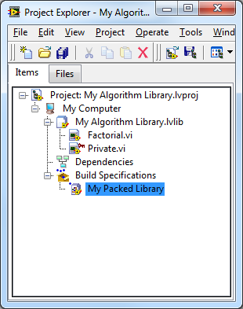
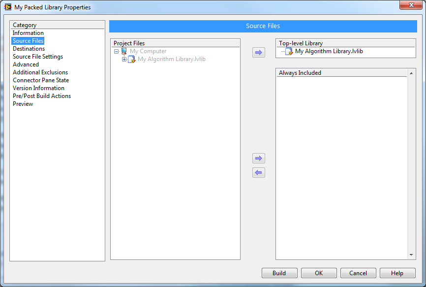
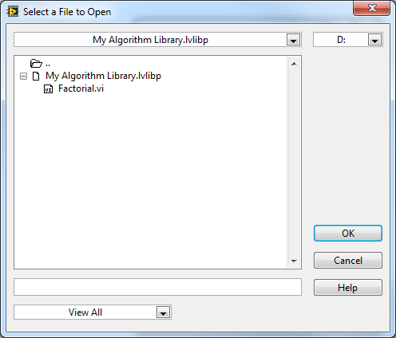
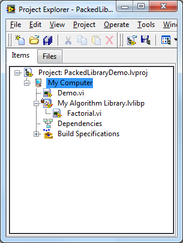

全书： https://lv.qizhen.xyz/

我使用Visual Studio的时间远比使用LabVIEW多。Visual Studio可以每次打开一个Solution，一个Solution包含多个Project。一般来说，我会为一个软件产品创建一个Solution。这个软件产品可能由多个文件组成，比如说有一个EXE，两个DLL组成，那么就为他们创建三个Project。每个Project的源代码都是独立的，可以设置自己如何编译，每个Project就可以被分开来开发。Projects之间是可以有依赖关系的，比如说编译EXE的时候可以自动的把另两个DLL先编译一遍。

LabVIEW的“项目”这个概念都是最近几年才有的，因此在这方面没有Visual Studio强大。在LabVIEW中，只有Project这一级，而没有Solution。这在开发大型程序时是有一些不便的。我觉得最严重的问题是程序模块划分不好做：所有的VI都只能放在一个Project中。最终生成的可执行文件是一个比较大的EXE文件；每次编译都有编译项目中所有的文件，很耗时；所有代码都混在一起，不容易彻底分隔开。

有些公司发布的产品不是可执行文件而是一个功能库，供其它程序调用的。他们或者以VI的形式发布，这样他们的VI源程序会被放置到用户的工程中去，很不合理；或者以DLL文件的形式发布，LabVIEW中调用DLL又很麻烦。

这个问题一直到 LabVIEW 2010 发布后才有所改善。LabVIEW 2010 增加了一种新的文件格式 Packed Project Libraries (\*.lvlibp)。这种文件格式兼有原来[lvlib](http://ruanqizhen.wordpress.com/2005/07/09/%E5%88%A9%E7%94%A8labview%E5%B7%A5%E7%A8%8B%E5%BA%93%E5%AE%9E%E7%8E%B0%E9%9D%A2%E5%90%91%E5%AF%B9%E8%B1%A1%E7%BC%96%E7%A8%8B/)和[llb](http://ruanqizhen.wordpress.com/2006/06/26/%E5%A6%82%E4%BD%95%E5%88%9B%E5%BB%BA%E5%92%8C%E4%BD%BF%E7%94%A8-labview-%E4%B8%AD%E7%9A%84-llb-%E6%96%87%E4%BB%B6/)文件格式的一些优点，再模块化程序的时候，可以考虑使用Packed Project Libraries 。

Packed Project Library 从名字上来看，就是被包装好了的Project Library。Project Library 是编程时候由程序员创建出来的。比如下图这个工程，我在里面创建了一个叫做“My Algorithm Library.lvlib”的工程库。它包含两个VI，其中一个是私有的。

Packed Project Library 并不是手工创建的，他是通过一个项目的生成规范，从 Project Library 编译而来的。比如上图的项目，我创建了一个Packed Library类型的生成规范。我在这个生成规范中指定把“My Algorithm Library.lvlib”编译成Packed Project Library 。

编译的结果是在我指定的路径下生成了一个名为“My Algorithm Library.lvlibp”的文件。它的后缀名仅比Packed Library多了一个字母p。

双击这个文件，可以打开它，看到他里面包含的VI：

如果需要在其它项目中使用到这个Packed Project Library，我们可以直接把它加到另一个项目中去，下图是一个演示项目：

Packed Project Library 看上去和 Project Library 非常相似，用法也完全相同。

Packed Project Library 与 Project Library

- 都是将功能相关的一组VI封装起来的方法；
- 库中的VI可以具有层次机构；
- 库中的VI都带有名字空间，名字空间是带有后缀名的库名；
- 都可以方便的放在项目管理器里使用

尽管它们十分相似，Packed Project Library 与 Project Library 相比，还是有一些明显区别的：

- Packed Project Library 是通过编译生成的；
- Packed Project Library 中的VI是编译后产生的，它们不能被修改；
- Packed Project Library 包含有私有VI，但用户无法看到也不能使用它们；
- Packed Project Library 把VI，.lvlib以及其它用到的文件都打成一个压缩包，用户在磁盘上就只能看到一个.lvlibp文件，看不到VI文件；
- Packed Project Library 很适合作为最终产品发布给用户使用；
- 在项目中使用Packed Project Library 可以缩短编译时间，因为Packed Project Library 中的VI是已编译好的，不会再随项目编译一遍。(这一条先这样写上，但我还需要再深入研究一下)

