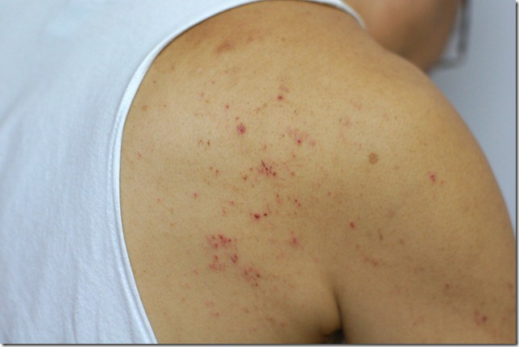
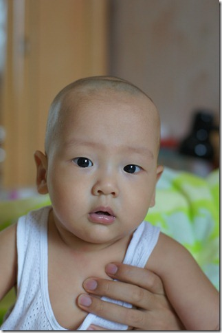
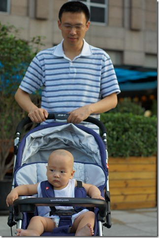
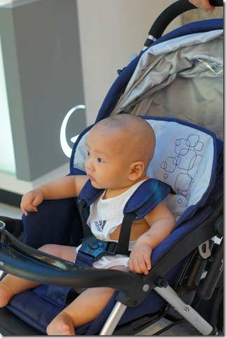
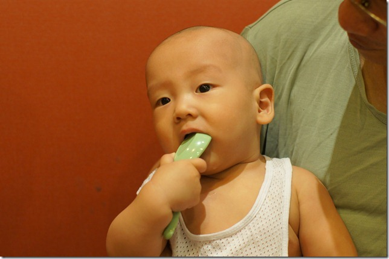
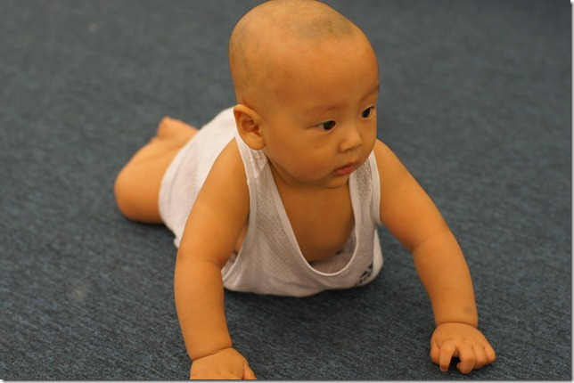

时间过得真快，一转眼，豆豆8个月了。

和同龄小宝比起来，豆豆人高马大，力气也大，但还没有学会控制自己的蛮力。他抓人的时候会死死的抓，咬人的时候拼命咬，搞得家里人人带伤。豆豆爸的胳膊上有好几道伤口，以至于豆豆的暴行都已经传播到爸爸的公司里了。不过，受伤最重的还是爷爷，爷爷的后背都被豆豆给抓烂了。

为了防止他长大以后赖账，我们还特地把豆豆的罪行给拍下来了：  

豆豆几个星期前又长了一颗牙，到现在还是总共5颗牙。豆豆总是有一颗牙领先于同伴先出来。

周末，又给豆豆剃了一个光头，然后领着他去逛商场。  

豆豆是个“野孩子”，就喜欢往外跑。他现在可以听懂一些简单对话，看明白一些动作了。一旦发现有出去玩的迹象，就兴奋的小腿直蹬。最近天热，我在家喜欢光膀子，出门才穿衣服，这个习惯被豆豆发现了。平时早上都是爷爷抱豆豆出去散步，所以一大早豆豆就抱着爷爷不放。我叫他，他不理。于是我就拿来T恤当着他的面穿上，他立刻就对我改变了态度，伸出小手往我身上扑。等我一抱上他，他就死死抓住我的衣服，说什么都不肯松手了。

豆豆现在太沉了，抱他出远门可吃不消，于是我翻出了豆豆的座驾。这是豆豆的豪华敞篷跑车：  

第一次坐上小车的豆豆既紧张又兴奋，在车里东张西望，看得可带劲了。但是到了没风景的地方，他还是不喜欢自己呆在车里的，一定要让人抱。

我们一家人推着豆豆来到了港汇广场，豆豆都看傻眼了。  

到了吃饭时间，我们打算在港汇5楼找一家饭店吃一顿。没想到这里生意极好，除了两家店，其它饭馆都需要排队。这里最清闲的饭馆是肯德基，门可罗雀。我还从来没见过肯德基在用餐时间可以不排队的。看来这种快餐店就适合开在商场底楼，我估计人们选快餐店的一个重要原因是顺路，开在楼顶肯定影响客源。我们不想浪费时间，于是选了另一家不需排队的餐馆，一个叫什么蕉叶的东南亚风味餐馆。吃上之后，发现这里不用排队是有他的道理的，真难吃，我是再也不会来了。

豆豆的表现真乖，一家人吃饭的时候，他不哭也不闹，自己在那啃勺子玩。  

吃完了饭，下楼来到儿童专区。这里有一小块供儿童娱乐的区域。里面的小朋友不算很多，于是我把豆豆也抱了进去。这里地面宽阔，比家里适合练习爬行。豆豆已经可以比较自如的往前爬了，但他的腿脚还是不听使唤。他只能依靠胳膊的力量，慢慢匍匐前进。  

旁边一个十个多月的小宝也在练爬行，他已经非常熟练了，腿脚十分协调，嗞溜嗞溜爬的飞快。尽管他比豆豆大了两个多月，但外形还比豆豆小了一大圈，所以爬起来比较轻便。

豆豆追着一个红色的皮球爬了十多米，这是豆豆爬的最开心的一回了。晚上回到家里，兴奋劲都还没过，吃饭都不好好吃，一个劲在床上爬。

大概豆豆这一天玩的太累了，第二天居然病倒了。早上妈妈给豆豆喂奶的时候，发现豆豆头很热，于是给豆豆量了一下体温，37.9℃，不算太高。豆豆吃完奶后，体温又稍有下降，我猜想可能是昨天太累了，或是水喝少了引起的，也许过一会就好了。哪想到过了才一个小时，豆豆的体温就升到39.1℃了。一家人这时候都急坏了。

从查到的资料来看，豆豆有可能是得了幼儿急疹，或者叫玫瑰疹：一种没有太大危险的传染病，不需要治疗，三天后自然就会退烧痊愈。但是，联想到豆豆前一天跟一大堆小朋友疯了半天，我就怕他染上某种儿童间传染的炎症一类的病，于是还是决定送豆豆到医院检查一下。验血的结果是白血球偏低，排除炎症的可能，基本上可以确定就是玫瑰疹一类的病了。大家总算放了心。

到晚上的时候，豆豆仍然还有点发烧，但温度已经降下来了。大家本来担心豆豆晚上会闹的，结果他睡的还挺香，一点都没哭闹。早上醒来，我一摸他脑袋，原来已经退烧了，病好啦。没想到豆豆这么强壮，一下子就战胜了病毒。

豆豆第一次发烧，但是表现的非常勇敢。除了体温超过39℃那段时间，他有点发蔫，其它时候，吃喝玩乐都不影响。尽管非常难受，但是豆豆还是会被逗的呵呵乐。只不过乐的时候还带着点哼哼唧唧的腔调，看着非常招人怜惜。
