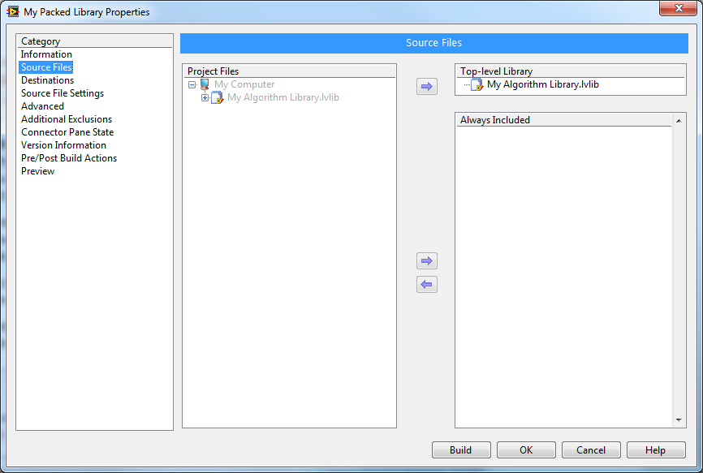
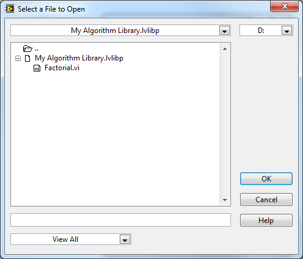

全书： https://lv.qizhen.xyz/

Packed Project Library 从名字上来看，就是被包装好了的Project Library。Project Library 是编程时候由程序员创建出来的。比如下图这个工程，我在里面创建了一个叫做“My Algorithm Library.lvlib”的工程库。它包含两个VI，其中一个是私有的。

Packed Project Library 并不是手工创建的，他是通过一个项目的生成规范，从 Project Library 编译而来的。比如上图的项目，我创建了一个Packed Library类型的生成规范。我在这个生成规范中指定把“My Algorithm Library.lvlib”编译成Packed Project Library 。

编译的结果是在我指定的路径下生成了一个名为“My Algorithm Library.lvlibp”的文件。它的后缀名仅比Packed Library多了一个字母p。

双击这个文件，可以打开它，看到他里面包含的VI：

如果需要在其它项目中使用到这个Packed Project Library，我们可以直接把它加到另一个项目中去，下图是一个演示项目：

Packed Project Library 看上去和 Project Library 非常相似，用法也完全相同。

Packed Project Library 与 Project Library

- 都是将功能相关的一组VI封装起来的方法；
- 库中的VI可以具有层次机构；
- 库中的VI都带有名字空间，名字空间是带有后缀名的库名；
- 都可以方便的放在项目管理器里使用

尽管它们十分相似，Packed Project Library 与 Project Library 相比，还是有一些明显区别的：

- Packed Project Library 是通过编译生成的；
- Packed Project Library 中的VI是编译后产生的，它们不能被修改；
- Packed Project Library 包含有私有VI，但用户无法看到也不能使用它们；
- Packed Project Library 把VI，.lvlib以及其它用到的文件都打成一个压缩包，用户在磁盘上就只能看到一个.lvlibp文件，看不到VI文件；
- Packed Project Library 很适合作为最终产品发布给用户使用；
- 在项目中使用Packed Project Library 可以缩短编译时间，因为Packed Project Library 中的VI是已编译好的，不会再随项目编译一遍。(这一条先这样写上，但我还需要再深入研究一下)
