https://labview.qizhen.xyz/

LabVIEW Web UI Builder是NI公司去年发布的一个软件，它是一个基于网页的软件，供用户编写简单的或者是需要通过网络发布的LabVIEW程序。

这个软件目前还是“预览版”，它的功能尚未完善，但基础功能已经有了，想见识一下网络版LabVIEW什么样的，现在就可以去玩一下了。这个软件的网页是：[http://www.ni.com/uibuilder/](http://www.ni.com/uibuilder/)。它的主页上有使用介绍以及一些示例程序的界面。

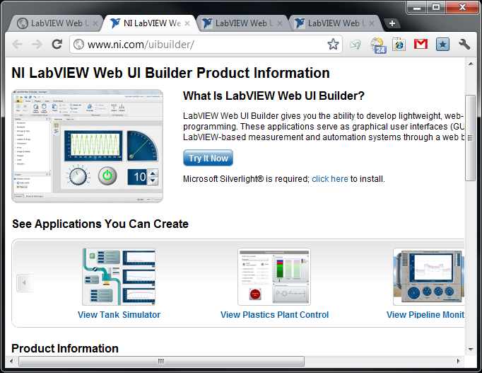

我们可以直接点击 Try It Now 按钮，启动 LabVIEW Web UI Builder。LabVIEW Web UI Builder是基于Silverlight编写的，如果网络速度较慢，第一次启动它可能需要等待一段时间。

软件起来以后，首先进入登陆界面。LabVIEW Web UI Builder必须登陆后才能使用，若没有账号，可以免费注册一个。

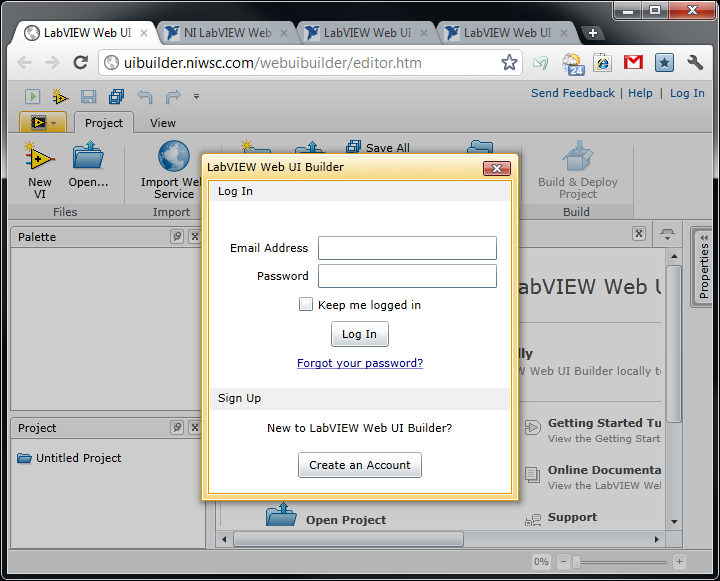

登陆后，就进入了程序的主界面了。大家看得出，这个软件的风格已经完全不像是之前的LabVIEW了，相比之下，他更接近Office的风格。

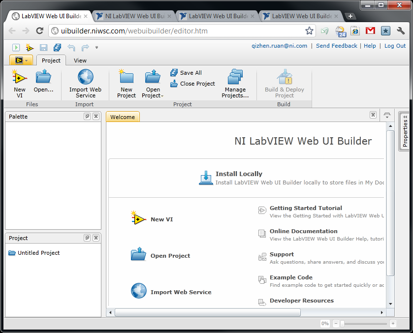

好在LabVIEW Web UI Builder非常简单，即便换了风格，也可以很快上手。先来点击“New VI”按钮创建一个新VI。

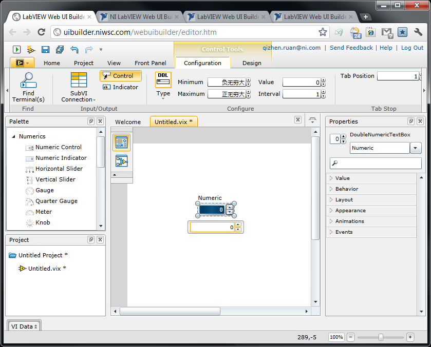

与桌面版LabVIEW不同，LabVIEW Web UI Builder不再采用窗口的方式，而是使用了单一一个集成开发环境，所有的VI都被放在了一个主环境内进行编辑。主窗口的中部是文档区，VI文件都在这里进行编辑；上方是Ribbon，常用的工具按钮；两侧以及下方摆放了其它一些编辑工具或者信息显示窗口。

尽管LabVIEW Web UI Builder的风格变了，但编程方法和原理并没有变化，它仍然还是LabVIEW。以编写一个简单加法运算的程序为例，先编写程序界面，从控件选板上脱下来三个数值型控件用于控制和显示数据：

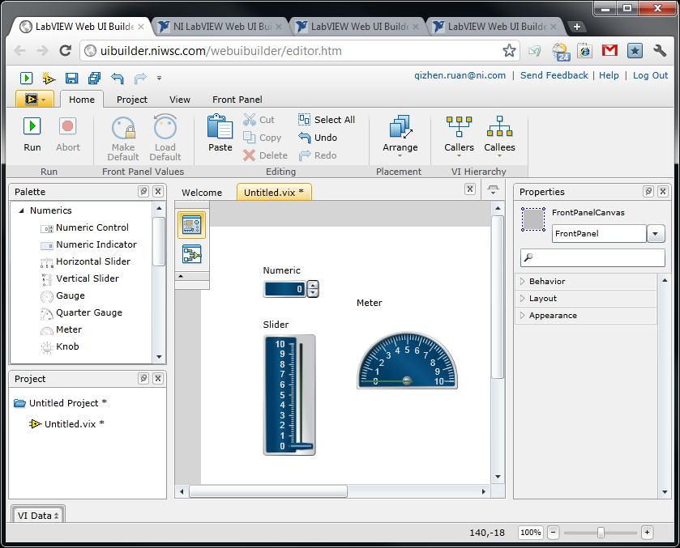

现在VI的前后面板被和到同一个子窗口中去了，不像以前那样，分属两个窗口。点击VI编辑区，左上角纵向排列的两个按钮中下方那个，就切换到程序框图了。大家看到的程序框图上列出的三个接线端，就是刚才我们放置的三个控件的接线端。

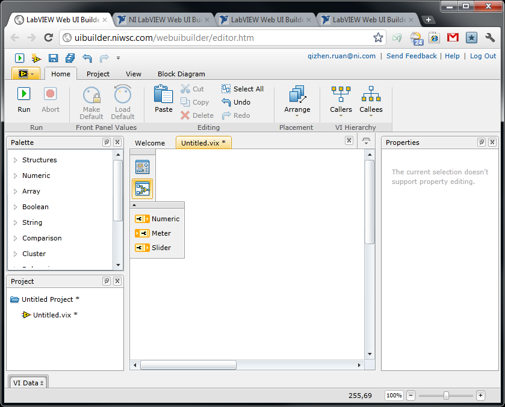

由于程序原理与以前的LabVIEW完全相同，我就不赘述了。不过需要注意的是，LabVIEW Web UI Builder不支持鼠标右键菜单。以前在右键菜单中完成的工作，可以使用Adorner来完成。Adorner是指，当鼠标选中一个对象后，在对象周围浮现出来的一些操作选项。比如下图中，我周在为While循环的停止条件创建一个控件。

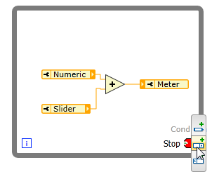

下图是编写好的程序：与以前的LabVIEW完全一致吧！

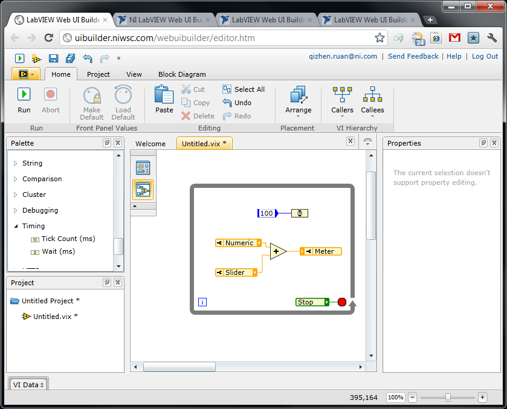

点击Run按钮可以让VI运行起来。

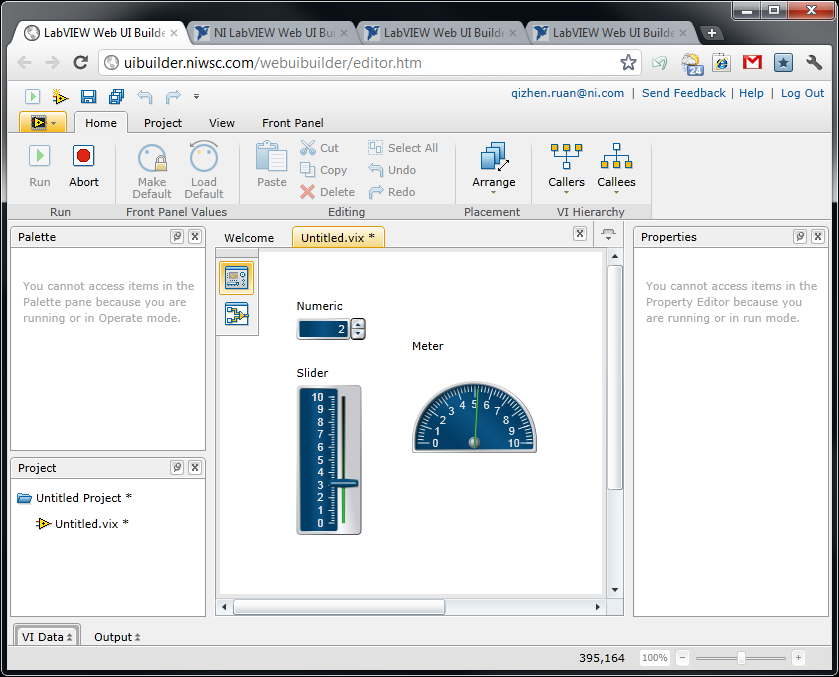

使用网页版LabVIEW的一个好处是，可以直接把编写好的程序存在NI的服务器上。保存时，程序会问你存放的Location的。

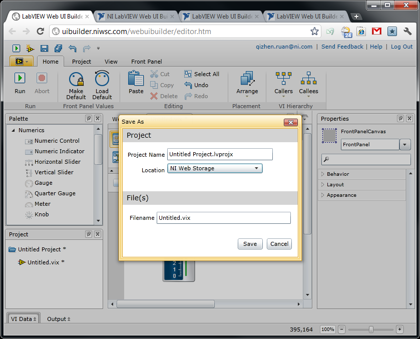

当然想把程序存到本地来也是可以的，点击Ribbon上的Export按钮，可以把程序导出到本地，存成后缀名为vix的文件。

如果大家打开这个vix文件看一下，就会发现，它是一个XML格式的文本文件。以后LabVIEW程序编写的时候可视化操作，保存的时候存成文本，图形化编程语言和文本语言的优势可以得兼，前景相当光明啊。

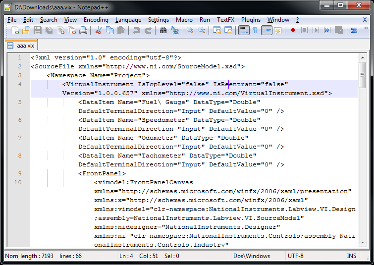
