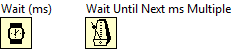
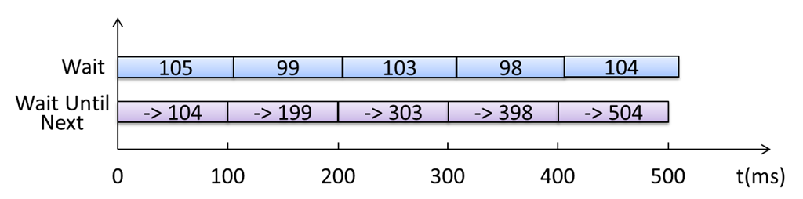
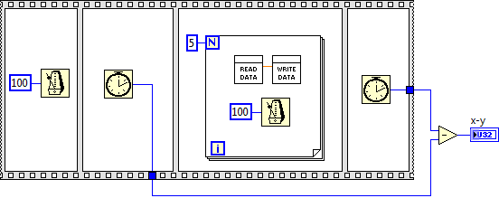
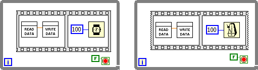

[https://labview.qizhen.xyz/](https://labview.qizhen.xyz/)

LabVIEW程序中需要定时的时候，常常会用到这两个函数。前几天，跟同事详细解释了一下这两个函数的区别。现在把总结的内容发布上来。

Wait 函数比较好理解：给它个输入参数n，每次程序执行到它的时候，它就停下来，等待n毫秒，再继续运行后续程序。

Wait Until Next 函数稍微复杂一点：给它个输入参数n，每次程序执行到它的时候，会暂停在这里，Wait Until Next 函数每隔n毫秒醒来一次，醒来后再继续运行后续程序。

单纯解释概念比较抽象，还是用程序来演示一下。下图左右两个程序的功能相同吗？

一般情况下，程序并不要求非常精确的计时，这时 Wait 与 Wait Until Next 区别不大，程序员选用哪个函数都可以。

只有在要求很高的时候，才需要考虑他们之间的细微差别。

我们假设上图程序中 Read Data 和 Write Data 函数的运行时间都是n毫秒。若 `n<50`，在默认情况下，上图的两个程序，循环每迭代一次，所需时间都大约为100毫秒。

**精度**

但是，两个程序的计时精度是不同的。使用Wait Until Next 函数的程序的精度远高于使用Wait的程序。

在Windows这样的非实时操作系统中，定时函数是非常不精确的，每次执行，误差几毫秒是也是正常的现象。

Wait 函数，每次运行到它才开始计时，因此单次的误差会被累积。假如每次误差四五毫秒，迭代五次误差可能就达到十几毫秒了。

Wait Until Next 并不需要在每次调用的时候计算延时。假设Wait Until Next 函数从0时间开始计时，那么程序一开始运行，它就可以知道自己每一次醒来的时间分别应当是：100ms, 200ms, 300ms……。假如误差是±4毫秒，那么它实际每次醒来的时间就是100±4ms, 200±4ms, 300±4ms……，这个误差不会被累积。

**第一次迭代的时间**

运行下面两段程序，x-y分别是多少呢？

使用Wait函数那个程序，x-y等于500（忽略误差）：延时了五次，每次100毫秒，那么总和就是500毫秒。

而使用Wait Until Next 函数那个程序，x-y的值则每次都不确定，但是值的变化范围是确定的，在 400+2n 与 500 之间。这是因为Wait Until Next 开始计时的时间并不是根据程序何时运行来确定的，对于程序来说，这个时间是不确定的。虽然 Wait Until Next 函数保证每次醒来的间隔是100ms，但它却不能确定第一次醒来的时间。第一次醒来可能是0~100ms之间任何一个时间。

如果循环第一次迭代就必须是精确的100毫秒，那么该怎么办呢？办法很简单，让Wait Until Next 第一次睡眠时不做任何事情，从第二次才开始使用它就行了。如下图的程序，每次运行，x-y的结果就会是确定的500

**并行与串行**

在前面看到的程序里，延时函数与循环中其它的代码是并行的，这样，只要其它代码耗时不长，循环每次迭代的时间就是有延时函数的输入参数来决定的。但有时候，延时函数需要与其它代码串行，比如必须在某两个节点之间延时。

当串行的时候，再使用Wait函数计时就不那么准确了。比如上图左面那个程序，它的循环没迭代一次的时间变成了2n+100。n这个时间是不确定的，它会受到电脑的配置，CPU负荷等的影响。因此用这种方式计时非常不准确。

而Wait Until Next 只考虑每次醒来的间隔，至于什么时候进入休眠的，并不影响醒来的时间。因此，对于它来说，并行与串行的效果是完全相同的（`2n<100`时）。
