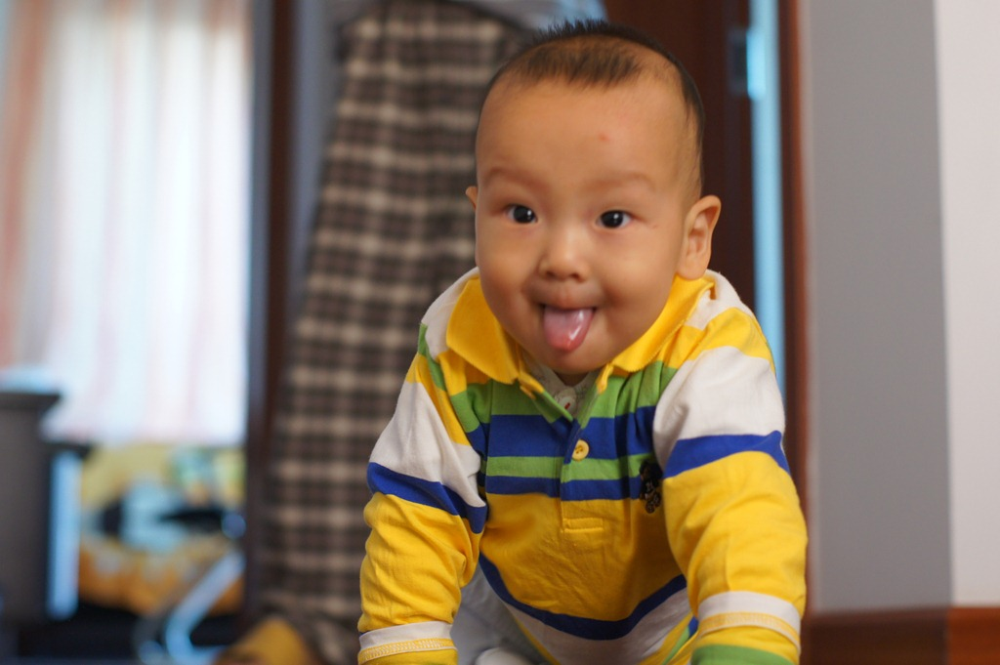
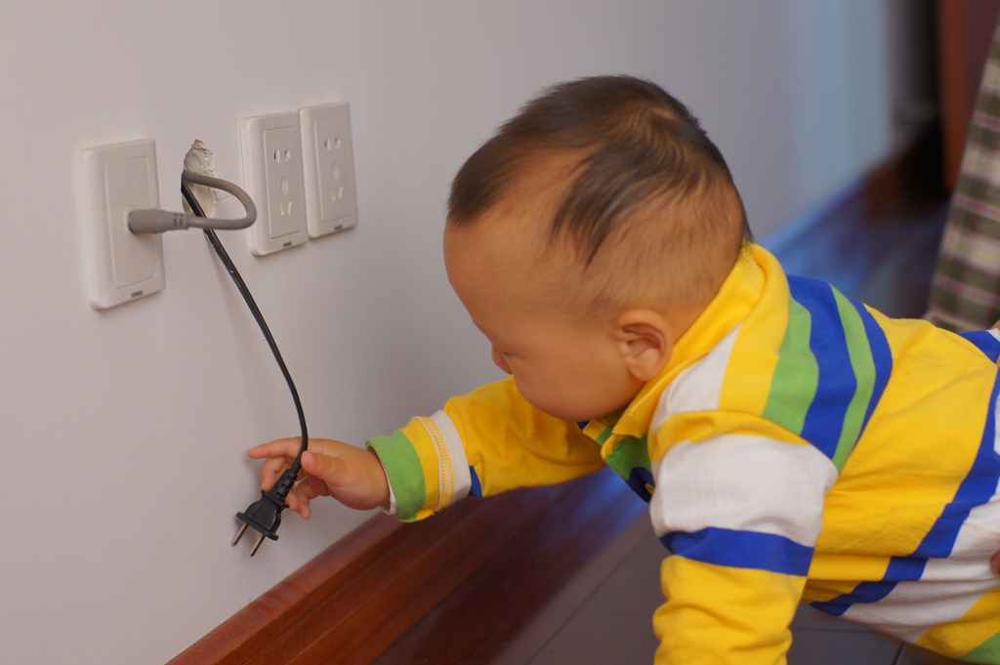
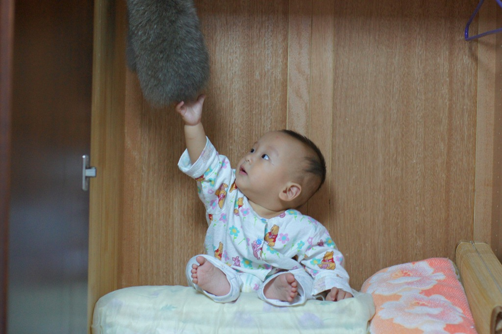
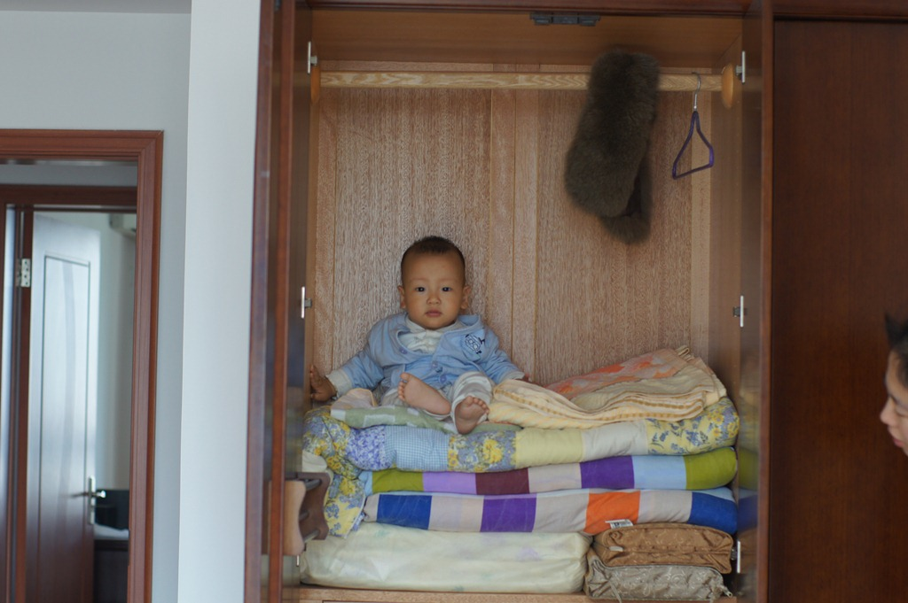
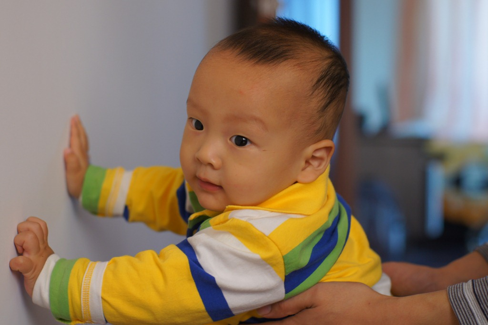
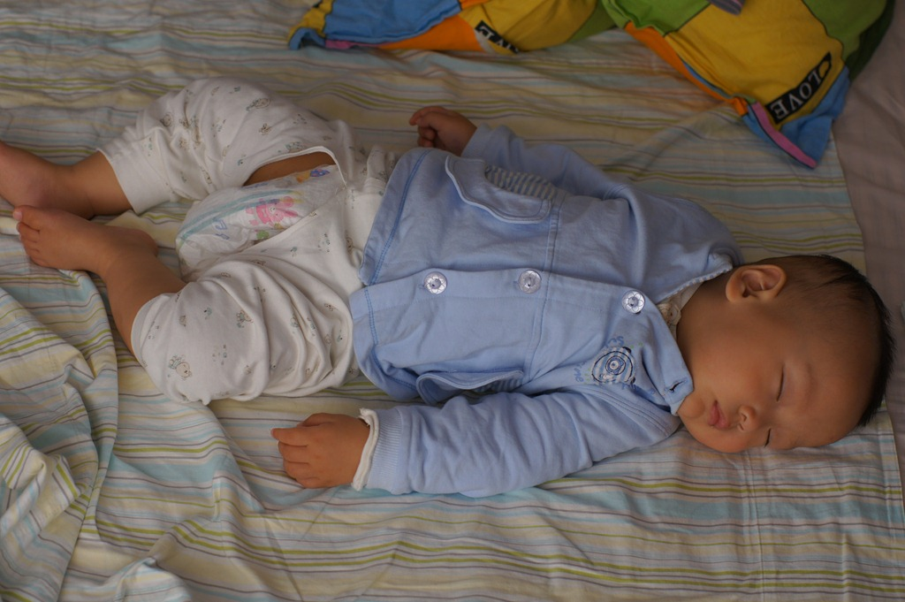
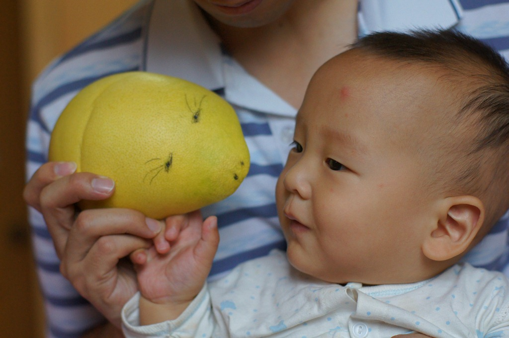
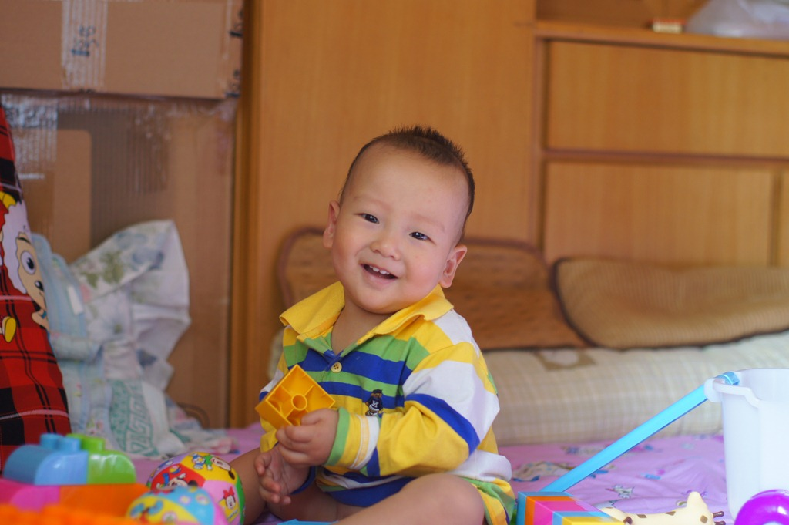
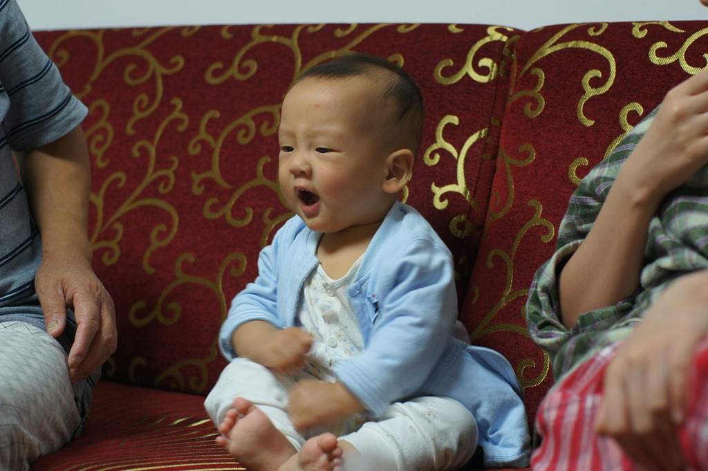

豆豆十个月的时候是在无锡爷爷奶奶家度过的。

豆豆早就对徐家汇租的小房子厌烦了，来到无锡别提多开心了。无锡家里大多了，地板上可以随便爬。

豆豆特别喜欢开关和插座，每次爬到那里必然要抓起来玩弄一下。

奶奶的大衣柜也是好地方，豆豆坐进去就不要出来了。

和大衣柜一比，豆豆像个小不点。

豆豆还给爷爷奶奶的房间搞了装修。先是在墙上抹了两个黑手印。然后干脆用手指甲抠了一个小洞。最后用玩具在桌子上砸了一排小坑。

小区的环境也很不错，有很多花花草草。豆豆眼睛都不够使了。在上海的时候，想哄他睡觉，就抱他出去转一圈。在无锡可不行了，外面这么新鲜，豆豆挺着个脑袋就是不肯睡。这个国庆，豆豆都极力抗拒睡觉，不过一旦睡着了，就睡的特别香。

我们领着豆豆去无锡城里逛了一圈，豆豆对所有商品的喜爱程度都差不多，只要是新鲜的，以前没玩过的，他就会上去又摸又抱。

豆豆到无锡走一趟，收获了不少玩具，包括爸爸DIY的“美女猪”

还有姑姑送的积木

豆豆会用声音表达意思了。以前他想要什么东西的时候会身子靠过去，或者抓我的手伸过去。现在方便了，盯着那样东西，“嗯，嗯，嗯……”叫几声就行了。

豆豆似乎有点懂“爸爸”这个词的含义了。有几次他吃奶的时候，他不想吃了，回头一看，我在旁边，于是就叫两声“爸爸”，然后朝我爬过来。

豆豆也终于开始学叫妈妈了：一次他饿的非常难过，哼哼唧唧的叫了一声“姆啊”的音。

豆豆最可爱的是学会了“啊啼”。豆豆在家有个专用的洗澡盆，没有带回无锡来，于是我们俩光溜溜的，我抱着他冲淋浴。豆豆突然打了两个喷嚏，他大概觉得打喷嚏很好玩，打完了还朝我笑笑。我于是很夸张的装作打了喷嚏，朝他“阿嚏”一声。豆豆开心的咯咯直笑，看他这么高兴，我又“阿嚏”了几声。等豆豆妈开门来接他的时候，豆豆朝妈妈“啊啼”了一声，然后就哈哈笑起来。

豆豆的模仿能力还不仅表现在说话上。有一天，我把去把车从停车场开到家门口。很短一段路，于是奶奶就抱着豆豆坐在副驾驶位置上。豆豆一动不动看着我开车。等我我一下车，他就“嗯，嗯，嗯……”表示要做到驾驶位置上去。一坐到驾驶位置上，他就马上学我的样，扳几下排挡再扭一扭方向盘。
