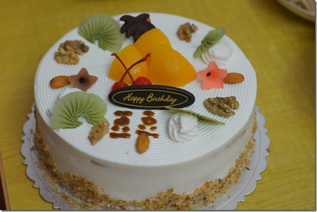
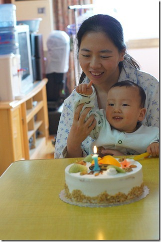
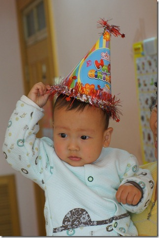
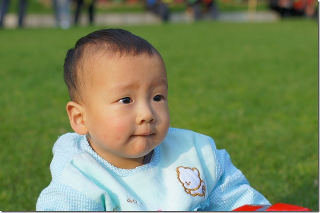
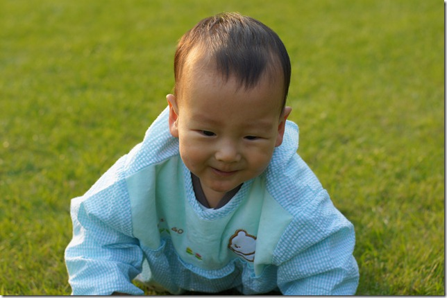
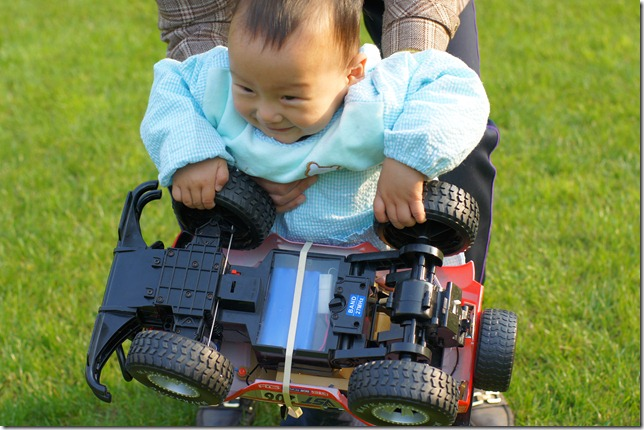
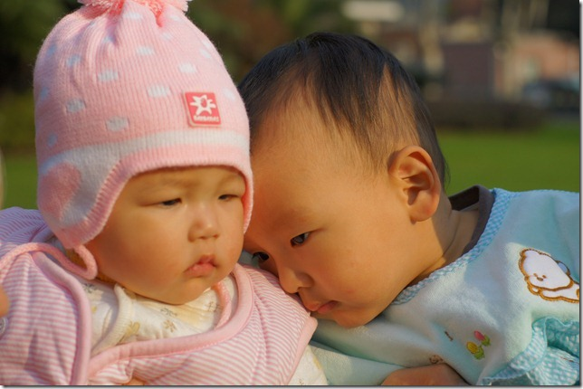
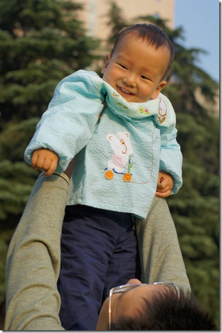
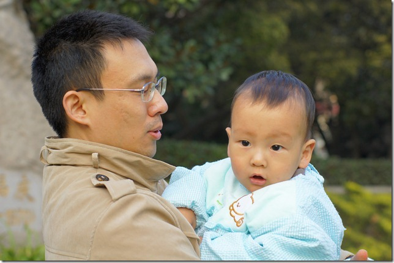

12月6号是豆豆的生日， 不过我们为了赶在周末，提前了两天给他过。

我们给豆豆买了一个生日蛋糕，蛋糕店不肯写字，豆豆妈自己动手写上了豆豆两个字。

我们还特地教豆豆比划出1这个数字。蛋糕店送了个好玩的帽子，不过豆豆不是很喜欢。

中午吃完蛋糕，就带豆豆去外面草坪玩。

豆豆爬得可开心呢。

豆豆是大力士，已经可以把他的大汽车搬起来了。

豆豆看见一个美女，赶紧凑过去亲密一下。

回家前，又跟爸爸疯了一阵。

虽然豆豆只能说一些简单的单词，比如爸爸、妈妈、袜袜等，但是大多数日常用语他都可以理解的。比如问他奶奶在哪呢，他就会去吧奶奶找出来。豆豆其实很爱说话的，只不过他说的话俺们都听不懂。

上午我和豆豆妈领着豆豆去取他的大蛋糕。本来是推着小车出去的，可是豆豆不喜欢坐车，非要让我抱不可，我只好抱着他。一路上，他就指着每一家路过的小店，跟我呜呜哇哇的说话。豆豆可真沉啊，出去取蛋糕，我来回抱了他差不多40分钟的时间，等回到家里胳膊就酸的抬不起来了。

豆豆现在跟爸爸可好了。我每天回家，一进门看见豆豆，他总要先大叫一声，然后就过来让我抱。然后就赖在我身上让我陪他玩。有时候我上个厕所他也要跟进来看看。
