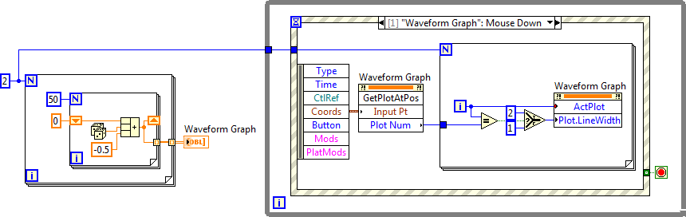
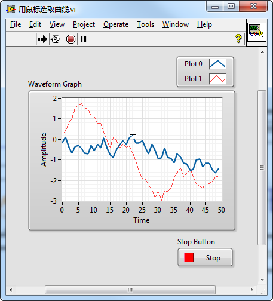

[https://labview.qizhen.xyz/](https://labview.qizhen.xyz/)

前几天上课的时候，有同学问起，LabVIEW是否提供了这样的功能，用鼠标在波形图控件上选中一条曲线。LabVIEW还真有这样的功能，它是波形图控件的一个方法“Get Plot At Position”。这个方法能可以查看波形图上一点附近是否有曲线经过，如果有，就返回这条曲线的索引。我写了一段示例程序：

这段程序的功能是，当鼠标点击在波形图控件的某一条曲线上时，把这条曲线变粗显示。程序框图如下： 

这个程序开始先造了两条随机数据的曲线。当用户在波形图上点击时，就调用“Get Plot At Position”方法查看是否有点击在了某条曲线上。如果是，则使用“Plot.LineWidth”这一曲线的属性把曲线宽度设置为2，其他曲线宽度都只有1。

程序运行效果如下：（蓝色曲线被加粗） 
