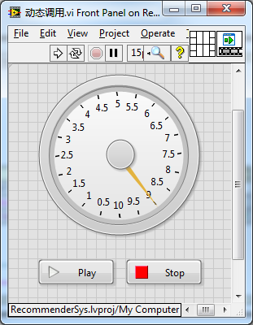
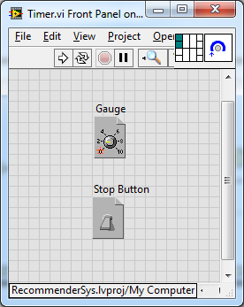
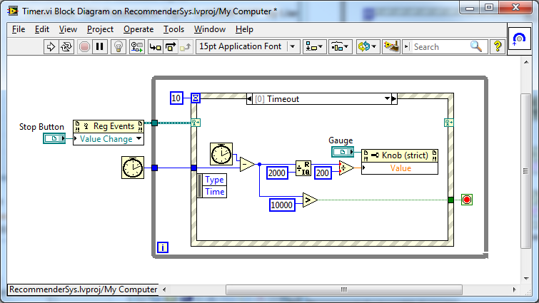
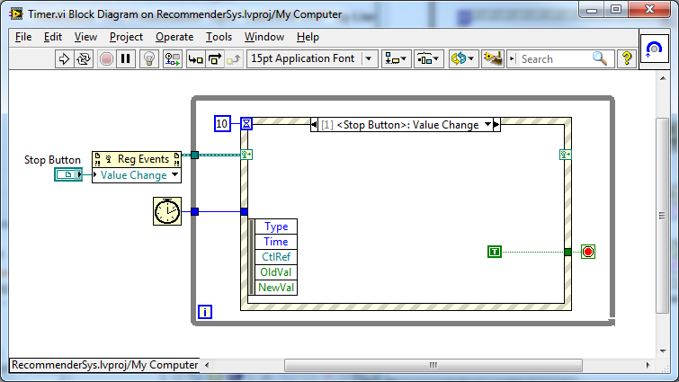
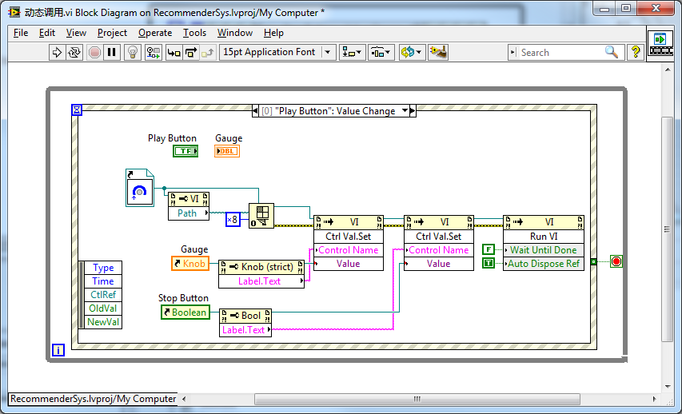
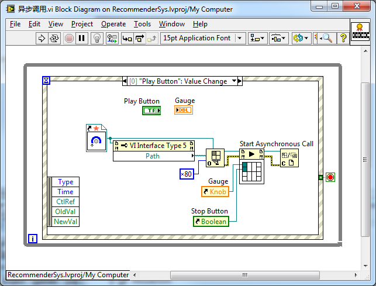

[https://labview.qizhen.xyz/](https://labview.qizhen.xyz/)

LabVIEW 2011 中增加了一个新的函数“异步调用”。这个函数可以简化运行异步VI或控制子线程的代码的复杂度。这个新函数在函数选板“编程->应用程序控制”里。

这里用一个例子来说明一下。

假设我们要编写这样一个程序，它的界面有一个仪表盘外加两个控制按钮： 

当Play按钮按下时，让仪表盘指针旋转。当Stop按下时程序退出。我们假设维持表盘转动是一个持续的任务，并且它不能够阻塞程序的其它任务，比如对Stop按钮的响应。这样我就需要安排一个独立的线程来做维持表盘转动这一任务。

我为这个任务创建了一个VI，这个VI有两个输入参数，分别是表盘和Stop按钮的引用。 

维持表盘转动的VI的程序代码如下： 

它每隔10毫秒挪动一下表盘指针的位置，没两秒钟让表盘转一周。10秒后程序停止： 

维持表盘转动的VI同时检测主程序中Stop按钮是否被按下，如果按下就立刻停止运行。

在LabVIEW2011之前，实现主程序功能的唯一方法是使用VI的“运行”方法，把“维持表盘转动VI”动态调用运行起来。主程序程序框图如下：

在这段代码最不尽人意的地方在于，运行子VI之前先要传递参数。这里只能通过VI的“设置控件值”方法为子VI传递参数。这种方法不但编写复杂，安全性也低。首先，它是通过控件名来找到需要传递参数的控件的，LabVIEW无法在编译时检查参数名字是否正确，子VI中的控件若是改了名字，程序编译时不会有问题，但运行时就会出错；其次，它无法检查需要传递的参数的数据类型，传递一个错误类型的数据进去，LabVIEW也不会在编译时出错。

使用“异步调用”函数，这段程序可以被大大改善： 

需要注意的是，在使用“异步调用”函数前，打开VI引用的时候，一定要传递一个值为0x80的“选项”给“打开VI引用”函数。“异步调用”函数的使用方法与“通过引用调用”十分类似，这里就不赘述了。它们的去要区别在于“通过引用调用”是同步的，程序会停在这个函数上直到被它调用的子VI运行结束；而“异步调用”函数是异步的，程序在这里把子VI启动起来后，并不等待，会继续运行后续程序。
