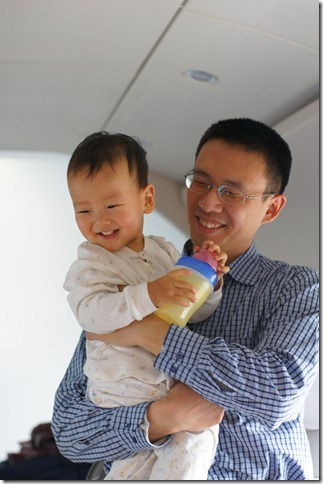
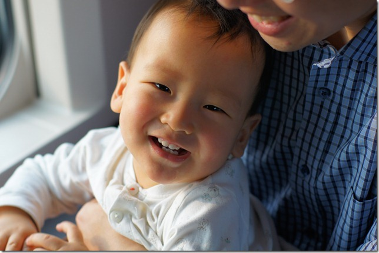
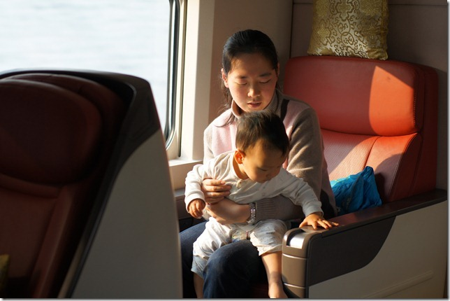
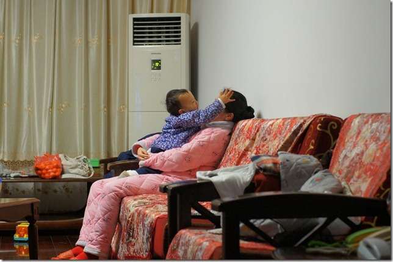
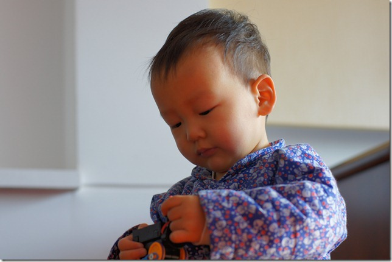
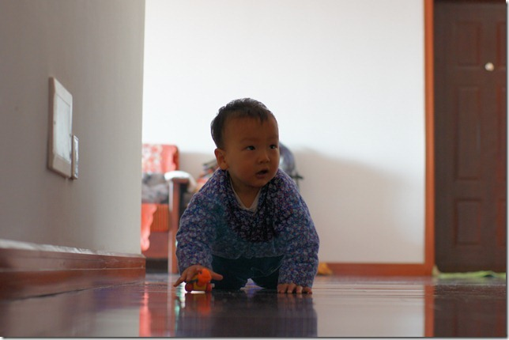
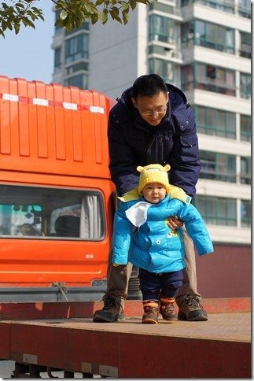

豆豆趴在大床的正中：面向左侧，右脸紧贴着床单，嘴巴在挤压下嘟成了一小团；两条腿蜷在肚子两侧，屁股撅撅着，把被子顶了个大包；豆豆右手向屁股的方向耷拉着，左手被我紧紧攥着快两个小时了。我斜躺在豆豆边上，看他安详的一呼一吸。要不是春节长假，我恐怕还很难找出这么长的时间看着他睡午觉。随着年纪变大，我明显察觉时间开始加速流逝。仿佛就在前天，老婆打来电话说她似乎有了；昨天我还在产房外焦急的等待；今天豆豆就已经开始呀呀学语了。即便是现在正握着他的小手，仍然感到有些惶恐，生怕还没享受够他带来的快乐，再一觉醒来，豆豆就已经长大要远走高飞。

我们的长假也给豆豆带来了惊喜，因为他可以出远门了，这个野孩子就喜欢往外跑。豆豆先去了无锡爷爷奶奶家，又去了济南姥爷姥姥家。无锡距离近，来回都方便；济南就相对远了些，要不是去年开通了京沪高铁，我还真不知道如何带豆豆去呢。我特别讨厌飞机，如果没有高铁，济南到上海的路程最快也要8个小时，豆豆坐这么久的车肯定会闹的。高铁把行程缩短到了三个半小时，这样的间隔，豆豆还是可以忍受的。

动身去济南那天是正月初二，火车上根本没有几个乘客。我们所在的车厢就只有两家人，我们和一对台湾夫妻。台湾阿姨一下子就被豆豆吸引住了，豆豆也会讨人喜欢，乖乖得让阿姨抱着玩了一会。豆豆开心，爸爸妈妈就有心情给他拍照了：

  
  

除夕那天是在无锡过得，豆豆可不管什么春节，只是夜晚不时升起的烟火吸引了他。豆豆一点都不害怕爆竹声，每次听到了还会兴奋的跟着喊一声“嘣……”。晚上才9点多，豆豆就困了，而我也早就对春晚失去了兴趣，于是把豆豆洗洗干净就陪他一起睡了。快到0点的时候，鞭炮声四起，把我们一家都吵醒了。豆豆倒是也不闹，闭着眼睛“嘣”“嘣”嘟囔了两声便倒头再睡。

这是除夕的晚上，豆豆在和妈妈疯呢：  

这次带豆豆出来最大的担心就是怕他到了新地方会不适应，尤其是去济南，离开了每天照顾他的爷爷奶奶，不知道他会不会难过呢？结果我们惊喜的发现，豆豆是个“没心没肺”的家伙，只要有饭吃，有玩具玩，在哪都一样。

  

豆豆对大车情有独钟，初一带他去散步，看到一辆平板大货车，拗不过他，我只好抱他上去转了几圈：  

姥爷家里有一只玩具大老虎，豆豆可以喜欢了，常常扑上去搂住它的脖子又亲又啃：  

