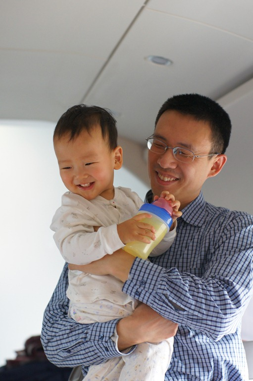
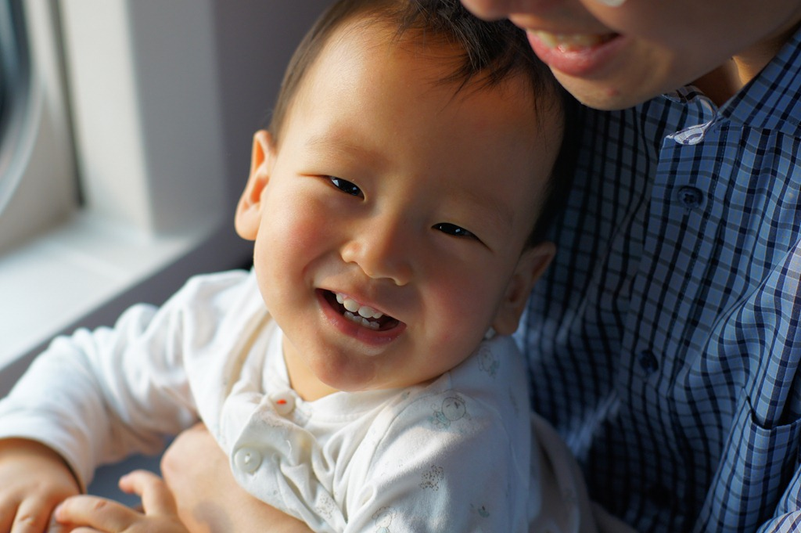
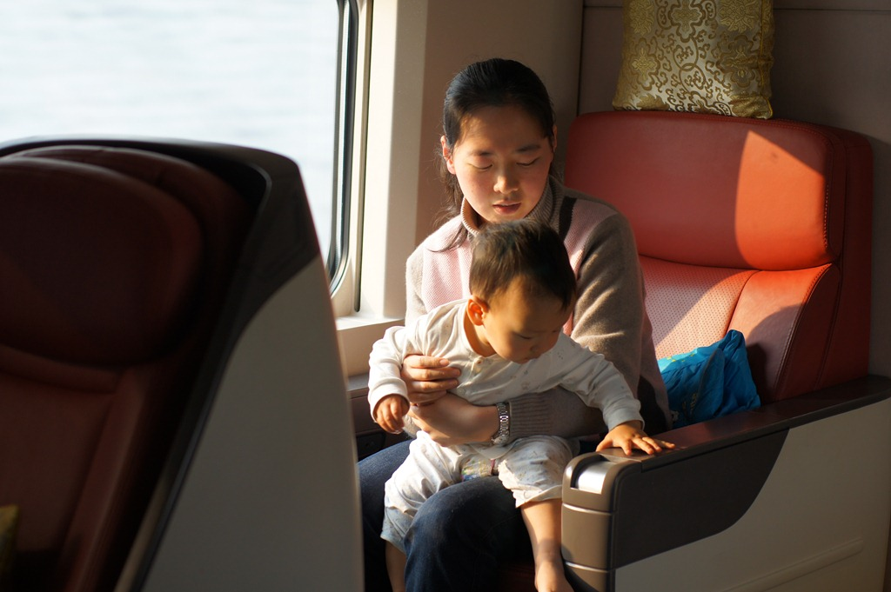
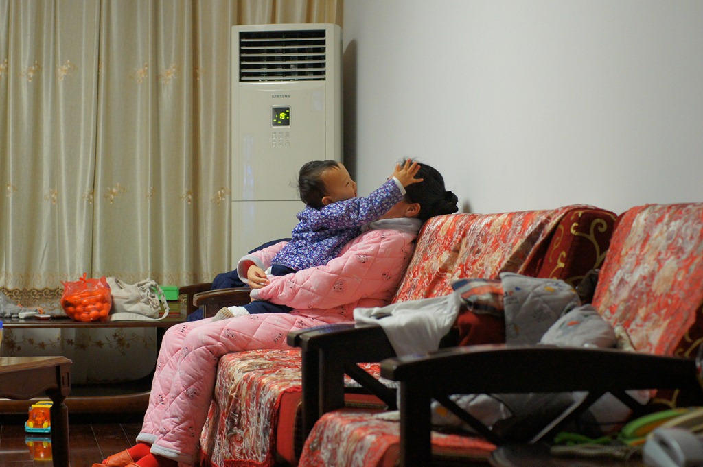
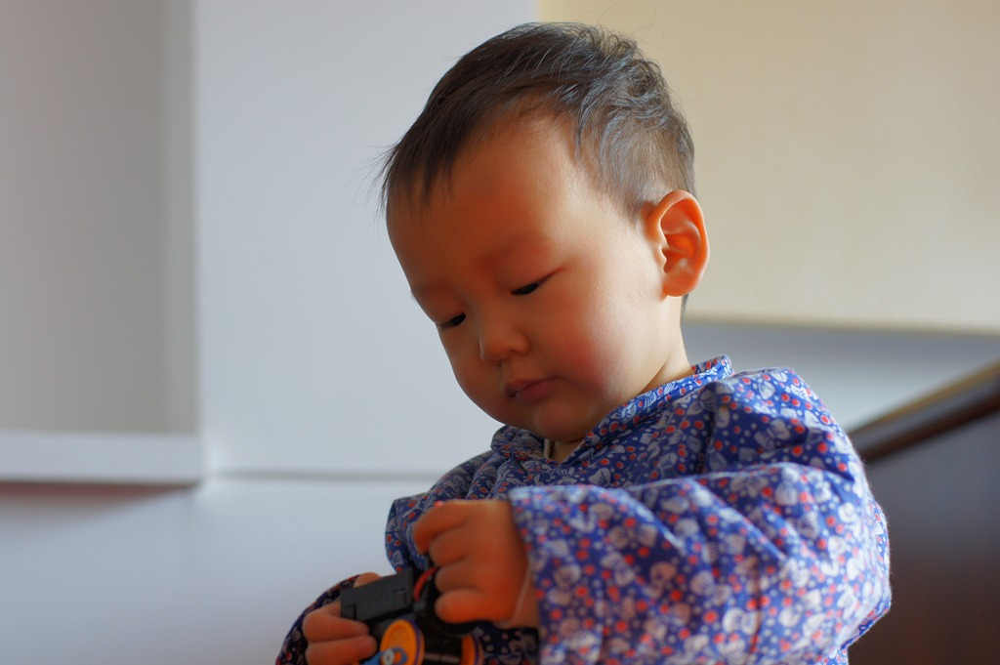
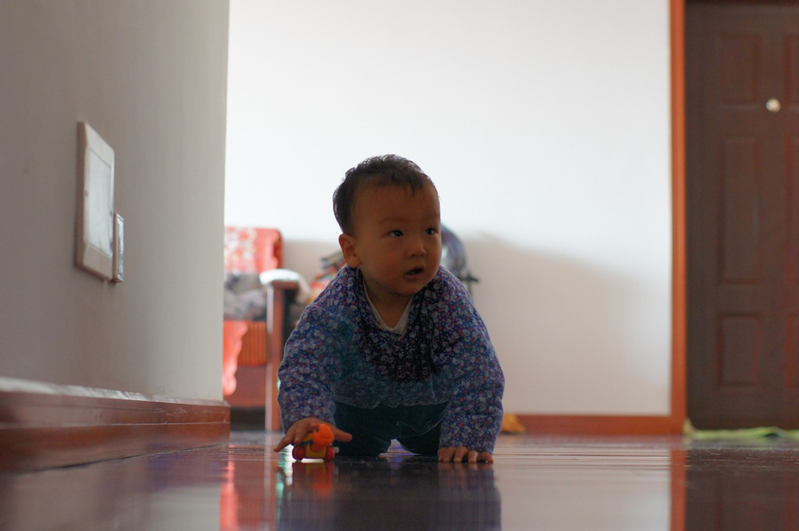
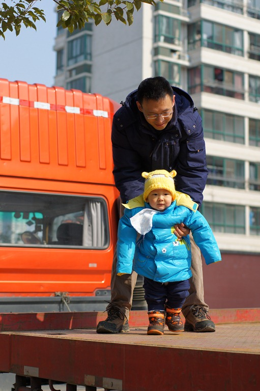
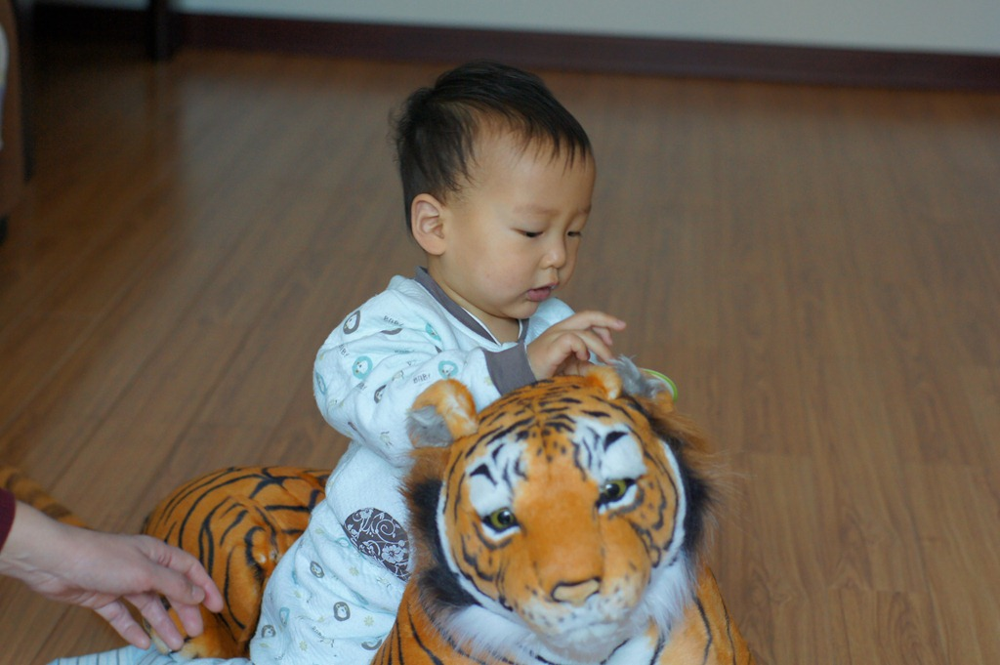

豆豆趴在大床正中央：小脸侧向左边，右颊软软地贴着床单，嘴巴被挤压成了一个可爱的小圆。他的两条小腿蜷在肚子两侧，小屁股高高翘起，把被子顶出一个圆润的大包。豆豆右手摆向屁股一边，左手被我轻轻握着，已经快两个小时了。我斜躺在豆豆身边，静静地看着他均匀的呼吸。若不是春节假期，我很难得有这样悠长的时光，只是单纯地陪他午睡。随着年岁渐长，我明显感觉时间的流逝开始加速了。恍惚间，还是老婆打来电话说她有了身孕的那天；转眼间，我在产房外焦急的走来走去；如今，豆豆已经开始牙牙学语了。即便此刻正握着他温暖的小手，心里却涌起一丝不安，生怕还没来得及充分品味他带来的每一份喜悦，转眼间孩子就要长大远行了。

这个春节长假给豆豆带来了特别的惊喜，他可以出远门了。这个野孩子就喜欢往外跑。豆豆先去了无锡爷爷奶奶家，又去了济南姥爷姥姥家。无锡距离近，来回都方便；济南就相对远了些，要不是去年开通了京沪高铁，我还真不知道如何带豆豆去呢。我特别讨厌飞机，如果没有高铁，济南到上海的路程最快也要8个小时，豆豆坐这么久的车肯定会闹的。高铁把行程缩短到了三个半小时，这样的间隔，豆豆还是可以忍受的。

正月初二那天，我们登上了去济南的列车。或许是春节的缘故，整个车厢异常空旷，只有我们一家和一对台湾夫妻。台湾阿姨一下子就被豆豆吸引住了，豆豆也会讨人喜欢，乖巧地让阿姨抱着逗弄了好一会。豆豆开心，爸爸妈妈就有心情给他拍照了：

  
  

除夕那天是在无锡过得，豆豆可不管什么春节，只是夜晚不时升起的烟火吸引了他。豆豆一点都不害怕爆竹声，每次听到了还会兴奋的跟着喊一声“嘣……”。晚上才9点多，豆豆就困了，而我也早就对春晚失去了兴趣，于是把豆豆洗洗干净就陪他一起睡了。快到0点的时候，鞭炮声四起，把我们一家都吵醒了。豆豆倒是也不闹，闭着眼睛“嘣”“嘣”嘟囔了两声便倒头再睡。

这是除夕的晚上，豆豆在和妈妈疯呢：  

这次带豆豆出来最大的担心就是怕他到了新地方会不适应，尤其是去济南，离开了每天照顾他的爷爷奶奶，不知道他会不会难过呢？结果我们惊喜的发现，豆豆是个“没心没肺”的家伙，只要有饭吃，有玩具玩，在哪都一样。

  

豆豆对大车情有独钟，初一带他去散步，看到一辆平板大货车，拗不过他，我只好抱他上去转了几圈：  

姥爷家里有一只玩具大老虎，豆豆可以喜欢了，常常扑上去搂住它的脖子又亲又啃：  

