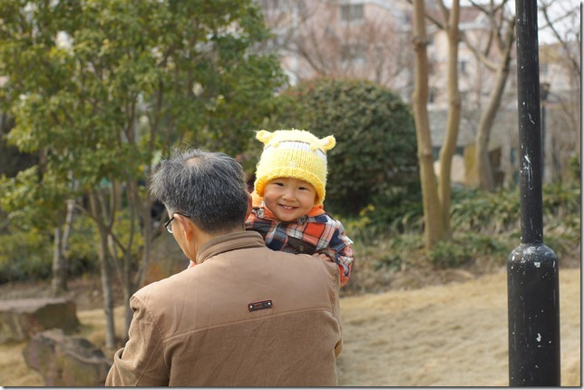
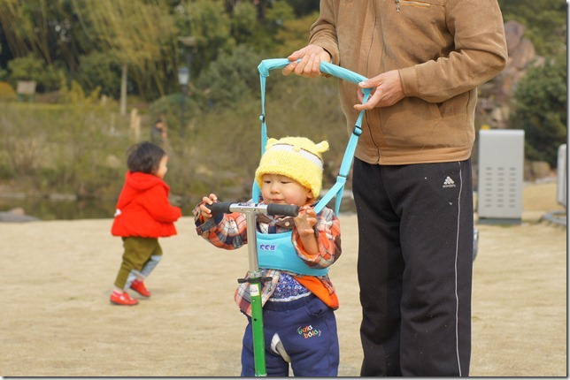
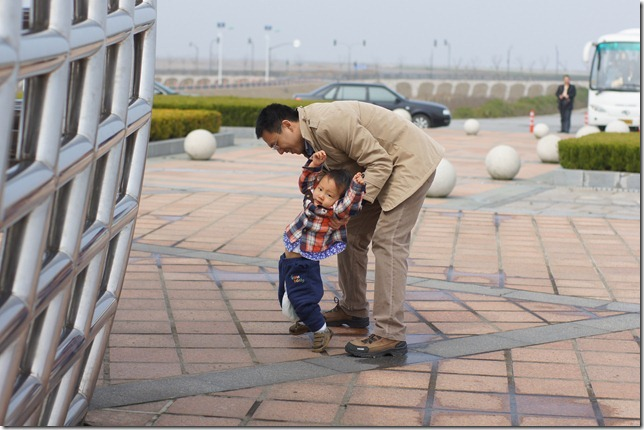
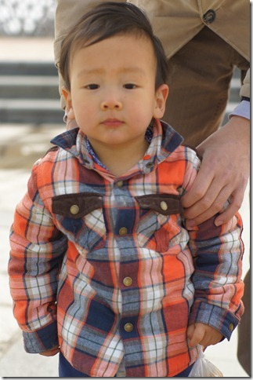
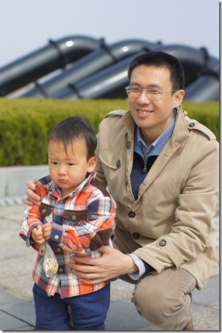
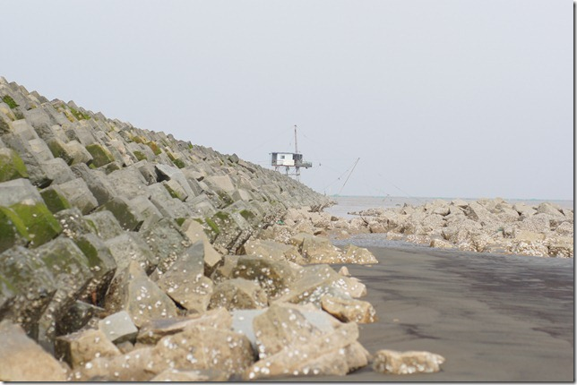

豆豆这个月学习说话的速度明显加快了，现在不但把家里四个人的称呼都学会了，还学会了两个非常有用的动词：“吃”和“抱”。豆豆不愧是馋豆，看见认识的食品，立刻就会兴奋的叫“吃，吃”。前两天看见我的时候直接就说了个句子：“爸爸，抱抱”。

豆豆可以直接从坐这的状态直接站起来了，算是正式会走路了。

上海整个二月都在下雨，进入三月也不见转好，现在只要没有雨就算好天气了。我每个周末都要抽出一天带豆豆出去玩，豆豆是野孩子，只要不在家里，去哪都很开心。

上个周末回张江了，这是在家门口的紫薇公园里：

现在豆豆走路仍然跌跌撞撞，离不开学步带的保护。豆豆在公园里走着走着，突然发现草坪里躺着一辆小滑车，立刻过去扶起来研究研究。豆豆天性就对各种有轮子的东西感兴趣。小滑车是属于身后那个红衣服小姐姐的，她正在一旁疯跑呢。后来一回头，看见自己的爱车被豆豆捡去了，立刻气势汹汹冲了过来。小姐姐比豆豆大了十个月，身高比俺们差了一大截，但是可凶呢，一把就夺过自己的小车。豆豆也不甘示弱，冲着小姐姐啊啊大吼。幸好奶奶急中生智，掏出一个漂亮的公交卡，吸引走了豆豆注意力，才化解一场战争。

这个周末带豆豆出远门，去了滴水湖。豆豆听说要出去坐嘀嘀，立刻兴奋了。挂着一脸的早饭，蹦起来就要出发。

早上出发的时候天气非常恶劣，到达滴水湖的时候甚至有点开始飘雨，结果忘记给豆豆拍照了。

中午就在滴水湖边上吃的。这里游客稀少，饭店也少，我们抱着死沉的豆豆走了好远才看到一家饭馆。但幸运的是，吃过午饭，天气居然转好了。等我们驱车到了滴水湖东面的观海公园，阳光已经穿透稀薄的云层照在了海岸上。豆豆刚学会走路，一旦有机会自己走，就千方百计想摆脱大人的控制。我有时候不得不抱起他，免得他乱跑。他也会反抗，把两只手朝上一身，拼命扭动身体，有时候还真包不住他。

豆豆这张一本正经的照片，看上去很像个大孩子：

这时候早已过了豆豆午睡的时间了，我把车停在了海堤上，豆豆妈在车里哄豆豆睡觉，而我则溜达到堤岸下面去看看。上海虽然临海，居然连一处沙滩都没有，只看得到碎石和烂泥。

