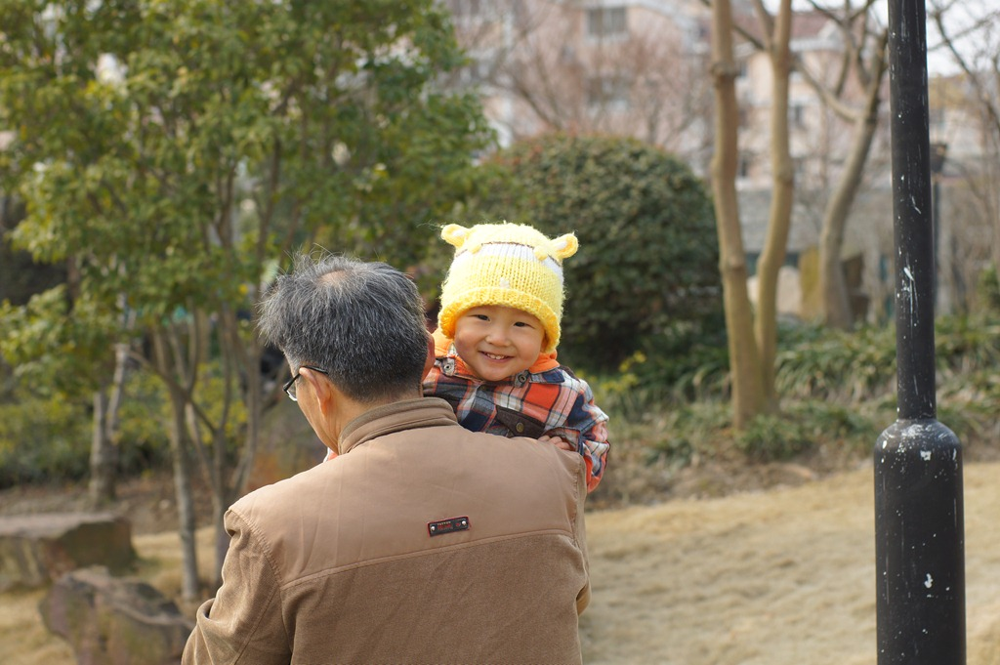

豆在这个月迎来了语言能力的飞速发展。他不仅学会了家中四位亲人的称谓，还掌握了两个非常实用的动词——“吃”和“抱”。小家伙不愧是个馋豆，每当看到熟悉的食物，便会兴奋地叫着“吃，吃”，那副兴奋的模样实在可爱。前两天，他见到我时，更是语出惊人，直接说出了一句完整的句子：“爸爸，抱抱。”这简单的几个字，瞬间融化了我的心。

豆豆现在已经能够独立地从坐姿站立起来，这也标志着他正式迈入了“蹒跚学步”的阶段，开始探索这个广阔的世界。

上海的二月阴雨连绵，进入三月也未见好转，如今只要不下雨，便算是难得的好天气了。我坚持每个周末都抽出一天时间带豆豆外出游玩。豆豆天性活泼好动，只要不在家里，无论去哪里都显得格外开心，对周围的一切都充满了好奇。

上周末，我们回了趟张江，并在家门口的紫薇公园度过了一段愉快的时光：

豆豆虽然已经能够独立行走，但步履仍然有些不稳，还需要学步带的保护。在公园里，他蹒跚地走着，突然发现草坪上停放着一辆小滑车，便立刻好奇地走上前去，又是捏又是摸，认真地研究起来。看得出来，豆豆对各种带轮子的东西有着与生俱来的兴趣。这辆小滑车的主人是身后那位穿着红色衣服的小姐姐，她正在一旁奔跑玩耍。过了一会儿，小姐姐回头一看，发现自己的爱车被豆豆霸占了，立刻气势汹汹地冲了过来。这位小姐姐比豆豆大了十个月，身高也比他高出一截，战斗力却着实不容小觑，毫不客气地一把夺回了自己的小车。豆豆见状也不甘示弱，对着小姐姐“啊啊”地大声抗议。幸好奶奶眼疾手快，及时掏出一张色彩鲜艳的公交卡，成功地转移了豆豆的注意力，这才化解了一场潜在的战争。

这个周末，我们决定带豆豆进行一次短途旅行，目的地是美丽的滴水湖。听说要出去坐嘀嘀，豆豆立刻兴奋得手舞足蹈，脸上还挂着没吃完的早饭，就迫不及待地想要出发了。

早上出发时，天气状况并不理想，甚至有些阴沉。到达滴水湖时，天空还飘起了零星的小雨，因此我们遗憾地错过了为豆豆拍照的最佳时机。

中午，我们在滴水湖边用餐。由于这里游客不多，餐馆的选择也相对有限，我们抱着沉甸甸的豆豆走了好长一段路才找到一家合适的饭馆。不过，幸运的是，午饭过后，天气竟然奇迹般地转晴了。当我们驱车来到滴水湖东面的观海公园时，阳光已经穿透稀薄的云层，洒在了波光粼粼的海岸上，景色宜人。

豆豆一旦有机会自己走路，他便会想方设法地摆脱大人的束缚，自由地探索世界。我有时不得不把他抱起来，以防他乱跑发生危险。而他被抱起后，也会用尽全身力气进行“反抗”，两只小手向上伸展，身体拼命地扭动，活像一条挣扎的小泥鳅，有时候还真有点抱不住他。

豆豆这张一本正经的照片，看起来俨然像个小大人：

这时，早已过了豆豆的午睡时间，我便把车停在了海堤上，让豆豆妈在车里哄他睡觉，而我则独自一人走到堤岸下，想近距离地看看大海。虽然上海临海，但令人遗憾的是，这里几乎找不到一片真正的沙滩，映入眼帘的只有遍布的碎石和淤泥。

