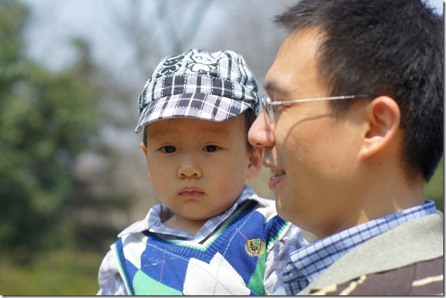
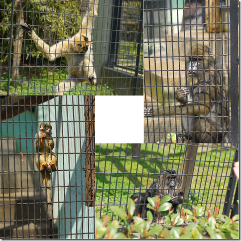
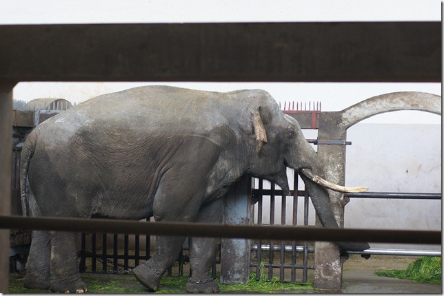
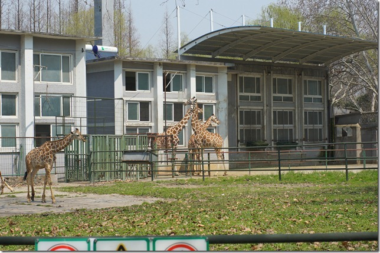
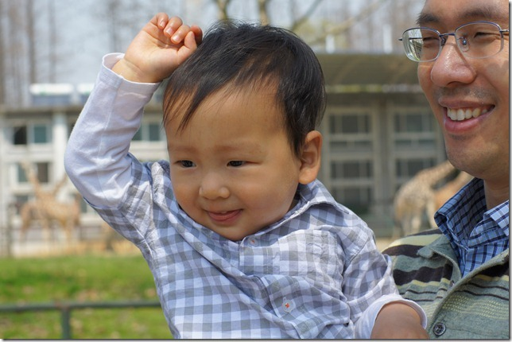
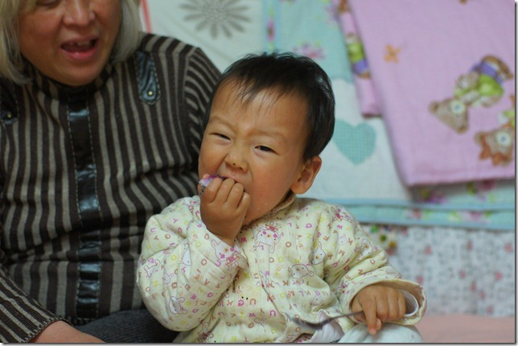
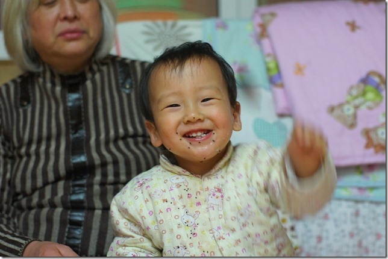

今天是春节过后第一个晴朗的星期天，我们决定带豆豆去动物园玩一玩。上了地铁10号线就发现车厢里全是小孩，一问都是去动物园的。看来小朋友们都憋坏了，难得一个好天气，不容错过。动物园里果然也是人山人海，我排队买票居然还排了二十分钟。

整个动物园里，豆豆最喜欢的是猴子。上海动物园的猴子种类还真不少，大大小小。其中一只猴子还抢了豆豆的橙子吃。

豆豆还去看了大象和长颈鹿

看完了长颈鹿，豆豆就困了。然后就趴在爸爸肩膀上睡着了。

豆豆睡了一个小时，然后又去看狮子、老虎。狮子老虎全是懒蛋，全都在睡觉，一动不动，真没意思。

接下来豆豆又去看了大熊猫、小熊猫、各种大鸟。然后就回家了。豆豆今天玩的好累，到了家里一改好动性格，老老实实坐在床上。不过吃东西的力气还是有的，豆豆的晚餐水果是火龙果。

