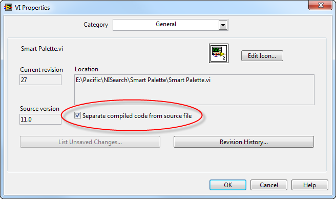

[https://labview.qizhen.xyz/](https://labview.qizhen.xyz/)

我在书中和[之前的文章](http://ruanqizhen.wordpress.com/2006/07/03/labview-%E6%98%AF%E7%BC%96%E8%AF%91%E5%9E%8B%E8%AF%AD%E8%A8%80%E8%BF%98%E6%98%AF%E8%A7%A3%E9%87%8A%E5%9E%8B%E8%AF%AD%E8%A8%80/)中介绍到了LabVIEW的一个与其它语言不同之处：它把程序源代码和编译好的可执行代码存储在了同一个文件中。我一直觉得这并不是一个好的方法。对于普通LabVIEW用户，这也许不是一个严重问题，甚至很多人都不需要关心LabVIEW是怎么保存文件的，只要他的程序能正确运行就万事大吉。

但是，源代码与可执行代码混合存储的弊病还是给我的开发带来了一定影响。我开发的项目较大，有多个人同时参与开发，这样一来，同一个VI文件就会在不同的开发者之间传来传去。每个开发者有自己的喜好，有人有64-bit的LabVIEW进行开发，有人用32-bit的LabVIEW，有人用Windows，有人用Linux。这本来不应该是一个问题，LabVIEW支持跨平台，相同的源代码不加修改就可以在任何平台下运行。

问题在于不同平台下编译出来的可执行代码是不同的，我的程序复制到同事的电脑上，即便代码不做任何修改，VI也会被修改，因为VI中包含的可执行代码变了。这样，我就没法简单的判断一个VI是否被同事做了修改，还是仅仅编译后的代码变了，非常不利于程序源代码管理。

这个问题可以通过分离VI的源代码与可执行代码来解决，这是LabVIEW2010开始出现的功能。在VI的属性对话框中，有一个选项是“分离编译后代码与源代码”。若这一选项被选中，则VI中只保留程序的源代码，而编译生成的代码则被移出VI之外。

被分离出来的编译好的可执行代码又LabVIEW统一管理，在我的Windows 7 系统中，文件夹C:\\Users\\\[user name\]\\Documents\\LabVIEW Data\\VIObjCache\\\[LabVIEW version number\]\\ 下有一个objFileDB.vidb 文件，这就是用来存储LabVIEW 程序所有可执行代码的数据库。

若程序会在不同平台下协同开发，或者程序会被发布到不同平台下去，都可以考虑采用可执行代码与源代码分离的策略，避免不必要的VI变动。

理论上，可执行代码与源代码分离开来，可以提高程序的加载速度：程序可以各取所需，只加载源代码或只加载可执行代码。不过我并没有太明显的感觉到速度的变化。
