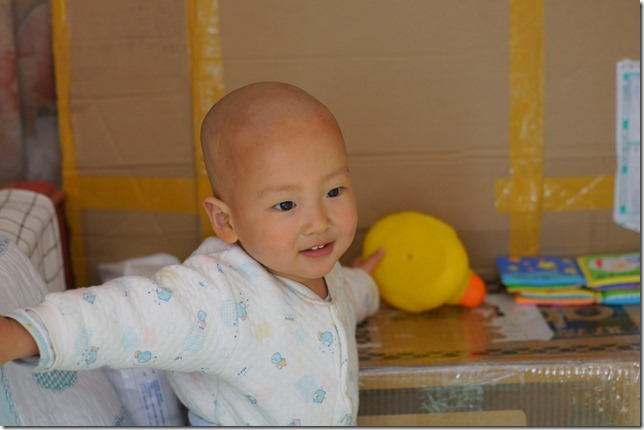
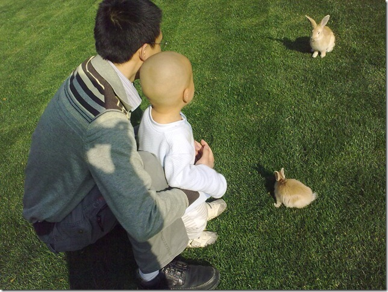
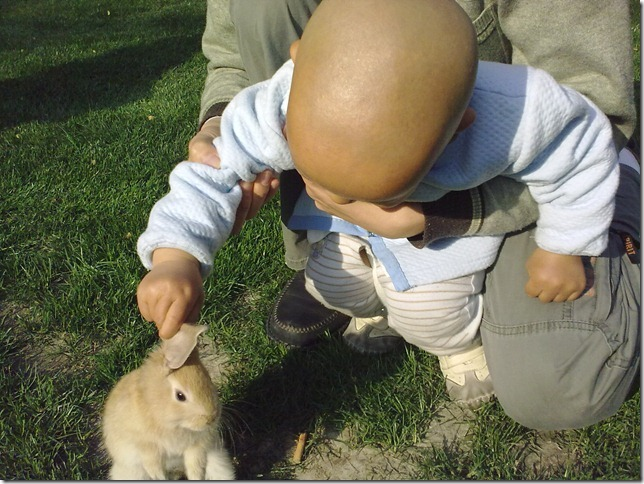

昨晚豆豆妈加班，很晚才回来。豆豆9点就困了，看不见妈妈，豆豆就找爸爸。我想让他躺床上给他讲故事，但是他不干，一定要让我抱。于是我抱起他，对他说：趴到爸爸肩膀上。豆豆就往我肩上一趴，我抱着他在屋子里边走边讲故事，走了两圈豆豆就睡着了。这是近来豆豆头一次晚上不吃奶睡觉。豆豆现在跟妈妈可粘糊了，看他每晚在妈妈怀里的赖叽样，让人觉得他离开奶就过不了了呢。以至于我常常担心他将来断奶的时候会不会太过难过。现在看来，豆豆是相当现实的一个小宝：有奶吃就吃，没有奶也不影响睡觉。这让我放心了很多。

最近上海天气转暖，于是我们又把豆豆头发剃光了。

豆豆每天要在外面草地上待三四个小时，走路的水平大有长进，摔跤次数越来越少了。这天，豆豆在草地上遇到了三只小兔。

豆豆对陌生动物倒是一点也不害怕，上去一把就抓起了兔子耳朵。

月初的时候，豆豆的姥姥姥爷来看他，而爷爷奶奶则回无锡去了。豆豆是个势利眼，只要有给他做饭、陪玩就行，根本不管是谁。姥姥姥爷一来，他就适应了，丝毫看不出有想念爷爷奶奶的意思。这几天我们一直在训练豆豆喊“姥姥”，豆豆三天就学会了，不过发音还不太准，现在见了姥姥就喊“欧欧”。

有一天白天，豆豆妈不在家，姥姥姥爷喂豆豆吃饭。豆豆贪玩，把饭往外掘。姥爷板着脸，对他一瞪眼，他立刻识趣得乖乖吃饭了。晚上又到了吃饭时间，还是姥姥姥爷在外屋喂豆豆吃饭。豆豆顽皮劲又来了，姥爷故技重施，又一瞪眼。这次豆豆知道妈妈在家，可就没那么乖乖就犯了，他立刻跑到妈妈面前满含热泪的哼唧，一副受了委屈的面孔。豆豆还挺有做演员的天赋呢。
