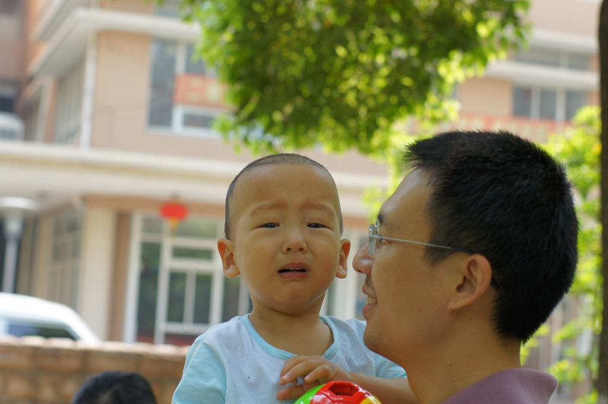
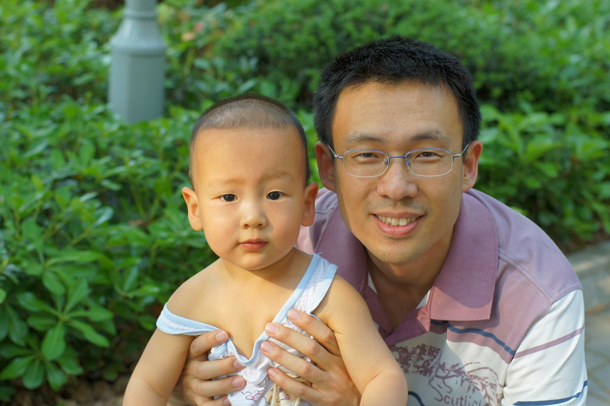

上个月我们搬到了新家，这里更干净，终于可以让豆豆下地自由活动了。为了给豆豆创造更清洁的环境，我还特意弄了一个吸尘器，用于打扫卫生。平时，豆豆只要看到地上的脏东西，就会指着它说“嗯，嗯”，然后大声叫“爷爷”，让爷爷把它收走。吸尘器一来，豆豆就被这个神奇的东西吸引住了：所有脏东西“呼”一下就被吸进管子里，都不需要爷爷来捡了。每次我干活，他都要在一旁指挥，告诉我脏东西在哪。不过豆豆还是有一点害怕这个嗡嗡作响的家伙的，每当我说“爸爸要开始吸了”，他就赶紧后退，最好躲到妈妈身后，探出小脑袋偷偷观察。或许是吸尘器的噪音太大，又或许他担心自己也会被吸进去。可一旦我关掉开关，豆豆就又立马冲上来，抓起吸尘器的吸管，在地上比比划划，嘴里还模仿着“呜呜”的声音，干得有模有样。

