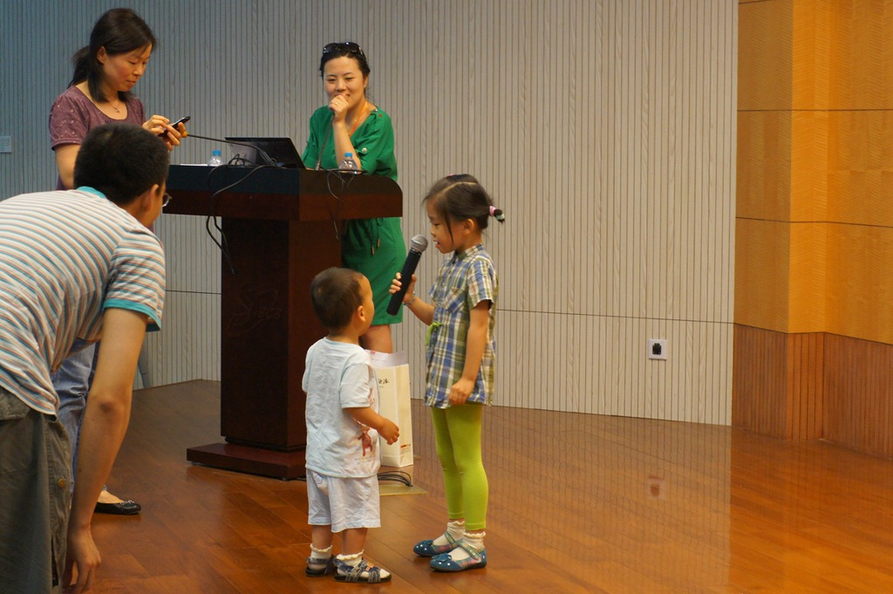

豆豆最近长速减缓了，目前身高大约86厘米，体重大约25斤，与同龄小宝平均水平差别不大。

最近六一儿童节，豆豆妈所在的生化所组织一次小朋友聚会。与会的大多是4～7岁的小宝，他们已经可以表演节目什么的了。可是豆豆啥都不懂，可是他发现舞台上似乎是个好地方，全然不顾别的小朋友正在演出，冲上去就开始捣乱。

豆豆可以熟练的说一些两字词了，比如：“吃奶”，“这个”。豆豆想要爬高的时候还会喊口号，一面使劲一面嘴里念念有词的喊着“一二一二”。豆豆很早就识别大小了，比如我拿两块馒头给他，他必定是挑大的那个。但是他也不算特别贪心啦，通常不会同时把大小两个吃的都拿走。

豆豆记性很好，一个月前我们带他到生化所的大院里玩，他看着一个老爷爷浇花看了半天。一个月后又来到了大院里，他立刻指着上次浇花的地方比比划划地说“哗哗”。
