豆豆这个月过得可开心了，豆豆爸最近比较清闲，带他外出的频率明显增高。

**ColorMe**

先是豆豆爸公司里组织了一次儿童节活动，在世纪公园旁边的ColorMe，一个专门组织儿童游乐的公司里举办。大约有三十来个小朋友参加了活动，可惜这些游戏活动都比较适合三岁以上的小朋友，豆豆太小了，没法参加任何集体活动。

活动原计划下午1点就开始了，但是豆豆睡醒午觉就快两点了，等我们赶到地方，已经将近三点了。大多数小朋友都已经来了，在活动场所里面的屋子里画画呢。我看见ColorMe一进门就有一处活动区域，都是软塑料积木，我又闻到他们活动场所里面的屋子都有一股装修味道，于是就直接让豆豆去积木区玩了，没有再进去。豆豆对积木毫无兴趣，但是他很快就发现积木区旁边有个小餐台，是给小朋友过家家用的。上面有各种木质的小锅、铲勺、饭碗等厨具，这些倒是挺好玩的，于是上去抓起几样就开始敲敲打打。

过了一会，里面有人喊，小朋友们做集体游戏啦。我就也把豆豆抱进去了，让他见见别的小朋友。在里面一间大屋子里，稍大一些的小朋友们都已经围坐在屋子四周了，中间空出一片活动区域，主持人正站在中央讲话。我把豆豆往地上一放，他就立刻冲到场地中间去手舞足蹈，全然不顾其它小朋友的感受。主持人发现有人抢了他的镜头，直皱眉头。我赶紧跑过去，一把抱起豆豆离开了游戏室。俺们还是单独活动吧。

**嘟嘟家**

从ColorMe出来，我们直接去了嘟嘟家。嘟嘟比豆豆小了四个月，虽然嘟嘟是个大美女，不过豆豆似乎对嘟嘟的玩具更感兴趣一些。

[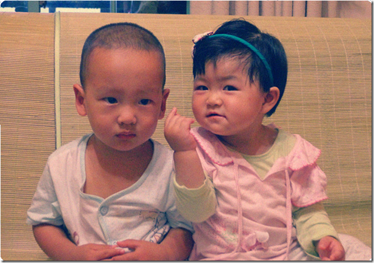](http://ruanqizhen.wordpress.com/wp-content/uploads/2012/07/image1.png)

[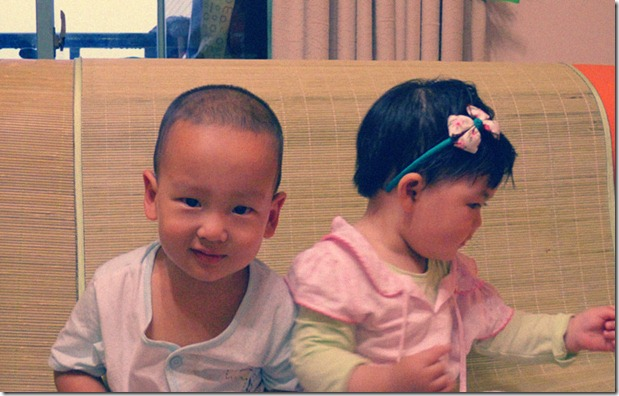](http://ruanqizhen.wordpress.com/wp-content/uploads/2012/07/doudou-smile1.jpg)

**动物园**

再过了两天，豆豆爸要去打疫苗，地点就在动物园旁边。于是想干脆把豆豆带去动物园玩吧。就这样，豆豆又去了一趟动物园。去动物园的路上，爷爷奶奶特地买了几个便宜水果打算喂猴子。等进了动物园，已经快到中午了，豆豆饿了，于是我们直奔动物园的餐厅而去。去餐厅的路上，路过金鱼展区。我喂了几块饼干给池塘里的鱼，豆豆也学会了，朝我要了饼干渣扔给小鱼们。小鱼张着大嘴巴在豆豆脚下抢吃的，逗得豆豆咯咯直笑。

动物园里的餐厅很一般，但价格不菲，我们吃了点家常菜也要三百多块钱。但是餐厅的环境可真好，绿荫环抱。餐厅的中庭里还有一座人造瀑布，抱着豆豆去看瀑布的时候，豆豆无比兴奋：伸着脖子，指着瀑布，小腿直踢。

吃完饭，我们就进去看猴子。先去看的是狒狒园，这是个开放式的池子，狒狒们在里面，我们在墙外。矮墙不高，但池子很深，又有水沟阻隔，所以狒狒们逃不出来。没了笼子，游人们可以方便的扔食物进去，爷爷奶奶买的便宜水果就全送给这些狒狒了。从天而降的水果引起了狒狒们一阵骚动，他们嚎叫着开始争抢食物，豆豆看的眼花缭乱。准备离开狒狒园的时候，我抱着豆豆问他：“猴子是怎么叫的？”他于是扯着嗓子“嗷……”地喊了一声。旁边一圈人本来在看狒狒的，现在全都转过头来看豆豆了。

从猴子区出来，我打疫苗的时间就快到了，于是我告别了豆豆去扎针。据说我一走，豆豆就躺在小车里睡着了。等两个小时后，我回来的时候，远远看到豆豆还在睡觉，等走到跟前，豆豆就像知道爸爸来了一样，一下子醒了过来。东张西望了一会，又伸了几个懒腰，然后就屁颠屁颠追鸽子去了。

由于这一天不是周末，人很少；天气也很好，阴天没有太阳，难得的出来玩的好时机，我决定让豆豆多玩一会。于是，我又推着豆豆去看大狮子。上次豆豆来动物园，狮子老虎都在睡觉，大熊猫前面挤满了人，豆豆玩的很不尽兴。这次好了，熊猫馆前一个人也没有，豆豆趴在玻璃窗上看大熊猫吃了一整棵竹子。大狮子也还算给面子，母狮子虽然在睡觉，但公狮子起床了，坐在地上一个人发呆，也许在回想自己在大草原上的风光往事呢吧。老虎就太懒惰了，依然在睡觉。

我们最后参观的是黑熊。黑熊也被关在一个深坑里，看到我们来了，又作揖又鞠躬。奶奶想起来我们还带了肉包子，于是掏出来喂给黑熊，它还挺爱吃的。我赶紧抢过肉包，递给豆豆喂。哪知道豆豆小气的很，每次只揪下来一小块，还要等上好半天才扔给黑熊。

**棒棒家**

月底，豆豆妈去北京开会，我抱着豆豆也跟去了。趁着豆豆妈开会的时候，我带豆豆去看他北京的小表弟——棒棒。棒棒家住通州，而我们的旅馆在大钟寺，过去一趟，单程两小时左右。以前经常跟同事声讨上海地铁的各种设计缺陷，这次带着豆豆长途体验了一下北京地铁，才发现，原来还有比上海烂的多的地铁系统。

首先，北京地铁是绝对不欢迎轮椅和童车的，因为别说是升降电梯，很多站台连扶梯都没有。新一点的线路虽然有升降梯，也都是摆设，全部都显示着“Out of service.”不同线路之间的换乘也都老长老长，相比之下，上海的一二号线之间换乘都显得好快捷啊。没办法，到了楼梯处，我只好把豆豆连车带人一起抱起来上上下下，幸好最近这一年半常常抱豆豆锻炼了点臂力。

豆豆倒是非常喜欢坐地铁，他逐渐掌握了地铁开关门的规律，等地铁一进站，就开始拍着小手叫：“开，开”。若是恰好对面也开来一辆的话，他还会兴奋的大喊“呜……呜……”。

棒棒的奶奶是豆豆的二姨奶。二姨奶在豆豆三个月大的时候，曾经照顾过豆豆一个月，对豆豆很有感情的。可惜豆豆不记得了，到了棒棒家，一看都是陌生人，有点紧张。稍微安静了一会，他就牵着我的手去各个屋子参观。这时候二姨奶偷摸过来换了我，领着他转。豆豆走着走着一回头，发现领着他的居然不是爸爸，哇一声就大哭起来。我赶紧去抱起他，随后二姨奶又拿出准备好的西瓜递给他，他这才破涕为笑。给了吃的就是熟人了，这回二姨奶也可以对他搂搂抱抱了。

吃饭的时候，二姨奶让豆豆叫奶奶，豆豆不肯。二姨奶夹起一块肉，递到豆豆眼前说：“叫奶奶”。豆豆立刻甜甜的说了一声“奶奶”。势利眼本性暴露无遗啊。

吃过午饭，已经下午两点了。豆豆该睡午觉了，我有一阵子没哄过豆豆睡觉了。没想到豆豆还是很给我面子的，我抱着他讲了几分钟故事，他就睡着了。

等豆豆再醒过来，可就不把自己当外人了。先是抓起拖把来拖地，然后又拿起蒲扇来跟棒棒的爷爷打打闹闹，疯得别提多开心了。

这是豆豆正在投抹布，准备擦地呢：

[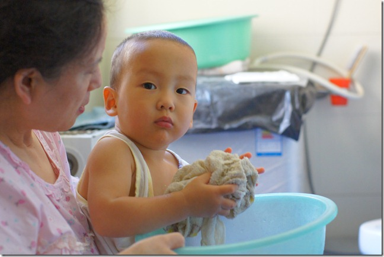](http://ruanqizhen.wordpress.com/wp-content/uploads/2012/07/dsc041591.jpg)

这是棒棒，刚45天大：

晚上从棒棒家回来，出大钟寺地铁站的时候已经9点了。这时我看看豆豆的尿不湿，已经很大了，我想出了地铁了，也不怕他乱尿了，捂着怪难受的，就解下他的尿不湿扔掉了。我还有点不放心，于是又问了他一下，你要不要嘘嘘啊。豆豆很干脆的说“啊不啊不”，豆豆已经能够清楚的判断自己是否要撒尿了。

回旅馆途中路过一个便利店，我想到我们还需要饮用水，顺路嘛，就进去买了一大桶。结帐的时候，我把豆豆往收银台上一放，付了钱。正准备走的时候，发现坏了，豆豆尿了一大泡在人家桌子上。收银员正在一边规整东西，也没看我们，我于是问他说你们这有没有抹布、纸什么的，我擦一下，这里湿了。他大概也没意识到出了什么事，没好气的说了句“没有”。我想，这可就不怪俺们了，于是夹起豆豆赶快溜。

我当时身后背着个重重的书包，装满了豆豆的换洗用品和食物，右手抱着豆豆，左手拎着水桶，眼看就撑不住了。幸好这时候接到了豆豆妈的电话，说她已经到了附近。又等了一会，豆豆妈终于出现解救了我。

**天安门**

豆豆妈说，豆豆来北京一趟，去看看天安门是必须的。可惜我们去的不是时候：正午时分，太阳火辣，我们拍了几张照，就草草收兵了。

[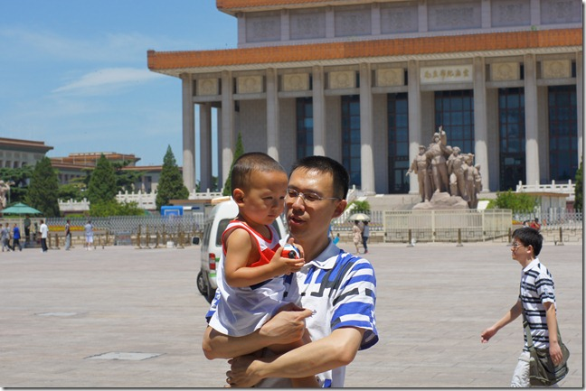](http://ruanqizhen.wordpress.com/wp-content/uploads/2012/07/dsc042281.jpg)

[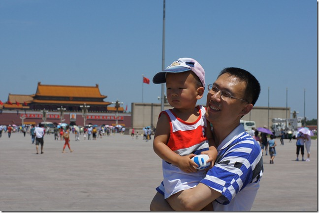](http://ruanqizhen.wordpress.com/wp-content/uploads/2012/07/dsc042491.jpg)

豆豆是分时段的：晚上9点到早上7点段跟妈妈亲，我抱他一下，他都会哇哇大叫。其它时段是跟爸爸亲，这时候不让妈妈抱呢。

[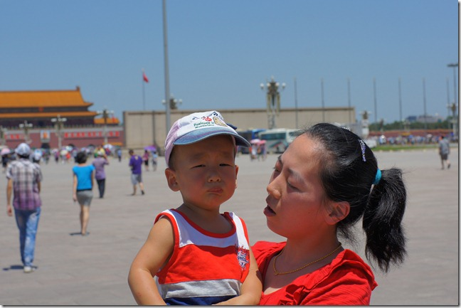](http://ruanqizhen.wordpress.com/wp-content/uploads/2012/07/dsc042681.jpg)

**鸟巢和水立方**

白天太热，只好晚上行动了。晚上我们领着豆豆去看鸟巢和水立方。

[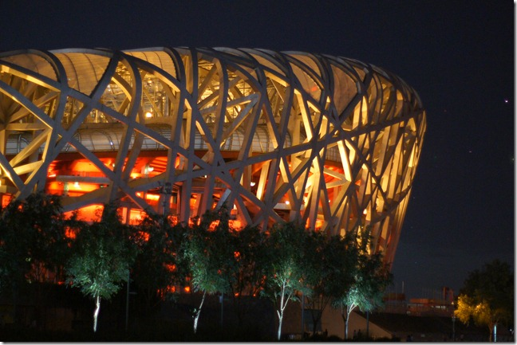](http://ruanqizhen.wordpress.com/wp-content/uploads/2012/07/dsc043571.jpg)

开始跟妈还不错

[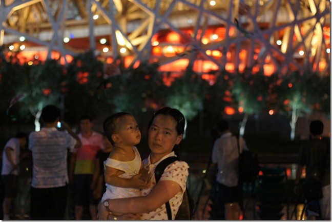](http://ruanqizhen.wordpress.com/wp-content/uploads/2012/07/dsc043451.jpg)

[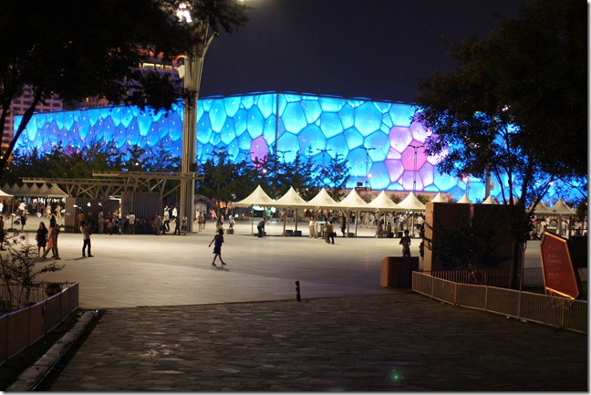](http://ruanqizhen.wordpress.com/wp-content/uploads/2012/07/dsc043651.jpg)

后来就开始找爸爸了

[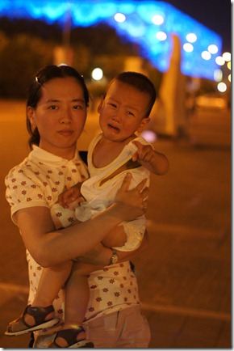](http://ruanqizhen.wordpress.com/wp-content/uploads/2012/07/dsc044481.jpg)

**游乐场**

由于白天太热，我们不想带豆豆去外面了。大钟寺广场有几个儿童玩乐的场所，于是我就找了一个，让豆豆进去玩。由于是工作日，里面玩的小朋友不是很多，总共四五个吧，看上去都在两三岁左右。期间，豆豆撞到了一个小男孩，那个小家伙比豆豆矮一块，但是行动非常灵活，豆豆想追他都追不到。我开始以为他比豆豆小，就问了他的爷爷，结果那个小男孩已经两岁零三个月了，比豆豆大了八个月呢，难怪已经运动的这么自如了。

豆豆18个月打完疫苗后去检查了身体，他当时身高是89厘米，体重25.5斤，都超标三个月以上。最夸张的是他的大脑壳，头围已经相当于三岁小宝了。我听到了还有点担心，不知道脑袋太大会不会有问题。

**洗澡**

豆豆平时就喜欢玩水，这回有了旅馆的免费洗澡水，可是玩乐个痛快。每天都要在洗澡间里带上个把小时，用喷头到处喷。他玩水的时候，我就蹲在地上扶着他，怕他摔倒。他有时回头看看我，然后就突然拿出喷头对着我的脸哗哗淋过来。我用一只手把脸上的水抹干净，然后等着他说“坏豆”，他就得意的哈哈大笑。

旅馆里地方太小，他又惦记着水龙头，有时一不注意，他就溜进去了。有一次，他跑进卫生间后，斜眼一看：“咦，这里有盆水啊”。于是把手伸进马桶里和弄了一通，豆豆妈这个气啊，心想：“我一个洁癖，怎么会生出这么个脏豆呢？”

[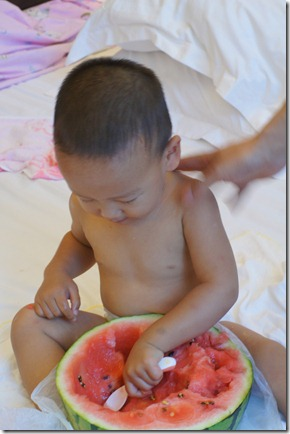](http://ruanqizhen.wordpress.com/wp-content/uploads/2012/07/dsc043081.jpg)
