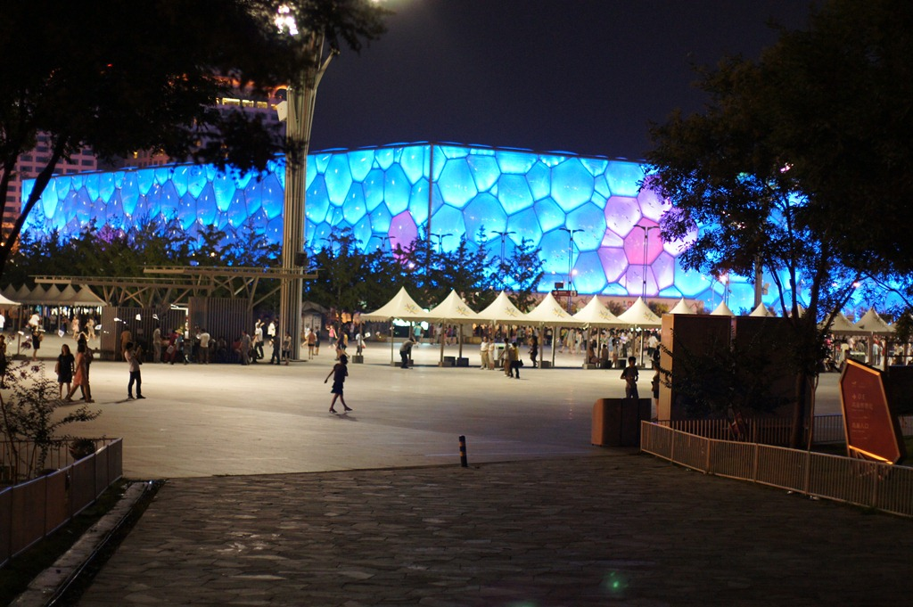

这个月，豆豆过得格外开心。最近，豆豆爸的工作不太忙，带他出去玩的次数明显增多。

## ColorMe

本月的一大亮点是豆豆爸公司组织的儿童节活动，地点在世纪公园旁的 ColorMe，一个专门为孩子们提供游乐活动的场所。大约有三十多个小朋友参加，可惜活动主要面向三岁以上的孩子，豆豆还太小，没办法参与集体游戏。

活动原定下午一点开始，但豆豆午睡醒来已经快两点了，我们赶到时，已接近三点。大部分小朋友都已入场，在里面活动室内画画。我刚进门就注意到，入口处有一个积木活动区，摆满了软塑料积木。同时，我还闻到里面活动室内有些装修的气味，于是决定不进去，而是让豆豆在积木区玩耍。

不过，豆豆对积木似乎毫无兴趣，倒是很快被旁边的小餐台吸引了。这是一个过家家游戏区域，摆放着各种木质的小锅、铲勺、饭碗等厨具。他立刻兴奋地拿起几样，咚咚敲打起来，玩得不亦乐乎。

不一会儿，活动室里传来召集声：“小朋友们，一起来做集体游戏啦！” 我便抱起豆豆，带他进去看看其他孩子。在一间宽敞的大屋子里，年纪稍大的小朋友们已经围坐在四周，中间留出一块活动区域，主持人正站在中央讲话。

刚把豆豆放下，他就兴奋地冲到场地中央，手舞足蹈，全然不顾其他小朋友的存在，成了全场焦点。主持人见有人“抢镜”，眉头紧锁，似乎有些无奈。我连忙冲上去，一把抱起豆豆，赶紧撤离游戏区。看样子，咱们还是单独行动比较合适！

## 嘟嘟家

从 ColorMe 出来，我们直接去了嘟嘟家。嘟嘟比豆豆小了四个月，虽然嘟嘟是个大美女，不过豆豆似乎对嘟嘟的玩具更感兴趣一些。

## 动物园

两天后，豆豆爸要去打疫苗，地点刚好在动物园附近。于是，我们干脆决定带豆豆去动物园玩一趟。

在前往动物园的路上，爷爷奶奶特意买了几个便宜的水果，打算进去后喂猴子。等我们抵达动物园，已是接近中午，豆豆有些饿了，于是我们直接朝园内的餐厅走去。

去餐厅的途中，正好路过金鱼展区。我拿出几块饼干，掰碎后撒进池塘，鱼儿们立刻争相抢食。豆豆看得兴奋，也朝我要了一些饼干渣，学着我的样子扔给小鱼们。看着小鱼张着嘴巴在他脚下争抢，豆豆被逗得咯咯直笑，开心得不得了。

动物园的餐厅环境真是不错，四周绿荫环绕，中庭甚至还有一座人造瀑布。不过，餐厅的饭菜一般，而且价格不菲，随便点了几道家常菜，就花了三百多块。尽管如此，豆豆却完全沉浸在新奇的环境中。当我抱着他去看瀑布时，他兴奋得不得了，伸长脖子指着瀑布，小腿不停地蹬着，眼里满是好奇和激动。

吃过午饭，我们正式开始动物园之旅，第一站是猴山。随后来到狒狒园，这是一个开放式的池子，狒狒们在池子中央的活动区，而我们则站在矮墙外观赏。虽然墙不算高，但池子很深，还隔着一道水沟，所以狒狒们无法逃出来。正因为没有笼子，游客们可以直接投喂食物。爷爷奶奶带来的水果很快被扔进池子，顿时引发了一场骚动。狒狒们嚎叫着争抢，场面既热闹又滑稽，豆豆看得目不转睛，眼花缭乱。

准备离开狒狒园时，我抱起豆豆，笑着问他：“猴子是怎么叫的？”

豆豆立刻扯着嗓子，“嗷——！”地大声喊了一声。

周围原本围观狒狒的游客瞬间被吸引，纷纷转头看向豆豆。豆豆见状，似乎更来劲了，开心地手舞足蹈，成了另一个“小明星”。

从猴子区出来后，我的疫苗接种时间快到了，只好暂时和豆豆道别，去打针。据说，我一走，豆豆就躺在小车里睡着了。

两个小时后，我回到动物园，远远就看到豆豆还在熟睡。可当我走近时，豆豆仿佛感应到爸爸回来了，猛地睁开眼睛，四处张望了一下，又伸了几个懒腰，紧接着翻身下车，屁颠屁颠地追着鸽子跑去了。

这一天不是周末，游人不多，天气也很舒服，阴天无烈日，正是难得的出游好时机。我决定让豆豆多玩一会儿，便推着他去看大狮子。

上次来动物园时，狮子和老虎都在呼呼大睡，而熊猫馆前更是挤满了人，豆豆根本没玩尽兴。这次情况好多了，熊猫馆里一个游客都没有，豆豆趴在玻璃窗前，看着大熊猫悠闲地啃完了一整棵竹子，目不转睛。狮子区也颇有看头，母狮子虽然还在睡觉，但公狮子已经醒了，独自坐在地上发呆，一副若有所思的样子，仿佛在回忆自己昔日在大草原上的风光。至于老虎嘛，依旧懒洋洋地趴着，一动不动，似乎睡得正香。

最后，我们来到了黑熊区。黑熊被关在一个深坑里，看到游客靠近，立刻开始表演——一会儿作揖，一会儿鞠躬，仿佛在讨食。奶奶突然想起我们还带了肉包子，便拿出来喂黑熊，没想到它还挺爱吃的。我赶紧抢过肉包，递给豆豆让他试着喂。

没想到，这小家伙特别小气，每次只揪下一小块，攥在手里捏了半天，才慢吞吞地扔下去。黑熊仰头等得十分焦急，而豆豆却玩得乐此不疲，逗得我们哈哈大笑。

## 棒棒家

月底，豆豆妈去北京开会，我抱着豆豆也跟去了。趁着豆豆妈开会的时候，我带豆豆去看他北京的小表弟 - 棒棒。棒棒家住通州，而我们的旅馆在大钟寺，过去一趟，单程两小时左右。以前经常跟同事声讨上海地铁的各种设计缺陷，这次带着豆豆长途体验了一下北京地铁，才发现，原来还有比上海烂的多的地铁系统。

首先，北京地铁对轮椅和童车极不友好。许多站点别说是升降电梯，连普通扶梯都没有。即便是较新的线路配有升降梯，也几乎全部停运，屏幕上写着醒目的“Out of service”。换乘通道又长又绕，走起来十分费劲，相比之下，上海地铁一、二号线的换乘简直算是“高效便捷”了。无奈之下，每到楼梯口，我只能一手抱着豆豆，一手抬起小推车，上上下下折腾，好在这一年半以来，抱娃的日子练就了不俗的臂力。

不过，豆豆对地铁充满了兴趣。他逐渐摸清了地铁开关门的节奏，每次列车进站，他都会兴奋地拍着小手喊：“开！开！” 如果恰好对面也驶来一辆列车，他更是激动得大喊：“呜……呜……”完全沉浸在自己的“地铁世界”里。

棒棒的奶奶是豆豆的二姨奶。二姨奶在豆豆三个月大的时候，曾经照顾过豆豆一个月，对豆豆很有感情的。可惜豆豆不记得了，到了棒棒家，看到一屋子陌生人，显得有些拘谨。他安静了一会儿，随后拉着我的手，开始探索房间，每间屋子都要进去瞧一瞧。这时，二姨奶悄悄走过来，试图换下我，牵着豆豆继续转。谁知豆豆走着走着忽然回头，一发现牵着自己的人居然不是爸爸，顿时愣住，随即“哇”地一声大哭起来。我赶紧上前把他抱起来安抚，二姨奶则拿出早已准备好的西瓜递给他。豆豆一看有吃的，立刻破涕为笑，三口两口就啃了起来。给了吃的就是熟人了，这回二姨奶也可以对他搂搂抱抱了。

吃饭时，二姨奶笑着让豆豆叫“奶奶”，豆豆却一脸倔强，死活不肯张嘴。二姨奶随即夹起一块香喷喷的红烧肉，在豆豆面前晃了晃，说：“叫奶奶。”豆豆眼睛一亮，毫不犹豫地甜甜喊了一声：“奶奶！” 他的“势利眼”本性暴露无遗。

吃过午饭，已是下午两点，豆豆该午睡了。我有一阵子没亲自哄他睡觉，本以为会费些功夫，没想到他竟然很给我面子。我抱着他，轻声讲了几分钟故事，没过多久，小家伙就安安稳稳地睡着了。

等豆豆再醒过来，可就不把自己当外人了。先是抓起拖把来拖地，然后又拿起蒲扇来跟棒棒的爷爷打打闹闹，疯得别提多开心了。

这是豆豆正在投抹布，准备擦地呢：

而这位就是棒棒，刚满45天的小家伙：

晚上从棒棒家回来，出大钟寺地铁站时已经9点了。我低头一看，豆豆的尿不湿已经涨得鼓鼓的，觉得既然都快回旅馆了，不如直接解下来，免得他难受。反正出了地铁，就算真尿了也不怕。我把尿不湿扔掉后，还是有些不放心，便问他：“要不要嘘嘘？”豆豆很干脆地回答：“啊不，啊不。”语气笃定，显然已经能准确判断自己是否要撒尿了。

回旅馆途中路过一个便利店，我想到我们还需要饮用水，顺路嘛，就进去买了一大桶。结帐的时候，我把豆豆往收银台上一放，付了钱。正准备走的时候，发现坏了，豆豆尿了一大泡在人家桌子上。收银员正在一边规整东西，也没看我们，我于是问他说你们这有没有抹布、纸什么的，我擦一下，这里湿了。他大概也没意识到出了什么事，没好气的说了句“没有”。我心想，这可就不怪俺们了，于是夹起豆豆赶快溜。

我当时身后背着个重重的书包，装满了豆豆的换洗用品和食物，右手抱着豆豆，左手拎着水桶，眼看就撑不住了。幸好这时候接到了豆豆妈的电话，说她已经到了附近。又等了一会，豆豆妈终于出现解救了我。

## 天安门

豆豆妈说，豆豆来北京一趟，去看看天安门是必须的。可惜我们去的不是时候：正午时分，太阳火辣，我们拍了几张照，就草草收兵了。

豆豆是分时段的：晚上9点到早上7点段跟妈妈亲，我抱他一下，他都会哇哇大叫。其它时段是跟爸爸亲，这时候不让妈妈抱呢。

## 鸟巢和水立方

白天太热，只好晚上行动了。晚上我们领着豆豆去看鸟巢和水立方。

开始跟妈还不错

后来就开始找爸爸了

## 游乐场

由于白天太热，我们不想带豆豆去外面了。大钟寺广场有几个儿童玩乐的场所是个不错的选择。我挑了一家，带豆豆进去玩。由于是工作日，里面玩的小朋友不是很多，总共四五个吧，看上去都在两三岁左右。期间，豆豆撞到了一个小男孩，那个小家伙比豆豆矮一块，但是行动非常灵活，豆豆想追他都追不到。我开始以为他比豆豆小，就问了他的爷爷，结果那个小男孩已经两岁零三个月了，比豆豆大了八个月呢，难怪已经运动的这么自如了。

豆豆18个月打完疫苗后去检查了身体，他当时身高是 89 厘米，体重 25.5 斤，都超标三个月以上。最夸张的是他的大脑壳，头围已经相当于三岁小宝了。我听到了还有点担心，不知道脑袋太大会不会有问题。

## 洗澡

豆豆天生就爱玩水，这次旅馆的免费洗澡水更是让他玩得不亦乐乎。每天洗澡都能折腾上一个小时，拿着喷头到处喷，仿佛自己是个小消防员。他玩水的时候，我就蹲在地上扶着他，生怕他滑倒。有时候他会突然回头看我一眼，然后调皮地把喷头对准我的脸，“哗——”就是一阵猛喷！我赶紧用手抹掉脸上的水，瞪着他说：“坏豆！”结果他反倒得意地哈哈大笑，笑得前仰后合。

旅馆里地方太小，他又惦记着水龙头，有时一不注意，他就溜进去了。有一次，他跑进卫生间后，斜眼一看：“咦，这里有盆水啊”。于是把手伸进马桶里搅和了一通。豆豆妈这个气啊，心想：“我一个洁癖，怎么生出了这么个脏豆？”

