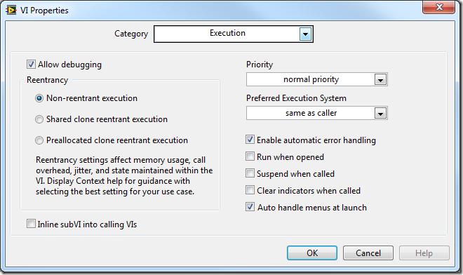

https://labview.qizhen.xyz/

新版本的LabVIEW在设置VI为可重入时，还有两个选项：“为每个实例预分配空间”和“让各个实例间共享空间”：

“为每个实例预分配空间”是旧版本LabVIEW（8.6之前）设置可重入VI时的唯一选项。它是指程序在运行前，编译的时候就为每个可重入VI的实例分配好各自的数据空间。比如说这个子VI被主VI在3处不同的地方调用了，那么就分配3份数据副本给它。但是，这种分配数据空间的方式有两个主要的问题。

其一，很多时候程序运行前不能预期会有几处调用到了这一个可重入子VI，比如递归算法就是如此。递归每迭代一次，就需要生成一个新的递归VI的实例。而递归的深度与输入数据有关，在程序运行时才能确定，因此无法预先得知应当分配多少个副本数据空间，也就没法设置为这种模式。

其二，这种设置方式控件效率太低。假设一个可重入VI A，它在主VI中有三处被调用，分别是实例1、2、3。假设程序总共运行3秒，第0秒运行实例1；第1秒运行实例2；第2秒运行实例3。在这个程序整个运行时间内，始终为可重入VI A开辟了三份数据空间，但是每份数据空间都只被使用了很短一段时间，其余时间都没被用到。若是能够重复利用它们，程序可以节约不少内存。

为了解决以上两点问题，LabVIEW又新添了一种为可重入VI 分配数据空间的方式：“让各个实例间共享空间”。个人觉得这个名称起的很不好，它容易让人误解为：只为可重入VI分配一份数据空间，然后它所有的实例都是用着份数据空间。实际情况当然不是这样的，否则就无法保证可重入VI功能的正确性了。

事实上，采用“让各个实例间共享空间”时，每个可重入VI 的实例让然会有它自己独立的数据空间。程序在逻辑功能上与“为每个实例预分配空间”的方式没有任何区别。唯一的不同在于，数据空间并不是程序一起动就分配好了的，而是只有当一个实例VI被运行到的时候，才为它分配数据空间，而这个实例VI运行结束后，它的数据空间就又被回收回去了。两个同时运行的实例VI是绝对不会共享同一个数据空间的；两个不同时运行的实例VI倒是可以分享同一片数据空间，这已是名称中“共享”的由来。

还是以上文的可重入VI A为例，若它被设置为“让各个实例间共享空间”，程序开始时，只需要为可重入VI A准备一份数据空间，供实例1使用；程序第1秒的时候，实例1运行结束，它的数据空间被收回，因此实例2还可以继续使用这份数据空间；第2秒时，轮到实例3继续使用者份数据空间。若我们改变一下应用程序的逻辑，把实例3在第2.5秒的时候就运行起来，由于原有的一份数据空间还在被实例2所使用，它不能再分配给实例3，这时候，LabVIEW就会为可重入VI A再开辟一份数据空间，供实例3使用。

“让各个实例间共享空间”的设置虽然提高的程序的空间效率，但它并非只有有点，因为数据空间的开辟回收都是需要时间的。因此它实际上是以牺牲时间效率为代价来换取空间效率的提高。

对于一个可重入VI，如果它在应用程序中被调用的地方并不是很多，或者它的各个实例常常会同时运行的，那么就应该把它设为“为每个实例预分配空间”；反之，这个可重入VI会被应用程序频繁的调用，而且每个实例运行的时间都很短，它们的运行时间不大可能会有重叠，就应当把它设置为“让各个实例间共享空间”。用于递归调用时，必须使用“让各个实例间共享空间”方式。
