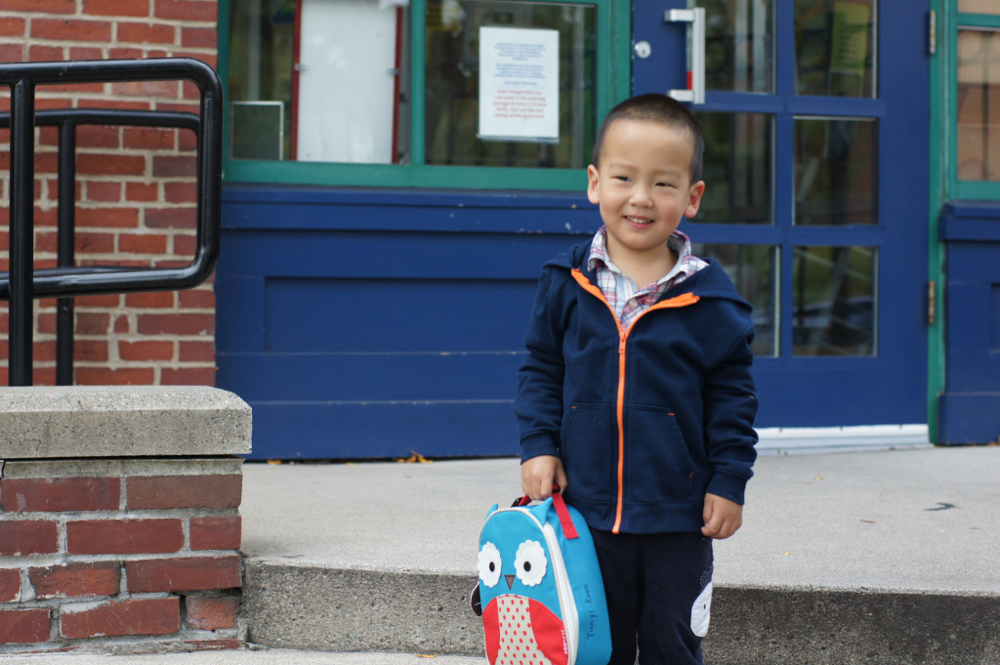

我一直希望豆豆尽早上幼儿园，这对培养他的生活能力和社交能力非常重要。而且，孩子越早适应集体生活，以后过渡起来就会越轻松。然而，由于条件限制，豆豆直到2岁10个月才开始入园，比我们预想的晚了一些。

尽管知道上幼儿园对豆豆成长是有益的，但在送他去之前，我仍然满怀忧虑。他从未经历过至亲都不在身边的情况，突然离开熟悉的家庭环境，独自面对陌生的人和事，肯定会让他感到无助。更何况，豆豆不懂英语，与老师和同学交流也成问题。我想起自己四岁上幼儿园时的情景 - 第一天趴在幼儿园大门上放声大哭的画面至今历历在目。我担心豆豆的反应会比我当年更激烈，他可没有我的耐性。

豆豆第一次上幼儿园是在一个周五的上午。这天不算是正式入园，而是一次提前预演，让他先适应一下。这一次可以有家长的陪伴。他一路上兴高采烈，充满期待，因为我们之前经常跟他说幼儿园多么有趣。他还不知道，这段旅程意味着要暂时离开爸爸妈妈，进入一个全新的世界。

到幼儿园时，老师正在给小朋友们讲故事。豆豆虽然听不懂，但看到一群小朋友围坐在老师周围，脸上露出了好奇的神情。我鼓励他过去加入，可他怯生生地摇摇头，坚持要我陪着。无奈之下，我抱着他坐到了小朋友旁边。老师讲完故事后，宣布游戏时间开始，并拿出了一大盒拼插积木。豆豆的眼睛立刻亮了起来，对我说：“爸爸，我也要玩积木！”我鼓励他自己过去玩，并趁他沉浸在积木世界中的时候悄悄退出了教室。

整个游戏时间，豆豆都玩得很专注。偶尔想起我，他回头看一眼，发现我站在门口，便安心地继续玩，没有吵闹。

一个小时后，到了室外活动时间。小朋友们排好了队，前往楼下的操场玩耍。豆豆见大家都走了，也跟在队伍后面下了楼。见他表现得还算适应，我便和豆豆妈商量，决定暂时离开，隔着操场的围栏偷偷观察他。

最初，豆豆跟着小朋友们模仿得有模有样。看到前面的孩子爬上滑梯，他也跟着爬了上去。然而，当他站在滑梯上四下张望时，忽然意识到爸爸妈妈不见了。他的脸色瞬间变了，接着大声哭喊：“爸爸！”

老师试图安抚他，可怎么都无济于事。我只好隔着围栏喊了他一声。这时，他才发现我们站在不远处，立刻跑过来，抱着栏杆哭着央求：“爸爸，你进来陪我！”

我们安慰了好一阵，他才勉强同意我们留在围栏外陪他挖了一会儿沙子。可没过多久，他又哭闹起来，不愿继续待下去。无奈之下，我们只好进去接了他回家。

整个周末，我和老婆都在反复讨论如何减少豆豆入园的痛苦。如果幼儿园允许，我愿意每天陪着他，帮助他适应环境。但我们也清楚，老师不会同意这样的安排。最终，我们也只能不断开导豆豆，帮助他接受上幼儿园的现实。

第二周的周一正好是假日，周二是豆豆正式上幼儿园的日子。虽然周末我们花了不少时间开导他，他也满口答应“去幼儿园不哭”，但真正临近出发时，他就怂了。一路上，豆豆各种耍赖，我们只能连哄带骗，总算把他送进了幼儿园的教室。

和老师聊了一会儿后，老师还是建议我们尽快离开。她说，每个孩子刚来都会哭闹，这是适应过程的一部分，她会好好照顾豆豆的。我们勉强点头同意。可豆豆很聪明，当老师一把抱起他，他就立刻明白了大事不妙。他挣扎着大哭：“老师，放我下来！”老师听不懂他的中文，他便转头向我求助：“爸爸进来！”我只能硬着心肠说：“老师不允许爸爸留下来。”他又哀求：“爸爸站在门口好不好？”看着豆豆红着眼眶、泪流满面的样子，我心里难过得要命，却只能安慰他说：“爸爸就在幼儿园楼下看着你。”说完，忍着不舍转身离开。他的哭声一路追随着我们，下楼到了幼儿园门口，依然清晰可闻。

我的担忧主要在于豆豆的“臭脾气”。在国内时，豆豆是在四个老人的百般宠爱中长大的，尤其是爷爷奶奶，见不得他哭闹，无论什么事都依着他。这样的溺爱让豆豆稍有不如意就情绪失控。可这次，他即使再怎么哭，幼儿园的老师也不会像家人那样妥协。我不知道，他是否能接受这样的转变。

虽然离开了教室，我和老婆其实并没有走远。幼儿园附近就是 Brookline 图书馆，我们决定在图书馆里待上一天，这样万一有什么突发情况能立刻赶回去。然而，坐在图书馆里，我根本静不下心，满脑子都是豆豆的哭脸。煎熬了一个小时，我终于忍不住给幼儿园园长发了封邮件，询问豆豆的情况。几分钟后，园长回信说：“豆豆已经不哭了，现在正在玩呢！”虽然心里稍稍安定了些，但我还是有些不放心，问老婆：“园长会不会只是为了安慰我们这么说？”老婆笑着说：“放心吧，豆豆聪明着呢，如果发现哭没用，他才不会白费力气呢。”

又过了一个多小时，到了幼儿园的户外活动时间。我和老婆悄悄回到幼儿园门口，从远处观察豆豆。我们不敢靠太近，生怕他发现我们。我们远远的看到了在操场上的豆豆，他虽然没有加入小朋友的游戏，却也没有哭。豆豆安安静静地站着，小脸上带着一丝倔强，似乎已经接受了这个陌生的环境。这一幕让我心中的石头终于落地，看来是我低估了豆豆的适应能力了。

下午三点，我们早早赶到了幼儿园，这是小朋友们午睡刚醒的时间。我走进教室，看到孩子们还在铺位上安静地休息。我悄悄走到豆豆身边时，他正迷迷糊糊地眯着眼。我轻轻摸了摸他的小脑袋，他一下子睁开眼，看到是我，立刻张嘴哭了出来：“爸爸，我要回家！”我心疼地将他抱起来，低声安抚了一番。虽然眼泪未停，他的情绪却慢慢平静下来。抱着豆豆走出幼儿园时，我相信，豆豆一定会越来越好的。

第二天早上，送豆豆上学的过程比前一天顺利了许多。他虽然还在小声哼唧，但在我和老婆的安慰劝说下，他竟然没有过多反抗，乖乖地跟我们到了幼儿园。分别时，他又哭了，不过明显没有前一天那么伤心。我刚到家，就收到了幼儿园园长发来的邮件，说我们前脚刚走，豆豆后脚就不哭了。这消息让我无比欣慰。

到了室外活动时间，我忍不住又去偷偷看了看。这次，豆豆的表现比前一天更好了。他正蹲在地上，拿着小铲子认真地挖土，小脸上带着专注的神情。这一幕让我既感动又放心，感觉他正在慢慢适应幼儿园的新生活。

到了第三天早上，分别的时候，豆豆虽然仍然有些委屈，但已经不再哭了，还乖乖地跟我挥手说了声“拜拜”。从那之后，送豆豆去幼儿园的日子变得轻松了很多。他不再抗拒，早上的“拉扯战”也逐渐结束了。入园的前两周，每次接他的时候，他总要哭一哭，问他原因，他说是到了下午的时间就特别想家。两周后，这样的“放学眼泪”也消失了。一个月后，甚至还出现了这样的场景：如果是我去接他，他反而要拉着我在幼儿园里多玩一会儿才肯回家。

最近，豆豆甚至常常主动跟我们说他很喜欢幼儿园。尽管如此，我还是觉得他内心深处更偏爱家。因为每次出门时，如果我告诉他是去玩或者买好吃的，他就特别兴奋，自己主动穿好衣服，甚至还要帮我穿；但如果一提是去幼儿园，他总会开始磨蹭，不是说肚子饿了，就是说要上厕所。

总体来说，豆豆上幼儿园的过程比我预想中顺利得多。我本以为他会哭闹至少一两周，没想到短短一天多，他就基本适应了。而且，他学习英语的速度也快得让我惊讶。到目前为止，他上幼儿园才六个星期，就已经能听懂一些简单的英语表达了。老师说，豆豆特别喜欢模仿其他小朋友，哪怕不明白意思，也要跟着学着说。周末和他一起逛街时，他跟在我身后走，看到我走得快了点，突然用稚嫩的声音冲我喊了一句：“Wait!”

这是第一天接豆豆放学时候，在幼儿园门口拍的照片，豆豆刚哭完，眼皮还是肿的：

