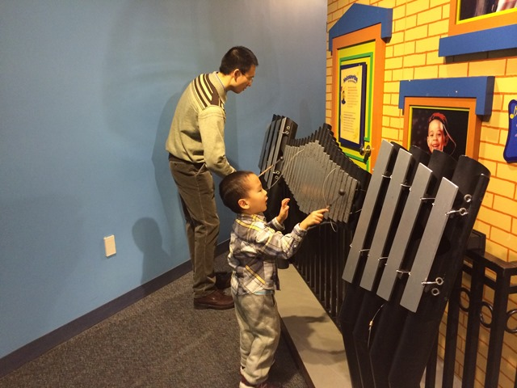
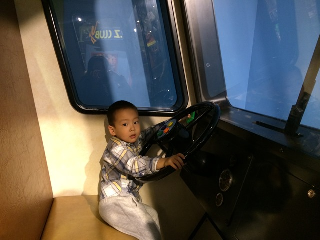
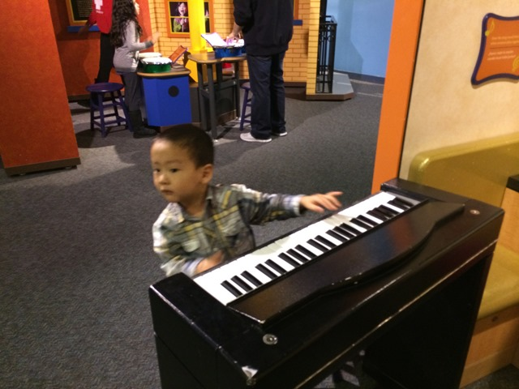
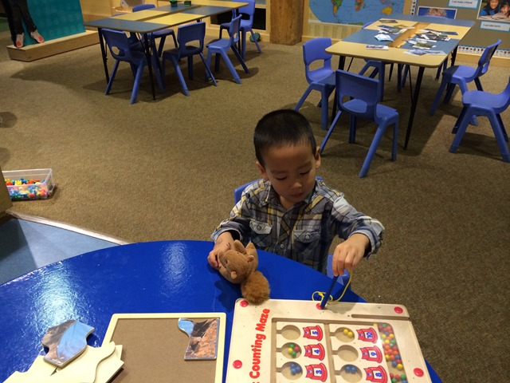
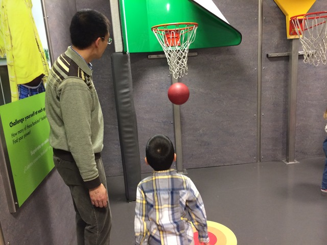
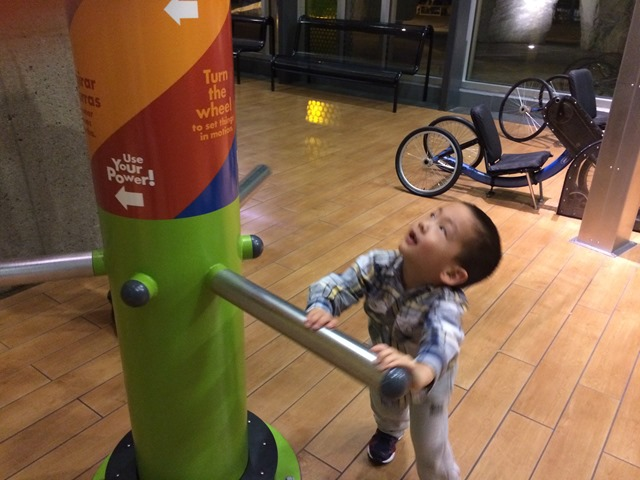
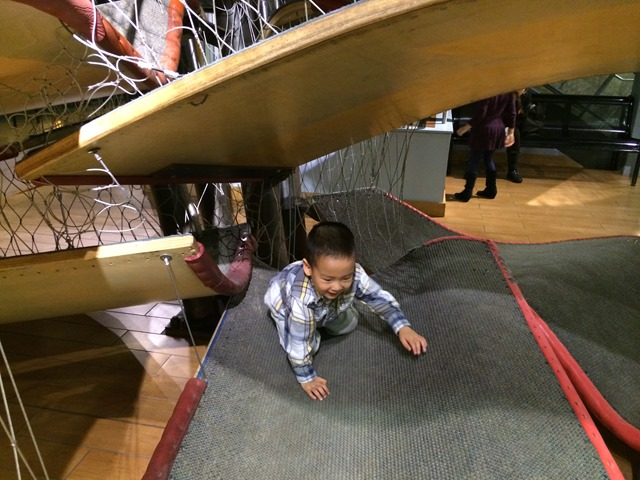
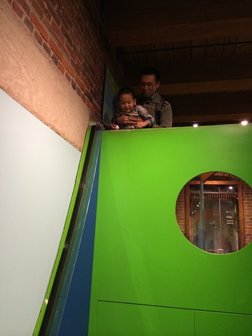
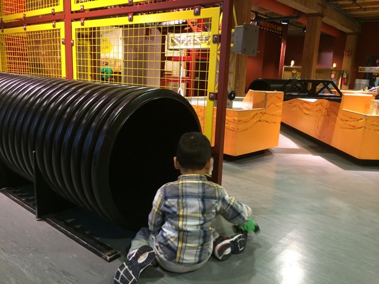

周五晚上，从幼儿园接了豆豆就直接带他去了儿童博物馆。豆豆没听过“儿童博物馆”这个名字，跟他说的时候，他还有点不想去，结果他一到了那里就立刻欢实的玩上了。儿童博物馆周五晚上的票价是每人一元，相当便宜，里面人也不算太多，实在是实惠。在上海的时候，我也领豆豆去过上海儿童博物馆，那个博物馆与波士顿的类似，但是规模和可玩性都差了一个档次。

博物馆里的好东西实在太多了，有物理实验主题的、生物主题的、音乐主题的、交通建筑主题的、日常生活主题的等等各种设备和玩具。豆豆每一样只是匆匆尝试了俩下，两个小时就过去了。不过豆豆明显的比一般小孩胆小，这点完全不像我，我小时候是著名的傻大胆，啥都敢干。博物馆里有两辆废弃的推土机，豆豆平时最喜欢这类车辆，可是现在可以爬到真车上去玩了，他去不敢了，连靠近都害怕，拽着我说什么也不上前。大厅里有一个由网绳和木头板构成的巨大结构，一层一层的交错起来，有普通住宅五层楼那么高，像立体结构的迷宫，这是给小孩攀爬用的。我看到一个一岁大的小朋友，还不会走路，就爬了进去爬到了很高的位置。豆豆特别喜欢这个东西，来来回回兴奋了爬了好几圈，但是只敢在第一层，也就是我膝盖高的高度来回爬。我鼓励了他数次，让他再上一层，他都哭丧个脸，说：“我害怕”。

豆豆进了博物馆就不肯走了。豆豆遇到这种情况常常不会直接耍驴，而是找各种理由耍赖。比如这天晚上，临走的时候，他找借口说要喝水，要坐会儿等等，磨蹭了半天才出了门。出门之后也是走几步就说要换一条路，转转摸摸往回走。

可能是玩的太兴奋了，豆豆回了家，过了平时睡觉的时间，还是不肯睡。爸爸妈妈劝说了很久都没有用。最后，还是我说自己困得不行了，一定要睡觉了，豆豆心疼爸爸，才肯陪爸爸一起睡觉的。他其实已经很困了，上了床，不到两分钟就睡着了。

由于睡得晚，第二天早上豆豆显然还没睡够，但是还惦记着玩呢。7点多钟的时候，豆豆醒来一次，一睁眼就说：天亮了，我睡醒了。妈妈说：再睡一会吧。豆豆立刻哼哼唧唧表示不满。于是我说：爸爸抱你起床。结果豆豆一转身，又睡着了。等过了半小时，豆豆一睁眼，立刻哭哭唧唧的说：“我怎么还在睡觉啊，我要去客厅玩小火车。”我说好，爸爸抱你起来，结果他一翻身，又睡着了。又睡了半个多小时，才真正睡醒，乐呵呵起了床。

