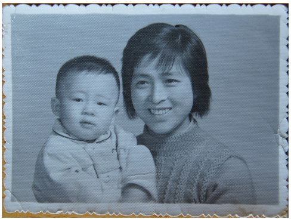
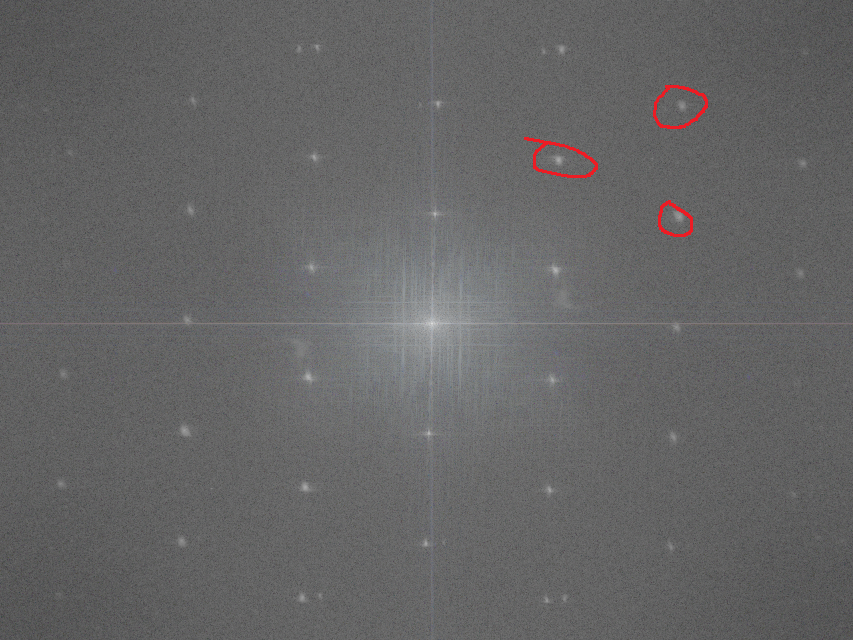
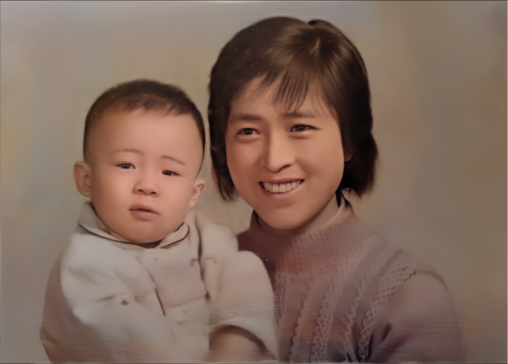

最近测试了一些翻新旧照片的算法，主要是试着把模糊的小照片翻新成清晰的大照片。据说淘宝上有很多人做这个生意，主要是靠手工来修复的。网络少也有不少PS修复旧照片的教程。不过我不会使用PS，所以只能依靠算法了。修复旧照的人工智能的算法也是有一些的，但目前来说，人工智能算法的修复效果在总体上还是比不了人工修复的，但某些情况下表现也还不错。

**第1步** 选照片

首先找一张老照片：

要想效果好，照片一定要找上图这样的：大头照，而且只有少量折痕和磨损。我也测试了一些质量更差的照片（人脸所占像素太小，有大片磨损等），人工智能对于它们目前还还无能为力。

**第2步** 去网纹

很多老照片都不是光滑的，像纸上有排列规则的凸点，扫描之后的图片上就会有网纹。上图的旧照片上可以明显看到这些网纹。我找的几个人工智能程序都是解决特定问题的，无法很好的处理这些网纹，所以先要人工去除这些网纹。网上搜了一下，没有专门去除网纹的程序，只有PS相关的教程。PS是收费软件，我也没有。好在有一些免费的图像处理软件可以替代PS。我用了GIMP（GNU Image Manipulation Program）加上FFT插件。FFT是快速傅里叶变换的缩写，用于把时域信号转换为频域信号。

上图经过傅立叶变换，在频域上的图像如下（灰度图部分）：

由于原照片里的网纹是规则的（有固定频率），频域图会在一些特定的频段里出现高能量区域，也就是上图用红圈圈出来的部分。我只画了三个圈，但其它那些亮点（除了中心低频区域外），都是网纹造成的，只要把这些亮点全部涂黑，再做反傅立叶变换，新生成的图片就是被去除了网纹的照片了。

**第3步** 上色

GitHub上最受欢迎的黑白照片上色程序是这个：https://github.com/jantic/DeOldify

我试了一下，效果只能说马马虎虎，上了色的照片看上去还是像旧照片，只是把原来的纯黑白色调中加入一点肉色，一看就不是真的彩色照片。

如果会PS的，肯定还是PS效果好。

**第4步** 清晰化

我在GitHub上找到了两个照片变清晰的软件，一个是微软的 https://github.com/microsoft/Bringing-Old-Photos-Back-to-Life

一个是腾讯的 https://github.com/TencentARC/GFPGAN

两个软件各有千秋，比如微软的可以修复裂痕，但腾讯的可以放大照片。具体那个效果更好，要针对不同情况测试一下。

这两个软件都是侧重于对人头像进行优化，对其它区域的优化会差一些，所以经过它们优化的照片常常是人脸非常清晰，但衣服还是模糊的。再有它们对于眼镜的处理都不太好。常把眼镜当成皱纹；或者把眼镜上的反光当作眼睛来处理。有时候生成的照片非常诡异吓人。

另外，它们也没法处理太小的人像，或是有缺损的人像。

**处理后的效果**

