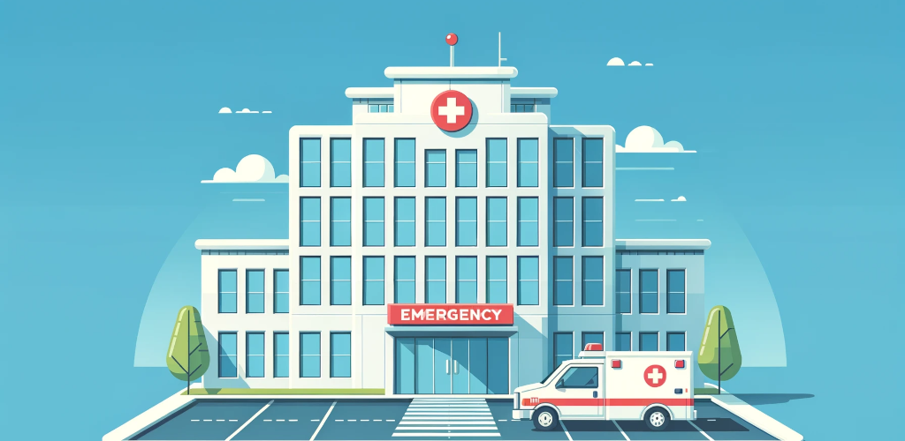

最近上海封城，搞得民怨沸腾。我在跟家人朋友讨论的时候，想了很多事情。大多数想法都没时间记录下来。因为正好给个朋友介绍了一下我在美国看病的经历，就写了一点关于中美医疗制度的比较。

（我只能比较一下波士顿和上海这两个我最熟悉的城市。这两个城市在各自国家都是拥有最好医疗资源，其它地区的情况可能并不相同。）

其中一个区别是：在中国，医院从病人那里收费，病人再从保险公司拿钱；而在美国，医院直接从保险公司收钱。

在中国，医院为了多赚钱，会倾向于过度医疗。病人只要还负担的起，一般不会为了省钱而承受耽误病情的风险。我在上海工作的时候，只要觉得有哪疼了，哪不舒服了，就立刻去医院。医院通常有用的，没用的，CT，B超之类的都查一遍。我小时候更是，只要一感冒就去医院，一去医院就是打一个星期的青霉素。长大之后才知道，青霉素对于感冒一点用都没有，小时的疼全白受了。长大之后，医院都改成一发烧就挂水，其实，也基本上就是安慰剂作用。

在美国，如果保险公司认为有过度医疗的嫌疑是会拒绝向医院付款的，所以医院为了避免收不到钱，会倾向于谨慎治疗。只要符合规定，能不治疗的就不治疗，能不检查就不检查。我大约20年前第一次体验了在美国看病。我当时发高烧，感觉自己快要不行了。强打精神来到医院，结果医生根本不当回事，让我自己去药店买两片非处方的退烧药吃。美国医院和药房也是彻底分开的，不能靠卖药赚钱，所以对于开处方药也是非常谨慎。后来在美国常住，多数时候去医院，连专科医生都见不到。打发我的都是“全科医生”或者叫家庭医生，相当与中国医院里挂号台的。当然，这个比喻有点夸张。在中国挂号台，护士一般也就问一句话：“哪不舒服”，然后就告诉你去什么科。全科医生问的非常全面，还要听听看看，几十分钟才会做结论。我多数时候得到的结论都是：你没病，回家去吧。试过几次后，我也就不像在上海时候那样，总往医院跑了。

一个典型的例子是我和我爸看耳石症的经历。这不是个传染病，但我们俩恰好差不多同时期都得了这个病，症状都是眩晕、呕吐。我爸在中国看的，CT、核磁一通操作下来，并没有什么真正的发现，然后开了一大堆不相关的药回家。我在美国看的病，医生跟我聊过之后，让我做了一些特定的动作供她诊断。最后她告诉我这是耳石症，过几天自己会好，就让我回家了。

美国这边，如果医生觉得你的病不需要治疗，或者是已经没得治了，是有可能会不顾病人感受而放弃治疗的。有些人可能还一下子接受不了这样的处理方式。新冠刚出现那会，大家心里都是比较害怕的。我们这里有位女士阳性了，跑去医院看病。她可能以为这么严重的病情应该进重症室监护室了，结果医生却让她回家。医生大概是觉得根本不用治疗，就别来浪费资源。但那位女士却无法接受，于是隐瞒病情飞回国，结果没进重症室，却进了拘留所。

中美这两种制度都有各自优缺点的。

中国的方式容易造成资源浪费，中国的医疗资源本就不及美国。我每次去医院，医院都挤满了人，排队要排几个小时。可能那里面相当一部分人都跟我一样，纯粹是去找安慰的。尤其是遇到新冠疫情这样的情况，大家都很恐慌的时候。医院会被轻症患者挤满，从而耽误了救治那些更需要被救治的重症患者。

美国这边医院里的患者就少的多了。即便在新冠疫情最严重的时期，我也没有在医院里见到拥挤不动的病人。因为余量够大，在疫情出现的时候才可能应对的更从容。美国的医生，一般每天只接待十来个病人，压力相对（中国医生）小多了，收入又高，所以他们对待病人的态度非常好。对待儿童更是格外的好，小画书、玩具、冰激凌都是现成的。我在美国遇到的每一个医生态度的特别好，绝对不亚于商店里向我推销的售货员。在中国，一个门诊医生一天处理上百个病人都是常态，别说好态度，能耐心听完病人讲话的就算不错了。我还遇到过张口就骂病人的医生。

美国医疗最大的问题就是贵。医生准入门槛高，又不能像中国那样薄利多销，于是就高收费。跟医生聊几句，至少也要付个几百美金的。一个国内收费一千人民币的门诊小手术，在美国可能要上万美金。还是说我看耳石症的经历吧，我爸在中国做了一大堆检查，拿了一大堆药；我在美国只是和医生聊了二十分钟。虽然过程差别巨大，但最后效果差不多，我俩付给医生和医院的钱也是差不多的。虽然直接付款的是保险公司，但羊毛出在羊身上，最终还是导致大家都要缴纳高昂的收入税和医保费。

