# AI 生成的一些图片

最近，我在个人电脑上尝试运行了 Stable Diffusion 模型，生成了一些有趣的 AI 图片。

与 Dall.E 等大模型相比，Stable Diffusion 的模型体积相对较小，因此能够在配置不高的个人电脑上运行。即便如此，我的电脑也仅能生成 512x512 分辨率的图像。虽然这些作品在效果上可能无法与专业级大模型媲美，但其中一些已经展现出惊人的逼真度。我前一段时间的实验主要集中在生成写实风格人像，以及探索其与“二次元”动漫风格人像之间的相互转换。值得一提的是，目前 Stable Diffusion 模型在直接生成高度逼真的人像方面尚有不足，需要配合 GFPGAN 模型对程序生成的人像进行优化。在人像生成的过程中，我个人感觉该模型似乎更擅长创作白人年轻女性的图像。我也尝试生成了一些中国人的面孔，但效果往往不尽如人意，多数图像显得有些不自然。这或许是因为模型的训练数据集中包含了更多白人年轻女性的样本，也可能是我作为在中国长大的人，对中国人的面貌特征更为熟悉和敏感，更容易察觉到细微的差异。

首先，展示两张由 AI 生成的仿旧风格照片，其逼真程度令人印象深刻：

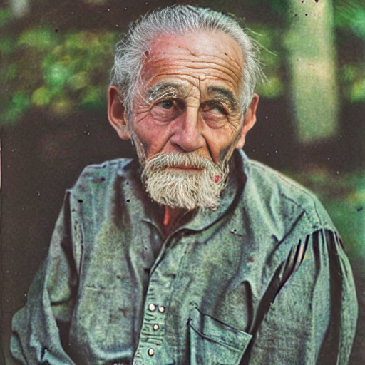

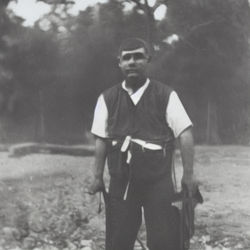

接下来几组图片，都是首先生成了左边的真实照片风格的图片，再根据照片转换成了右边二次元图片：

| 真实照片风格  | 二次元风格    |
| ----------- | ----------- |
| 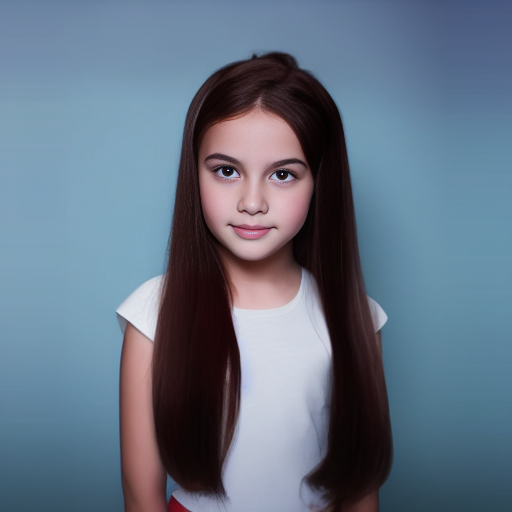 | 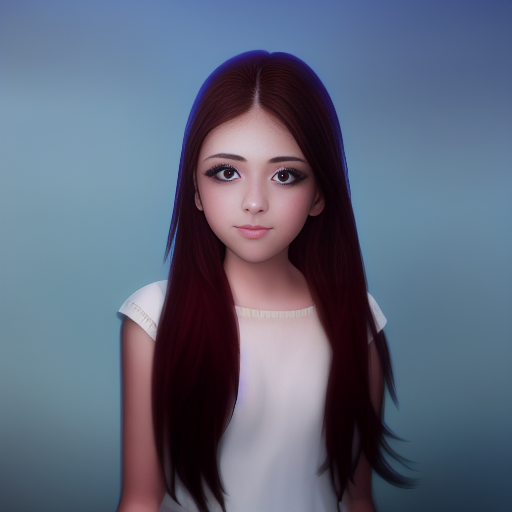 |
| 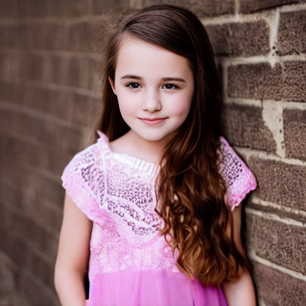 | 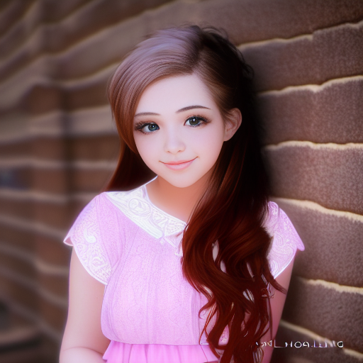 |
| 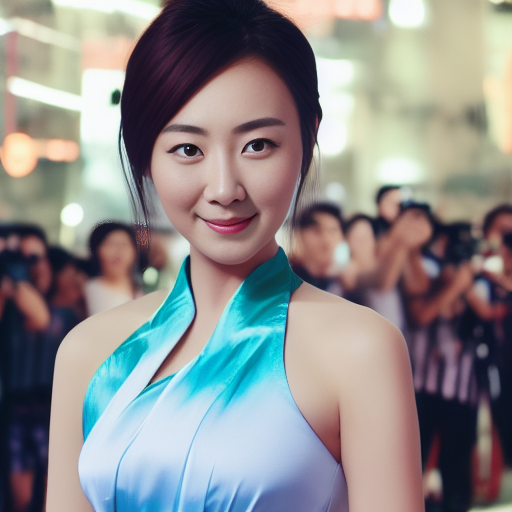 | 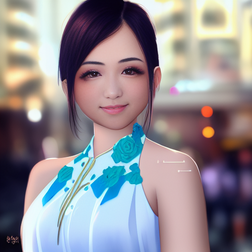 |
| 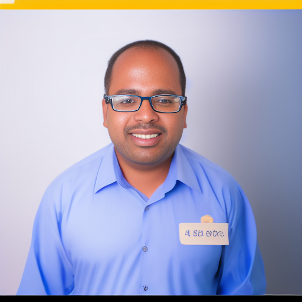 |  |

下面这两组图片是先生成的左边的二次元风格图片，再根据它生成右侧的真实照片风格图片：

| 二次元风格    | 真实照片风格  | 
| ----------- | ----------- |
| 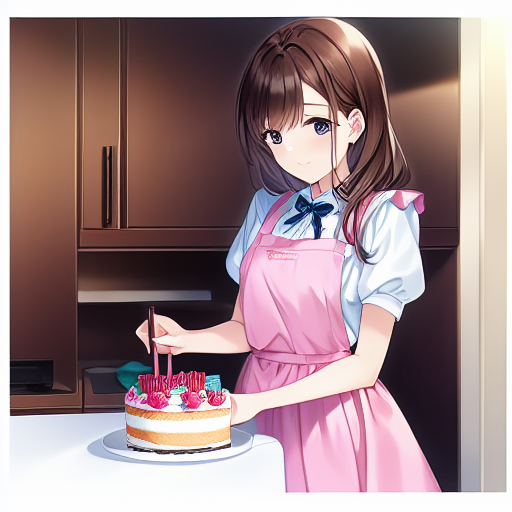 | 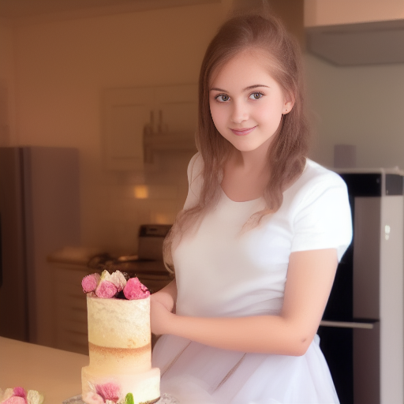 |
|  | 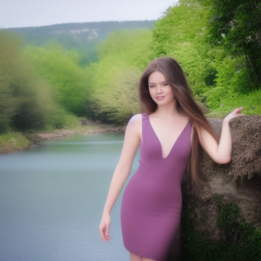 |

可以明显感觉到，生成真实照片要困难很多。可能是因为人脑对所谓“真实”照片更挑剔吧。

下面两组是风景图片，感觉两种风格生成出来的图片区别远没有人像的区别那么大

| 二次元风格    | 真实照片风格  | 
| ----------- | ----------- |
| 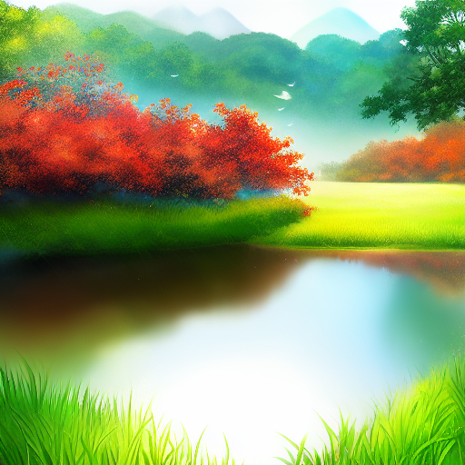 | 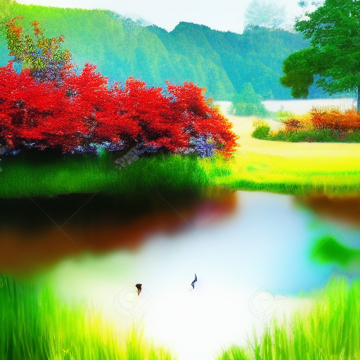 |
| 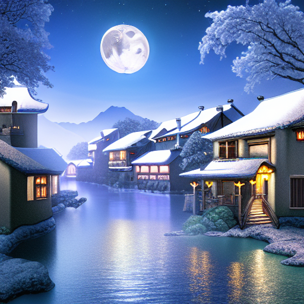 | 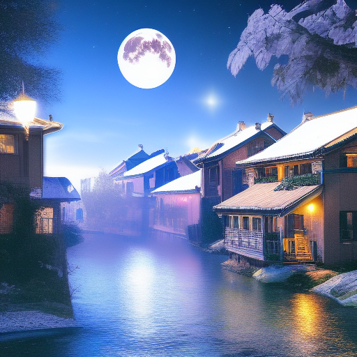 |
