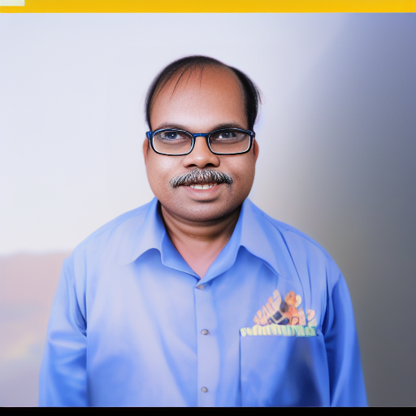
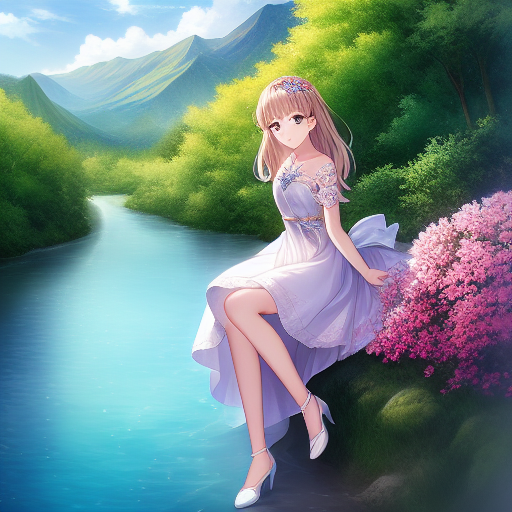

这几天在电脑上运行了 Stable Diffusion 玩了玩。这是我正的测试页面：[https://qizhen.xyz/genimg](https://qizhen.xyz/genimg)

这个模型比 Dall.E 的小很多，所以才能在配置不高的个人电脑上跑。而且，我的电脑也只能勉强生成 512\*512 的照片。虽然效果可能不如专业网站用的大模型，但有些作品已经很逼真了。我主要试试了生成真实人像以及和二次元人像之间的转化。Diffusion 模型不太擅长逼真的人像，程序生成的人像使用 GFPGAN 改善过的。在人像中，个人感觉这个模型最擅长生成白人年轻女性的照片。我也尝试了让它生成一些中国人的照片，但感觉都不是那么美，实际上多数生成的中国人照片都看起来比较别扭。很可能是因为它的训练集中就有比较多的白人年轻女性照片，或者也可能是因为我生长在中国，对中国人的面貌更敏感，更容易发觉异常。

先贴两张 AI 生成的仿旧照片，看起来还真挺像真的：

接下来几组图片，都是首先生成了左边的真实照片风格的图片，再根据照片转换成了右边二次元图片：

| 真实照片风格  | 二次元风格    |
| ----------- | ----------- |
|  |  |
|  |  |
|  |  |
|  |  |

下面这两组图片是先生成的左边的二次元风格图片，再根据它生成右侧的真实照片风格图片：

| 二次元风格    | 真实照片风格  | 
| ----------- | ----------- |
|  |  |
|  |  |

可以明显感觉到，生成真实照片要困难很多。可能是因为人脑对所谓“真实”照片更挑剔吧。

下面两组是风景图片，感觉两种风格生成出来的图片区别远没有人像的区别那么大

| 二次元风格    | 真实照片风格  | 
| ----------- | ----------- |
|  |  |
|  |  |
