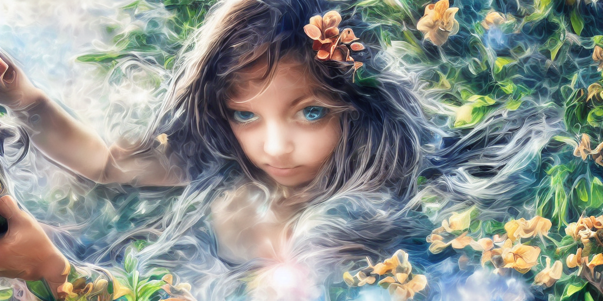
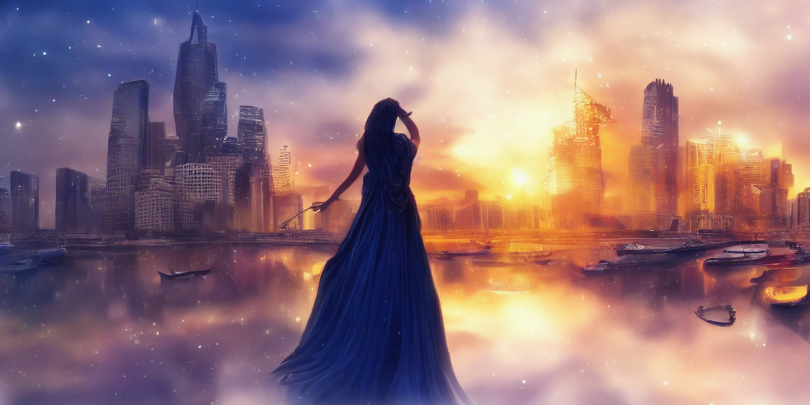

我喜欢让 AI 自由发挥，胡乱画一些东西，画一些现实中不存在的，甚至完全没有的东西。当然，大多数这类画作都是模糊一团，但也有一些挺有意思的。我把他们大致归类了一下，贴出来。

这个帖子里的画作都还不算太远离真实世界。它们看上去更像是某种艺术流派的作品，我对绘画艺术一窍不通，都不知道有哪些流派，只是感觉这些 AI 画作类似某些艺术作品。

我很喜欢这个创意，把头发和烟雾融合在了一起：

降临派：

