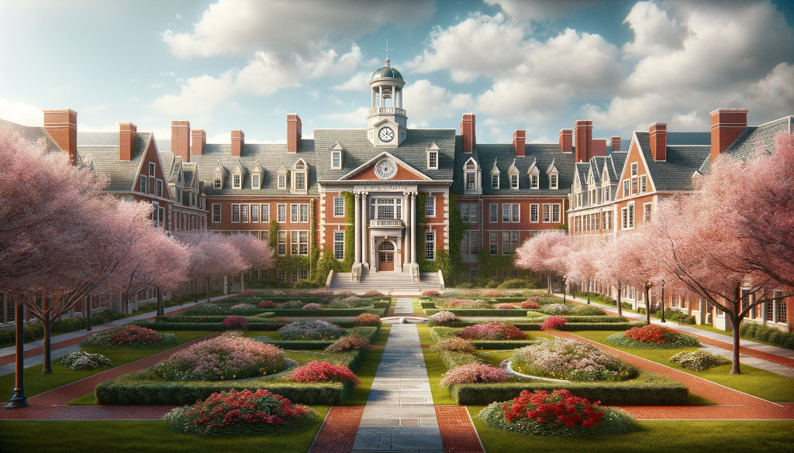
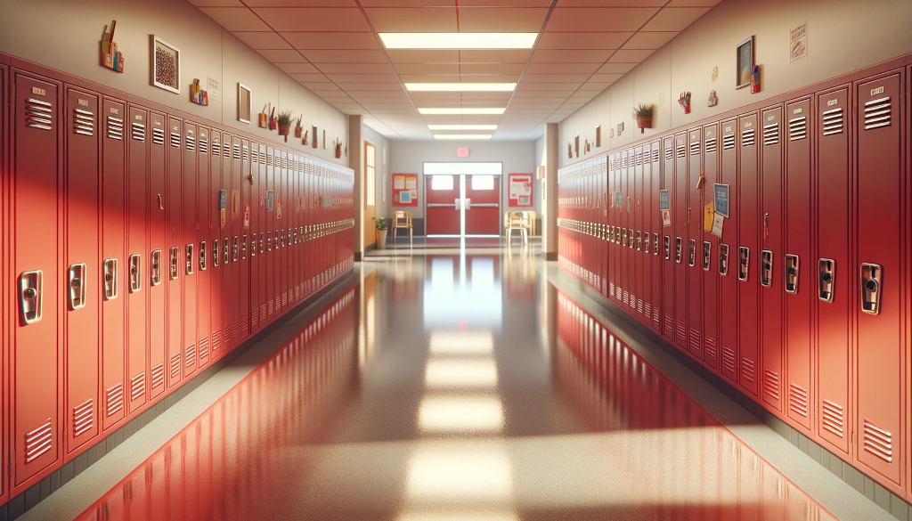
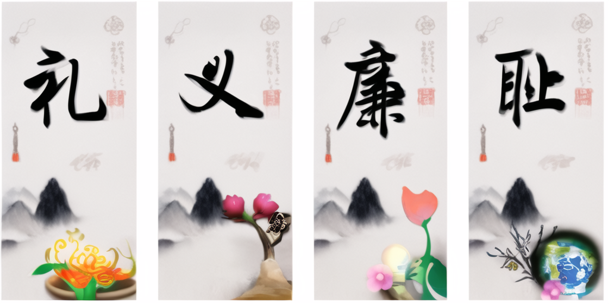

儿子今年小学毕业了。在他就读的这六年间，我得以近距离观察和体验美国的基础教育体系。这篇文章记录了我的一些感受，主要是围绕我和儿子两代人的小学教育经历展开对比。

十年前，我做出了移居美国的决定。这个选择并不轻松，因为彼时我已在国内工作多年，不再年轻。与刚毕业的学生们相比，我出国不仅要面对更多挑战，还要承担更高的机会成本。在反复权衡后，儿子的教育问题成为了促使我下定决心的关键因素之一。那时他才刚来到这个世界，但我已经能够察觉到他性格中与我相似的特质。回望自己的学生时代，虽然童年记忆总是镀着一层温暖的光晕，但我对自己的中小学教育经历仍存有一些遗憾。

让我最难以释怀的有两点：首先是教育资源分配的不均衡。老师们往往倾向于在成绩优秀的学生身上投入更多精力，而对学习困难的学生，更多采用的是批评和惩罚的方式。作为后者，我不仅没能得到足够的关怀与引导，反而在频繁的批评中逐渐滋生了自卑情结。其次是教育内容过度强调意识形态灌输，有时甚至为了宣传需要在教科书中添加失实的内容。这两点，都是我希望能够让自己的孩子避免经历的。

到儿子出生那年，我对国内中小学教育又多了一个新的忧虑：教育内卷日益严重。为了进入理想的大学，就必须考入重点高中；为了上重点高中，就要从优质初中、小学开始铺路；为了进入好的小学，从幼儿园起就要提前学习小学课程。除了应付繁重的课业，还要在各类才艺上全面发展，参加各种培训班和竞赛才能保持竞争力。看着周围朋友的孩子，小小年纪就失去了玩耍的欢乐时光。我既不忍心鸡娃，又担心他在竞争中落后，就只能考虑带他离开这个环境。

儿子出生前，我因工作关系多次往返美国，断断续续在这里生活了近一年时光。虽然当时并未特别关注教育议题，但多少从同事那里了解了一些当地的教育理念，感觉它更符合我的期望，也坚定了我选择让儿子在美国接受教育的决心。

## 学制

美国实行的是 13 年义务教育；中国则是 9 年制义务教育。美国的中小学教育体系一共包括十三个年级，被简称为 K12。其中 K 是 kindergarten（学前班）的缩写，是义务教育的第一年，后面 1 ~ 12 每个数字代表一个年级。在美国，小学和中学的划分有很强的地方自主性，每个镇都可以根据自身条件作出不同安排。最常见的分法是把 K 至 5 年级划归小学；初中为 6、7、8 三个年级；高中是剩下的四个年级。一些城镇采用较为简单的两级制，仅分为小学和中学；也有城镇采用更为细致的四级制，分为初小、高小、初中、高中。“高小”这个词在国内解放后就很少听说了。美国小朋友一般是 5 周岁开始上 K，中国小朋友一般是 6 周岁开始上一年级。从学制对应来看，中国的六年制小学大致相当于美国的 1 至 6 年级，初中则对应美国的 7 至 9 年级。

在学年安排上，国内学校通常将一学年分为上下两个学期，并以寒暑两个长假作为学期间的分割。美国的情况更为灵活，没有全国统一的假期安排，大多数地区仍会将学年划分为两到三个学期。但是由于美国没有类似中国那样的长寒假，学期之间的界限就显得不那么分明。以我所在的美国东北部地区为例，新学年开学时间与国内相近，通常在八月底九月初。在圣诞和元旦之间会有大约 10 天的节日假期，此外多数学校还会在二月至四月期间安排一到两个为期一周的冬假或春假。美国学校的暑假一般比国内的长，会持续两到三个月。

美国学校的班级运作方式也呈现出与国内迥异的特点。首先是班级规模的差异：国内教育部虽然规定每班不超过 45 人，但我上学的时候，每个班级都超过 60 人；而美国小学的班级则普遍保持在 20 人左右的规模。其次是班级的延续性：在国内，除非特殊情况，一个班级从组建到毕业基本保持稳定，任课老师和同班同学也相对固定。而在我儿子就读的美国小学里，不仅班主任老师每年更换，学生也会每年重新分班。在他们年级近百名学生中，经过六年的时光流转，儿子几乎跟每个孩子都有过同班的经历。这是我非常满意的一点。这一点让我深感欣慰，因为孩子们不仅有机会接触到更多的老师和同学，也不必担心遇到不太投缘的老师就要忍受整整六年。另外一个显著的区别在于，美国小学的主要课程（包括阅读、写作、数学、科学、社会学等）都由班主任一人负责教授，只有音乐、艺术、体育、图书馆等专业课程才由专科教师执教。等到步入初中，班级的概念又发生更大的转变，因为已经没有固定教室了。每个学生需要根据自己的选课安排，在不同的教室间穿梭，这种模式与国内大学的情况颇为相似。正因如此，美国中学的走廊上总是排列着大量储物柜，供学生存放随身物品，这也成为了美国校园文化中的一道独特风景线。

国内这种稳定的班级制度自然也有其优势，尤其体现在同学之间能够建立起更为紧密的情谊。最典型的莫过于同桌之间的友谊，朝夕相处之下往往能结下比普通同学更深厚的情谊。而在美国，由于采用独立的小桌子，已经没有了同桌的概念。不过老师们经常会将几张小桌子组合成圆桌形式，便于学生们进行小组讨论。这种分组也是灵活多变的，会根据教学需要不断调整。

## 私立学校

在美国，从幼儿园到大学的每个教育阶段都有私立和公立之分。虽然公立中小学提供免费教育，但仍有相当一部分家庭会优先考虑收费的私立学校。由于我的孩子就读的是镇上的公立小学，我对私校的了解相对有限，不过仍想分享一些基本认识。

一般而言，同一区域内的私立学校在师资配备、教学设施等各方面都会优于公立学校。这种现象不难理解——私立学校需要通过收取学费来维持运营，如果教育质量无法令人满意，家长们自然会选择免费的公立教育，这样的私校也就办不下去了。值得注意的是，由于美国的大学不属于义务教育范畴，公立大学也会收取学费。因此在大学阶段，私立与公立之间的差距会相对较小。不过我们也要看到，教育质量的评判不能简单地用公私来划分。许多优质学区的公立学校，其教育水平往往好过差学区的私立学校。

美国的私立学校呈现出多层次、多类型的特点。处于金字塔顶端的是一些被称为"贵族学校"的顶级私校，每年的学费高达六万美元以上，而且学校的运营还依赖来自家长、校友和社会各界的大量捐赠。这类顶级私校的入学并非仅仅依靠经济实力，它们的录取程序与大学极为相似，需要学生参加标准化考试，准备申请文书，并通过面试环节。有趣的是，学校不仅要面试学生本人，还会与家长深入交谈，以确保申请家庭的教育理念与学校相契合。

对于普通家庭而言，选择普通私校可能更为实际。如果是走读制的普通私校，年度学费可以控制在在三万美元以下。此外还有一类特殊的私立学校是由教会创办的，主要依靠教会资金支持，因此学费相对更为亲民。不过，由于这类学校往往会将宗教教育融入课程，对于无信仰或持其他信仰的家庭来说可能需要慎重考虑。

相比之下，中国的私立学校发展呈现出不同的特点。目前中国较为知名的私立学校主要服务于外籍人士子女或计划出国深造的学生。尽管中国家庭历来重视教育投入，私立教育市场本应大有可为，但受制于体制因素，私立教育的发展面临诸多限制。中国的教育体系中，维护政权稳定和宣传意识形态始终是重要使命，因此国家对教育领域保持着较强的管控。据我所知，近年来一些地区开始要求优质私立学校执行统一教学大纲，甚至将择校选拔改为随机抽签制度。这些政策调整无疑给私立学校的发展带来了新的挑战。

## 公立学校

美国的公立教育体系为学生提供了全方位的免费服务。不仅免除学费和教材文具等费用，在我所在的镇上，学校甚至为学生提供了免费的午餐。

与中国的统一的教科书体系不同，美国学校更依赖图书馆资源。说到图书馆，不得不称赞美国发达的图书馆系统。每个镇、每所学校都设有自己的图书馆，这些图书馆不仅完全免费开放，而且利用网络互通有无，让读者可以获取几乎无穷无尽的资源。在美国的教育理念中，阅读占据着极其重要的地位。虽然小学生可能没有传统意义上的书面作业，但每天的书籍阅读却是雷打不动的必修课。正是得益于便捷的图书馆系统，我的儿子从幼儿园到现在积累了大量的阅读量，这也是我最欣赏美国教育体系的地方之一。

公立学校虽然便宜，但教学质量真的是良莠不齐。与中国类似，美国不同学区之间的教育水平差距巨大，优质学区的房价也随之水涨船高。美国对中小学采用 1 到 10 分的评分制度，这个分数已经成为华人购房时的重要参考指标。不少华人执着追求 "10-10-10" 学区，即小学、初中、高中都达到 10 分的顶级学区。即使不那么苛求的家庭，也很少有人会选择去一两分的学区定居。曾经听某个有经验的同事讲过，在 1、2 分的小学里，老师的主要任务是防止男生违法犯罪、女生意外怀孕。按我个人的标准，7 分以上的学校就已经称得上是优质学校了。

我所居住的马萨诸塞州波士顿地区，历来是美国教育最好的地区。这里不仅有举世闻名的哈佛大学和麻省理工学院，在中小学教育方面也领先全美。我在儿子上学前又特意搬到了一个比较好的学区定居：莱克星顿。这可能是唯一一个在中国也极负盛名的美国小镇。在我上中学的年代，有一篇课文叫做《莱克星顿的枪声》，讲述了这个美国独立战争的发源地。莱克星顿是一个华裔比例极高的社区。虽然在全美范围内华裔仅占总人口的 1%，但在我儿子的学校里，华裔学生已接近四分之一。镇上，无论是新移民的亚裔家庭，还是世代居住于此的白人家庭，都对子女教育倾注了极大的热情。

表面上看，中美两国的学区制度颇为相似，但实际上存在本质差异，这主要体现在教育经费的来源上。美国公立学校的经费主要来自当地的物业税。以我所在的镇为例，房屋售价中位数超过百万美元，年度物业税率约为房价的1.5%。也就是说，镇上一半以上的家庭每年都要缴纳超过 1.5 万美元的物业税。这些税收中相当大的比例都投入到了教育领域。根据镇政府公布的 2022 年财政数据，每位公立学校学生的年度教育支出超过 2 万美元，这个数字相当于主流私立学校的学费水平。

这种机制形成了一个良性循环：优质学区吸引更多重视教育的家庭来此居住，从而推高房价，进而带来更多的物业税收入，让学区能够投入更多资源提升教育质量。但也是这样的正反馈循环，使得美国学区间的差距难以轻易改变。

相比之下，中国目前尚未实行物业税制度，学校经费主要依赖国家统筹拨款。理论上，这种中央调配的方式更有利于缩小区域差距，比如可以向欠发达地区倾斜更多资源。但现实情况是，中国教育资源的集中程度反而更高，因为掌握资源分配权的群体往往会优先考虑自身利益。

回想起我的学生时代，学校常常强调要培养"德智体美劳"全面发展的人才。虽然现在已经有了新的口号了，但不妨就用这五个传统维度来比较一下中美教育的异同。

## 德

品德教育，包括规范行为举止和树立正确的三观等，在中美两国的教育体系中都占据首要地位。两国都非常重视传统美德的培养，如爱国情操、助人为乐、维护集体荣誉等。不过在具体实践中，两国还是存在一些显著差异。

最初我以为崇尚自由的美国对学生的行为管理会相对宽松，但通过观察儿子和周围朋友孩子的校园生活，发现美国学校在某些方面的要求反而比国内更为严格，尤其是在遵守指令、保持专注、与同学友善相处等方面。老师们的观察也十分细致，有一次老师发邮件说观察到儿子频繁使用消毒液擦拭桌子，问我们是不是儿子对于新冠病毒太过紧张了。我开始还有点纳闷，儿子一向不怕脏，怎么可能担心病毒。问了他才知道，这个熊孩子在课桌上发现了一个小洞，想试试看能不能用消毒液把洞堵上。儿子还有收集废品的习惯，比如在家里，有时候，他会把玩具、食物等的包装盒、塑料袋等都收藏起来，不许我们扔。老师也发现他在学校收集了很多回形针、便签条之类的小物品，告诉了我们。虽然儿子解释说他收集的物品都是别人用剩的，但考虑到可能会被误解为浪费公共财物，我们还是帮助他改掉了这个习惯。

在学校与家长的沟通方面，美国与中国也有明显不同。记得我小时候的家长会都是全班家长集体参加，老师会当众表扬或批评学生，而评判标准主要是学习成绩。成绩好的学生家长自然倍感光彩，而我老妈就很抗拒参加家长会，因为总是得不到老师的好脸色。相比之下，美国更注重保护隐私，家长会采用一对一形式，每学期一次，每次单独和老师会谈二十分钟，足够进行深入的交流。

除了家长会，当孩子出现不当行为时，美国老师也会及时与家长沟通。儿子也曾几次被老师“告状”：一次是在上课使用电脑时未经允许打开了与课程无关的网页，虽然内容并无不当，但老师仍高度重视，不仅通知了家长，还报告给校长，最终儿子不得不给校长写了检讨书。另外两次则是因为在教室墙面和地面上乱涂乱画。

儿子虽然调皮，但性格温和，每次被批评都能能乖乖认错，所以老师一般通过电子邮件沟通即可。儿子班级里也有小朋友不服老师管教的，比如被批评后摔打文具。遇到这种情况，学校就会要求家长当面沟通，严重时甚至让学生回家反省几天。

当然，美国学校在某些行为规范上的确要求较为宽松。比如我小学时上课必须手背后方，正直端坐，而在美国课堂上，学生的坐姿则相对自由。

在价值观教育方面，美国与中国的侧重点有所不同。美国特别强调社会的多样性，这种多样性体现在种族、性别、身心障碍等诸多方面。虽然美国社会常因种族歧视问题受到诟病，但在反歧视方面的努力却值得肯定。相比之下，中国的某些歧视现象，如地域歧视，其严重程度并不亚于美国的种族歧视。在中国，招聘广告中常见“男性、三十五岁以下、城镇户口、四肢健全、五官端正、口齿清楚”等要求，在美国都会被视为歧视行为，可能招致法律诉讼。

美国学校不仅在口头上倡导多元包容，更付诸实际行动。以我所在的小镇为例，虽然居民主要由白人（近六成）和亚裔（超过四成）构成，但为了增加学生群体的种族多样性，学委会特意从非裔聚居区接收部分学生来此就读，并提供免费校车服务。

在特殊教育方面，美国的包容性也更强。与中国将残疾学生集中在专门学校不同，美国倾向于让他们与普通学生共同学习。儿子曾与两名先天性发育障碍的同学同班，这两位同学需要轮椅代步，交流也有困难，学校除了配备班主任外，还专门安排了两位老师照顾他们的特殊需求。

这样的教育环境对培养儿童正确价值观大有裨益。儿子就曾告诉我，虽然班上有些同学在交流和行动上有困难，但他仍然很喜欢和他们一起玩耍，甚至与其中一位结下了深厚的友谊。

## 智

这是我唯一觉得国内教育优于美国的方面。虽说我不太赞成国内的鸡娃做法，但是美国这边的要求也确实是太低了。

我小时候特别讨厌上学，总是盼着放假，甚至有时候生病了，想到可以不去上学都觉得不那么难受了；但是儿子非常喜欢上学，有时候我们想安排个长途旅行，如果耽误了儿子上学，都会被他否决。一个重要的原因是，儿子在学校里没有感受任何压力。整个小学阶段，都没有家庭作业，也几乎没有考试。偶尔有一些考试，考试成绩也是隐私，不可以用来给学生排名。比如麻州每年有一次标准化考试，这个考试成绩是给学校评分的重要参考。考试的成绩由考试机构直接寄送到每个学生的家里的。每个人可以看到自己的成绩，但老师和其它同学是无法得知自己的成绩的。有一些考试必须要有排名的，比如学校要搞一个竞赛之类的东西，这时候，学校会让每个学生给自己起一个只有自己知道的代号，然后用这个代号公布成绩，没有真实姓名。这样每个人也还是只能知道自己的成绩和排名。

美国的班级因为学生少，相对来说，每个学生都可以得到更多的老师的关注。不过一般来说，老师会花更多时间在学习比较差的学生身上。儿子经常跟我说，他学习非常好，所以老师不太管他，很多时候让他在图书馆找书看。而班级里有几个同学单词还拼不出来，加减法还算不明白的，老师就每天盯着他们。

儿子的学习水平非常普通。但是在美国这里，一向以鼓励教育为主，不管是什么简单问题，如果答出来，老师都会“太厉害了”，“真能干”之类的一通夸，再加上没有考试排名，搞得每个小朋友都自信心爆棚，都觉得自己是班级里最好的学生。

这种可能是有好有坏吧。好处是童年真的很幸福，也有利于树立自信心。我作为国内培养的差生，是被老师骂大的，容易自卑。但儿子却超级自信，觉得自己什么都能干。

当然，缺点也是非常明显。来美国之后，我才意识到，即便我带儿子离开了鸡娃的环境，也无法令我摆脱对他未来的担忧。我非常担心东亚的内卷文化会被输出，将来美国社会竞争也会越来越激烈。儿子现在生活的这么安逸，将来适应不了竞争的环境可怎么办？听着夸奖长大的小孩，如果在社会上得不到认同，会不会心理落差太大，产生心理问题呢？总之，我也是个非常矛盾的人：如果儿子课业重，就担心他不快乐；如果他很安逸，就又担心他将来不快乐。

上面说的是我儿子小学的情况，但是美国是一个非常多元化的国家。我儿子的学校有一定代表性，却不能代表所有学校。我来美国之前，我以为美国所有的学校都这么轻松的，接触的多了才发现并不是的。也有一些学校，尤其是私立学校，对学业的要求是非常严格，他们的作业量和竞争程度都不亚于国内学校。另外，美国社会对儿童格外的宽容和照顾，但随着孩子年龄增加，社会对他们的期望会迅速增加。别看小学这么轻松，等到了中学，即便是公立学校，也都开始有作业和考试了。顶尖的高中和中国的高中的内卷程度也没太大差别，很多最好的公立中学也要考试择优录取（比如波士顿地区最好的公立中学：拉丁中学）。听一个朋友说他的侄女考上了加州一所非常好的高中，之后不论节假日，每天学习到凌晨两三点才睡，即便如此也只是保持住在班里排名中等的学习成绩。

在美国，如果只考虑比较好的学校，那么从小学到大学，学习负担是逐级加重的。在中国，我当年上学的时候，对于相当一部分同学来说是高中最累，大学最轻松。

## 体

体育教育方面，美国做的远远好于中国。在美国，多数小朋友们除了上体育课，还会参加一两个运动队。美国的体育运动类型丰富多彩，很多国内十分小众的运动这边都非常普及，比如滑雪、高尔夫、击剑等等。不过，美国最最流行的也还是常见的几大球运动。我儿子上学之后尝试了各种体育运动，最后选择了冰球，成了持续时间最长的体育项目。我觉得具体玩哪一项体育运动并不重要，重要的是两点：第一，养成终身体育锻炼的习惯，身体是革命的本钱，要是没有健康，其它的就都不重要了。第二是可以通过集体活动培养与人相处和团队合作的能力。  

相比起来，中国学生太缺乏体质方面的锻炼了，身体素质跟美国小朋友完全无法相提并论。时常会听说一些国内的年轻人过劳死的事件，这一方面是因为国内很多企业里的工作压力太大，另一方面也是因为太多人缺乏体育锻炼，身体素质不行。

对于我自己的儿子，我也是觉得身体健康远比学业成功更重要。所以，尽管我觉得他数学太差，但还是宁愿让他花更多的时间参加体育运动而不是做题。

## 美

这一类包括所有艺术相关的教育，主要有美术、音乐、戏剧等。我个人觉得艺术的重要性远没有体育那么重要。一个人要想身体强壮，只看看别人比赛绝对不行，必须亲身参加锻炼。但是艺术吗，这世界绝大数人不会作曲，不会绘画，不懂戏曲，但是不要紧，听听看看别人的作品也足够了。除非将来从事相关专业，否则艺术水平好一点，坏一点，都没有太大影响。我儿子对于艺术也确实没什么兴趣，所以除了学校的相关课程，我就没有给他报名任何其它活动了。

即便如此，我还是发现美国小学在艺术方面的教育也比国内好很多。尤其值得一提的是儿子学校里的音乐课，儿子比较幸运，遇到了一位非常优秀的音乐老师：不但专业水平极高，还对待教育事业充满了热情。他的老师有一年还入围了全国格莱美音乐奖教育奖的评选决赛。学校每年都要组织一次合唱会给家长听，儿子他们每次唱的都是老师自己作曲的歌，非常好听。学校里还会教授几种乐器，儿子毕业时，已经可以用大提琴拉一些简单乐曲了。想我当年在小学最多也就碰过三角铁之类的乐器。

国内现在很多家庭也开始卷艺术和体育了，不过多数还是出于升学加分的目的，没有太多考虑孩子兴趣，功利性还是太强了。 

## 劳

无论中国还是美国，小学阶段的劳动都没有特别值得一提的，主要也就是给教室打扫卫生之类的。上中学之后可能才会多一些。

我上中学的时候，学校安排了一些额外的体力劳动。当时学校种葡萄，冬天需要盖树叶防冻，于是满大街收集落叶就成了每个学生秋季的固定任务。我当时在黑龙江，九月底收树叶的时候，经常地上的水都已经上冻了。那时候也没有除雪车，冬天我们还要负责清理学校附近道路上的积雪。这些劳动对于学生来说都是非常好的锻炼，不知道现在国内的学生还有没有这些劳动项目了。

在美国，小学生通常不需要什么劳动。但是升入中学后，就需要参加更多的社区活动了，这也是申请大学的必要条件之一。中学生最常见的劳动项目包括：组织更小的小朋友们的集体活动、通过清洁车辆或销售商品等方式为学校和公益基金筹款等。我小时候学校组织的劳动，是直接为学校或社会做贡献的，不会涉及到钱的问题。美国学生的劳动虽然也是公益性质，但通常需要先换算成钱，再把钱捐赠给相关机构。比如擦车，学生们为客户擦车，收取客户的佣金，再把佣金捐赠给学校。学生们在这一过程可以同时了解劳动与钱的关系，也是一段非常宝贵的经验。

