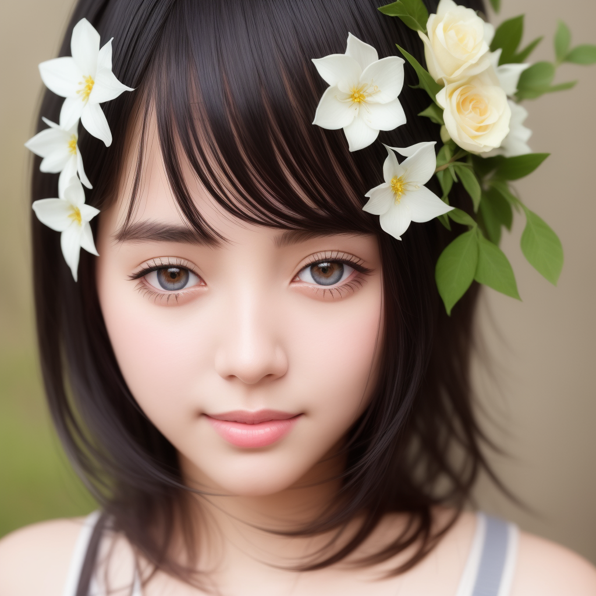
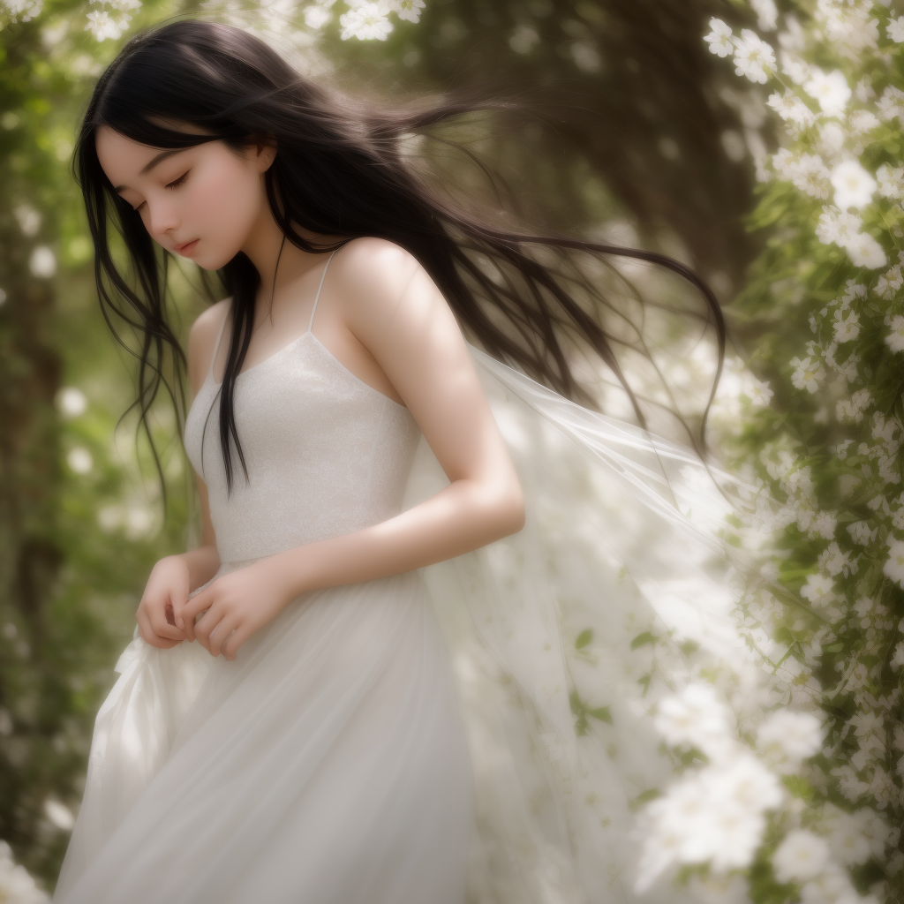

AI 绘画的发展速度比我预想的还要快。几个月前，Stable Diffusion 发布的时候，它们训练了一个通用模型，什么类型的图片都能生成，但无论什么类型都是马马虎虎。比如，对于人像的生成，多数都很模糊，甚至走样，只能看个大概。但是这几个月来，针对各种特定目标的模型都被训练出来了。这里当然少不了专门生成帅哥美女的模型，此外还有针对卡通、国画、油画等等各类绘画风格训练的特化模型。除了模型，各种辅助工具也被开发出来了，比如有些工具可以让用户摆放几根线段，代表人体骨架的姿势，然后模型就可以按照这个姿势生成人像。这就实现了对构图的精细控制。精细控制，配合上某明星的订制模型，就可以生成这个明星的任意姿势的照片了。

AI 绘画工具的出现对于我的帮助还是非常大的：我经常希望在自己的文档中添加一些插图，但是却没有绘画的能力。现在可以让 AI 来帮我画了，就算没那么完美也不要紧，有就比没有强。

半年前，AI 绘画勉强可以达到实用水平的时候，从新闻和论坛里看到的绘画从业人员的普遍反应是抵制。随着 AI 能力的加强，从业人员更多的是表示担忧了。我作为非专业的人员，可能体会不到那种危机感，但我还是觉得画师们并不需要太过担心的。在专业领域，那些老板们，无论有什么样的工具，也不可能自己去动手操作的，还是需要有专业人员来操作，差别无非在于一笔一笔得画，还是一条指令一条指令得画。工具毕竟是工具，新的工具不会取代人，只是会改变人们生产的方式。

被改变的可能不止是生产方式，或许还会有审美标准。AI 不但可以生成以假乱真的真人照片，还可以生成并不真实存在，但却是人们心目中的完美人像。当下，对大众审美影响最大的是明星们。将来会有越来越多 AI 生成的虚拟明星们出现。真人明星们就算化妆、整容、开滤镜，也不至于和真人容貌差太多，虚拟明星们长啥样就很难预料了。

我的 Facebook 上经常会收到骗子的好友申请。由于工作相关，我还曾经仔细研究过几个骗子的页面。在社交媒体上有很多知名度极低的小网红们，经常性的发布自己的生活照片视频等。骗子们会把这些内容收集起来，发布在一个虚假的账号下面，把这个账号伪装成某个帅哥美女的账号，然后行骗。估计以后骗子们的手法也要升级了，不需要再去收罗真人的内容，用 AI 生成全套的内容就可以了。

