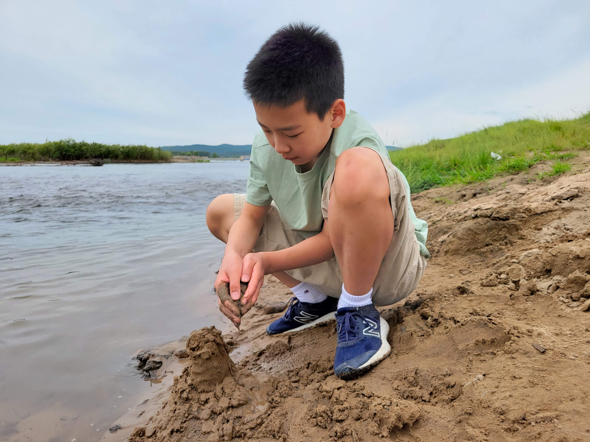

最近回国了一趟。

## 手机支付

再上一次回国还是 2015 年，本来前几年就有计划要回去看看的，可以因为国内的疫情封控，一直没能成行。直到今年放开了，才有机会再回国一趟。现在回国的成本还是挺高的：俄乌战争造成的航班减少，加上大量之前憋了三年无法回国的旅客，导致今年的回国机票严重供不应求，价格飞涨。

回国最直接的感受是支付方式的变化：在美国，主要刷信用卡；在国内基本靠刷手机。其实我上次回国的时候支付宝就已经被广泛使用了，我当时还在麦当劳用手机买了汉堡。但当时的移动支付可远不像如今这么普及：这次回国发现就连早市卖菜的小贩也用手机收钱了，其它的比如打车、公交、用医保买药、办理各种手续等凡是需要花钱的地方也都支持手机付款。信用卡支付在国内从来都没有普及起来过，很多商店无法使用信用卡，却几乎都可以支持手机支付。一些发达城市的店家甚至彻底放弃现金了。现在出门可以不带钱包，但万万不能不带手机。

手机支付比起信用卡确实有一些优势：每增加一项服务，就只需要安装一个新的应用软件，不必再新增一个物理卡片。不过，这点优势也不算特别显著。在美国，信用卡已经足够满足大多数交易所需，并且支票的应用也非常普及，所以多数人懒得尝试手机支付。手机支付在美国恐怕永远都不会像在中国那样普及了。

像我这样使用国外手机的用户，手机支付可就不是那么方便了。国际漫游的手机在国内很可能是通过国外的 Proxy 来接入网络的，因为这样的手机可以直接访问被国内屏蔽的网站。但是，访问国内网站就不那么顺畅了，很多付款链接根本就打不开，或者打开了也会提示“不支持国际支付”，“需要国内手机号认证”等等。因此，在很多情况下我还是不得不使用现金交易。

## 衣食住行

### 物价

对比我出国之前，很多商品的价格明显上涨了。最重要的可能是房价吧，上海房价涨了有四五倍了吧。食品价格也涨了不少，去吃了一次麦当劳，也是为了怀旧的。当年我最喜欢麦当劳的板烧鸡腿汉堡，单一个汉堡是 12 元，套餐大约二十。这次又点了一个同样的套餐，要五十多了。

也有价格没怎么变化的地方，比如上海地铁票价，似乎还是那样。

### 电动车

走在路上，感觉最不适应的是满大街的电动车。在东北还好，可能因为冬天太冷，实在不适合电动车。南边一点的城市，比如上海、无锡、济南等，电动车已经彻底取代了自行车。跟自行车相比，电动车车速快，重量沉，危险的多了。我短暂的回国期间就已经目睹好几起电动车相撞的事故。中国素来没有车让人的传统，对于已经习惯了美国交通路况的我，在国内繁忙的街头过马路还真有点紧张。

### 快递

快递其实没有之前方便了：以前的快递都是送货上门的，现在多数快递都只送到小区的分发中心，需要客户自己去取。这对于老年用户实在不便。我父母在购买沉重的物品（比如矿泉水）的时候，总需要特意选择那些可以送货上门的商家。不过对于那些经常不在家的上班族，可能自取反而更方便吧。

### 服务态度

这次回国一个让我感到惊喜的地方是商店服务员的服务态度。我小时候，商店都是国营的，那时候购物是顾客求着售货员，售货员们一个个爱搭不理，拽的不行。（其实这样也好，防止大家堕入消费主义的陷阱:）后来商店大多私营了，服务员们态度越来越好，在我出国之前就已经不错了。这次回国，发现他们的态度又更上一个台阶了。笑脸相迎那是最基本的了，主动打折送礼品也是标配，而且客户无论怎么挑剔折腾，售货员们都没有一点不耐烦的，还要帮着客户出主意选款式。我老婆买鞋的时候，售货员上来就要帮我老婆穿鞋、系鞋带，让我觉得有点热情过头，快消受不起了。

老婆认为这是因为最近经济不好，顾客太少的原因。可能是原因之一吧，我们工作日去逛商场的时候，的确发现多数的店铺门可罗雀，顾客还没有售货员多。

当然也不是所有的店家都如此。老婆最喜欢的蛋糕店是上海的“红宝石”，老婆说他们的点心最好吃，我倒是没尝出来有什么特别。老婆特地带我去打浦桥的“红宝石”店，买了几个糕点。店里服务员一如既往，拉着个驴脸招待每一位顾客。

所谓服务好，也是指服务业的。政府部门的工作人员普遍态度还是比较差。相对来说，上海公务员的态度是最好的了。上海人一般做事比较认真，公务员也是。我去派出所、交警队等办理事务的时候，就算有些人不那么热情吧，至少还是耐心交流，认真办事的。据说东北的公务员可就不这样了，没钱没关系啥也别想干，幸好我也不需要跟他们打交道。

### 地铁

刚一到上海，我就需要从浦东机场赶往虹桥火车站，我选择了乘坐地铁。出国前，二号线是我每天的通勤线路，当时的广兰路站超级拥堵，不要说上车，有时候挤进地铁站都要费一番力气。这次坐地铁，我恰好又赶上了下午六点的下班高峰。然而我惊讶地发现，地铁里完全没有出现我想象的人挤人的情况。实际上，在整个浦东路段，车厢里都还算宽松，到了浦西人才多起来，也远达不到当年的拥挤盛况。只有在我下车的时候，才在换乘 17 号线那里看到了乘客挤不上车的熟悉场景。

也许是现在地铁线路多了，乘客被分流了？或者因为私家车多了？又或许是更多的人在家工作了？尽管上海地铁盛况不再，但已经是我去过的几个城市里最繁忙的地铁了。其他地方，比如无锡、济南地铁里经常连座位都坐不满。南京地铁人稍微多一些，也远比不上上海。

### 儿时的零食

国内饮食是没得说了，各种各样的饭菜都比美国的好得多。尤其是，国内每隔一段时间就会开发出一些网红食品。这次回东北的时候，我去吃了当前比较受欢迎的铁锅炖，这道菜在我出国之前还完全没流行开来呢。

此外，让我感到欣喜的是在东北又见到了那些我小时候视如珍宝的零食，比如江米条、炉果、长白糕之类的。小时候生活条件艰苦，零食种类极其贫乏，这些零食承载了我儿时最美好的记忆。我在离开东北去了南方之后就再也没也见过这些零食了。本来想买一些，回味一下儿时的味道。可是看着它们上面的糖和油，就又思想斗争开了，太不健康了，哎，最终还是没吃。

## 封控

### 互联网

我的手机在国内使用漫游数据的时候，仍然可以直接访问那些在国内被封禁的网站（比如 Facebook，Youtube 之类的）。可能是为了避免太过糟糕的国际形象吧，中国的防火长城居然对于外国手机网开一面，没有禁止它们访问敏感网站。我一旦把手机接入 WiFi，手机里一大半的功能就立刻不好使了，因为我的手机的 Android 系统高度依赖各种 Google 服务。

对于网络的控制不需要回国就感受到了。我刚出国的时候，还继续活跃在国内各大网站上。随后，那些网站对于言论的管制就越来越苛刻，敏感词越来越多，牢骚贴再也发不出来了。再后来，几个跟时政沾边的论坛，以及博客网站都干脆关闭了。剩下的网站，即便是与政治毫不相关的技术论坛也都纷纷开始强制实名认证，不认证就别想发帖。

国内的手机与身份证是绑定在一起的，所以实名认证主要是通过手机验证来完成。我这种没有国内手机的用户根本无法通过认证，也就基本告别国内的网络社区了。

回国后发现，手机验证也已经渗透到线下生活的方方面面了，比如，登录公共免费 WiFi 要手机验证，获取购物优惠要手机验证，参观学校要手机验证，等等。没有国内手机，很多事情干脆就别想了。

### 参观大学

美国的大学是没有围墙的。因为上班的公司就在 MIT 边上，我有时候吃完午饭，就会去 MIT 的校园里甚至教学楼里去溜达一圈。国内大学都少不了围墙和大门，而且大门通常还是大学最具标志性的建筑。我出国前，国内大学还是允许外来人员进入校园的，我还曾带老婆去我的母校参观过。

这次回国很想带儿子去参观一下我曾经学习过的两所大学：东南大学和上海交大，然而非常遗憾的发现学校已经不允许外来人员进入了。学校门卫说可以预约参观，我上网一搜还真搜到了相关新闻，说是今年暑假，学校开放了19天参观日，公布预约网站后几小时内所有的预约名额就被抢光了，看来根本没打算给我们这些外地参观者任何机会。

带着儿子匆忙跑到上海和南京，最后参观了两个满是岗哨的校门。估计儿子也没有对中国大学留下什么好印象。

### 安检

国内坐地铁是要安检的，我出国前就这样了，每次进地铁都要把水瓶掏出来，把背包塞进安检机，不胜其烦。美国这种“枪林弹雨”的国家里，火车、地铁都不需要安检，中国不是最安全的国家吗，怎么上地铁还要安检呢。这次回国发现安检范围又扩大了，长途汽车也要安检了。既然地铁和长途客车都安检了，公交车要不要也安检啊？

我就细数一下最后回美国这一路，我们经历的每一次安检吧。我们从无锡客运站出发，乘坐机场大巴直接开往上海浦东机场，然后乘飞机前往美国：

从家里出发，坐地铁去客运站，进地铁是第一次安检。进入客运站的候车区是第二次安检。等汽车到了浦东机场，下车后马上第三次安检。说实话，上车安检我也认了，下车安检到底是为了个啥呢。

进入机场大厅的时候是第四次安检。我感觉前几次安检都是走形式的，我很怀疑他们是否真的发现过任何危险品。进入机场这次安检就稍微认真一些了。我们总共有6个箱子1个背包，等我再次把箱子一个一个摆放到安检机上，胳膊都有点酸了。还没把全部箱子取下的时候，工作人员拦住了我，问箱子里是否有一个弹弓，他们需要登记。我告诉他们是我在淘宝买的弹弓，你们登记吧。可是工作人员说不行，非要把我的弹弓翻出来看了才登记。登记就登记呗，非要看个啥呢，难道弹弓翻出来看看还能变成一把枪吗？老婆有强迫症，最受不了别人翻她的东西。安检员一打开箱子老婆就立刻变成臭脸，说话也开始没好气儿了。我劝了半天总算安抚住了老婆。

进入机场大厅，办理行李托运还是比较顺利的，托运行李的安检比较宽松，很快就完事了。

再之后的步骤是出海关。我出入关都非常容易，直接到快捷通道，在机器上刷一下护照就出了关了（入关也一样）。老婆儿子的护照是远程办理的，没有指纹信息，无法走快捷通道，只好去人工通道。老婆的心情本来就还没恢复，被海关人员像审犯人一样盘问了几句，脸更臭了。海关主要询问老婆和儿子去美国做什么，老婆后来跟我发牢骚说：我家在美国，去干什么都不管他们的事，有啥好问的。也不能怪老婆，既然有些人可以只刷一下卡就出关，说明那些问题本来就是可有可无的，何必搞得这么繁琐呢。

我也只能再次好言安慰老婆，哪知道更让老婆烦心的还在后面，因为进入候机厅的第五次安检是最严格的。其实我们打包行李的时候，就已经为安检做了优化了：可能有电池的物品都随身携带，避免托运行李被开箱检查；其它有风险的物品尽量托运，免得无法带上飞机。但还是有疏忽：我们随身携带了一套新买的理发用具，因为其中的电推子是充电的。但是我们忘了这套工具中还包括一把齿剪刀。安检员翻出这把剪刀跟我们说要么没收，要么托运。航空公司是不可能帮我们翻出已经托运的行李再放个东西进去的，也不可能只托运一把剪刀。但老婆已经闹上情绪了，就是不肯把剪刀丢掉。幸好，我们随身带了两个登机箱，而且也还有托运额度。我赶紧把两个箱子倒腾了一下，把肯定不会再出问题的物品集中到一个箱子里，准备去托运。我跟着一名工作人员再次入关，托运箱子，重新出关，安检（第六次），一通折腾，总算是搞定。

在飞机上，开饭的时候，老婆举着空姐发的不锈钢刀叉对我说：看看，哪个不比我的理发剪危险。

在美国入关的时候，只有人工通道，但海关工作人员态度好多了，只问了我们两个问题：有没有携带违禁品，带了多少现金。然后就微笑着说：Welcome home!

### 回不去了

2012 年，我考虑出国的的时候，对于中国的发展前景还是非常乐观的，主要因为当时经济的蓬勃发展。当然我也有一些对于大环境不满意的地方，比如对国外网站的封锁以及日益猖獗的贪污腐败现象。不过，我那时候经常在各种论坛以及个人的博客上发牢骚，针砭时弊，痛骂贪官。牢骚归牢骚，我觉得既然国家还允许老百姓们发表意见，那就有希望在群众的监督下，朝着好的方向逐步发展。

现在回头来看，那时候可能是国内最为开放和充满生机的一段时期了。我对国内发展预期的转变始于出国后的三四年里。我在国外也一直喜欢观看有关中国的节目，有一天在 Youtube 看到了中国官方制作的一段关于扶贫的纪录片。影片介绍了政府帮助偏远山区人民脱贫致富的过程，看得我精神振奋，热血沸腾。然而，看着看着，我就感觉到了一些不对劲：每个农民的新家里都在最显眼的地方挂上了领袖的巨幅照片，怎么又开始搞个人崇拜了呢？熟读历史的我非常清楚个人崇拜意味着什么。

当时我还有些侥幸心理：也许这不是领袖的本意吧。然而，再几年后的“修宪”就彻底让我死心了。老婆自幼生活优越，也更加留恋故土，出国之后还一直跟我讨论何时才能回国定居。即便如此，在上海封城之后，老婆的想法也开始了大转弯。再讨论起来，都是悲观的说：恐怕再也回不去了。

## 齐齐哈尔

我在很多城市生活过，真正算做故乡的，应该还是齐齐哈尔：我的幼儿园、小学、中学阶段都是在齐齐哈尔度过的。上大学离开了齐齐哈尔，后来父母也搬离了齐齐哈尔，所以之前有快二十年没回去看看了。这次回国一个重要行程是带老婆儿子回去看看我小时候生活的地方，他们还从来没去过东北呢。不但老婆儿子，我把爸妈也带上了，一起去怀旧一下。

### 铁路南局宅

挨着齐齐哈尔火车站西南那一片是我的老巢，童年大部分时光都是在这里度过的。我上过的学校：铁路南幼儿园、铁路第一小学、铁路第五中学（初中）都是在这一小片里。小时候觉得这里好大，是我的整个世界。现在回来，又把这些地方全走了一遍，感觉这里好小，半个小时可以转好几圈了。

我当年上的幼儿园已经没了，变成了养老院了。小学还在，而且几乎没有变样。

初中也还在，但改名了，现在叫做齐齐哈尔市第四十五中学。初中的校园跟当年已经完全不同了，我上学时候，教学楼是一栋二层小黄楼，还是当年日占时期盖的。我上学那会它就已经是危楼了，学校在教室的墙面上加固了钢架，以防止楼体倒塌。初中另一处给我留下深刻印象的是葡萄园。那时候，每当秋天，学生们就要顶着寒风到处去收集树叶，用来给学校的葡萄保暖过冬。现在校园不让进去参观，但葡萄园肯定是没了，在原来葡萄园的地方矗立起了一座新的教学楼。

南局宅的中心是一片小树林，树林中心有一座英雄纪念碑，都还是原来的模样没太大变化。小树林周围的旧居民楼却全部被新住宅楼取代了，完全没了当年的痕迹。但树林南侧的图书馆和铁路南文化宫都还在，也是我当年常去的地方。可惜这两处都在大门上贴着“接上级通知，停止对外开放”的字样，无法进入。我们来的时机不太好，就只能在外面看看。印象里，南文化宫应该是一座相当宏伟高大的建筑，小时候就喜欢在它大门前的台阶和水泥围栏上跳来跳去。再次看到，很多已经模糊的记忆才被重新拾起。

走到文化宫的时候，恰好下起了暴雨，于是就在它的门廊下躲了一会。东北天气变得快，二十分钟后就雨过天晴了。走出文化宫大院时，发现路上积水有小腿那么深了，终于又有了当年的感觉！儿子兴奋的冲进了水坑里，正如当年的我。

### 齐齐哈尔市第一中学

我的高中是齐齐哈尔市第一中学。我上学的时候校址位于永安大街、新文路路口。当时它还是齐齐哈尔最好的高中。后来我离开齐齐哈尔，对母校的关注就少了，之后听说它搬去了一个鸟不拉屎的地方，升学率越来越差，现在在齐齐哈尔可能连前三都排不进去了。

一中的旧址，校园连同教学楼一起给了齐齐哈尔市第三十四中学。就在我回齐齐哈尔的前两天，第三十四中学的体育馆坍塌，压死了十来个学生，事件震动全国。为此，齐齐哈尔关闭了所有公共文化场所，这也是我们没能参观铁路图书馆、文化宫的原因。那个体育馆其实是原来一中建的，听别人讨论新闻的时候，我也觉得脸上无光，不敢插嘴。

回到齐齐哈尔，我领儿子去参观了我上高中的地方。刚到三十四中的附近就发现了一些异样，好多便衣警察在那里啊。果然，我们刚走到学校大门口就有人来拦住了我们，让我们离远一点。我们退后了一些，然后掏出手机准备拍几张照片，立刻又有人上来阻拦。我只好解释一下，我就是想带儿子参观母校，留个念。那人还算通情达理，他挡住了体育馆的方向，但允许我们朝着大门方向拍了几张照片。

一中的新校址我也去参观了，其实不算远。可能我已经习惯跑远路了吧，在上海上班时候，有阵子每天通勤的单程距离都超过20公里，现在每天上班单程也将近20公里。齐齐哈尔，只考虑城区的话，方圆还不到十公里，到哪去都不能算远。

新一中果然比旧校区气派多了，占地面积至少大了十几倍，新盖的大楼有七八栋，每一栋都比旧校区的楼大的多。学校还增加了初中部、宿舍、食堂等，都是原来没有的。现在的学校都不允许游客进入，不过我们到达一中北门的时候，正看到有几个中年人进进出出，于是决定碰碰运气。我也没吱声，领着老婆儿子就往里走，门卫居然没有阻拦，我们就这样顺利进入了校园。

进去之后就明白什么是“金玉其外败絮其中”了：从远处看上去辉煌壮丽的几栋大楼下面都拦了绳子，写着“高空坠物，请勿靠近”。抬头一看，外墙的贴砖已脱落了不少，东一块，西一块露出了里面灰白的墙体。这工程质量，难怪体育馆会塌。

我们从北门走到了南门，出去的时候，却被保安拦住了，问我们是干啥的。我说是游客啊。保安一听就急了，喊到：我们这里不允许参观，谁让你们进来的？我一笑：是吗，我哪知道呢，我就从大门这么走进来的，也没人阻拦啊。保安气急败坏却也无可奈何，只能对着我的背影一个劲喊：不许发抖音，记住了，不许发抖音。

### 老去的城市

在美国，无论去哪里都能看到许多小孩子，美国的小孩相对来说喜欢户外运动。回国后，看到的小孩的比例就少多了，除了中国出生率确实更低之外，中国孩子学习压力大，没时间在户外活动也是重要原因。等回到齐齐哈尔，发现不但是小孩子，青壮年人员的比例也少得可怜，周围到处都是老年人。

我从前生活的铁路地区（齐齐哈尔市铁锋区）曾经有过非常辉煌的时代，现在却成了齐齐哈尔最没落，最老龄化的区域。1983 年之前，这里有过一个齐齐哈尔铁路局，管理着周边黑龙江、内蒙、吉林等地区的铁路系统。那时候的铁路系统可不仅仅是火车和车站，而是一个完整的小社会，有自己的学校、医院、商店、法院等全部配套设施。铁路系统职工的收入和福利都相当不错，因此，铁锋区在齐齐哈尔算是相对富裕的。1983 年齐齐哈尔铁路局被撤销，但还保留了齐齐哈尔铁路分局，虽然管辖范围大大缩小，但依然可以得到铁道部的资金支持。90 年代，整个东北成了下岗大潮的重灾区，突然失去工作的家庭惨不忍睹。铁路部门却没有受到下岗大潮的冲击，优势更加明显。我高考的时候，铁路院校是最吃香的方向之一，铁路相关工作被戏称为铁饭碗。

然而，风水轮流转，2005 年，齐齐哈尔铁路分局也被撤销了。铁路系统就只保留了最核心的车站，车辆维护等几个部门，其它服务部门，比如学校、医院之类的全部被剥离出去了。没有了足够的投资和工作岗位，年轻人们也只好去外地谋生了。

我高中同学中，只有很少几个还留在齐齐哈尔生活。我亲戚中，跟我同辈的表兄弟们全都去外地谋生了，这次回齐齐哈尔一个也没见到。去二姨家做客的时候，她跟我说，他们这一栋楼几十户人家，几乎全是像她这样的留守老人：老人还在，子女们都搬去更好的城市了。

二姨家对面就是一所小学，我小时候，这所学校每个年级能有三百来个学生。然而今年，它们总共就只招收到了 10 名一年级新生。学校把他们编成了两个班，每班 5 人。铁锋区的中小学已经经历过几轮合并，数量还不及当年一半。估计二姨家对面这所小学也快要消失了。

## 加格达奇

我四岁上幼儿园之前，家在加格达奇。说实话，我对于加格达奇已经基本上没什么印象了，但那里是老爸老妈度过了十年青春的地方，我还是决定带他们故地重游一番。

齐齐哈尔再向北就没有高铁了，只能乘坐绿皮火车。两地车程大约七八个小时，我计划的挺好，在卧铺车上睡一晚，正好到地方。可惜事与愿违：我太多年没做过绿皮火车了，完全受不了车上那股刺鼻的烟味，呛的我根本就睡不着。凌晨三点，窗外的天就亮了，于是干脆起来看风景。

随着列车接近加格达奇，窗外逐渐由平原草甸变成了丘陵林地。进入加格达奇市区后，爸妈都趴到了窗前，仔细搜索着以前老家的痕迹。我们当年的家在东山坞，是砖头搭的小平房，紧邻铁道线。如果旧宅还在，应该可以从火车里看到。火车驶过东山坞的时候我们只看到了一片新建的住宅楼。老爸无奈的摇摇头说：认不出来了。

加格达奇可真小啊，站在我们住的酒店上张望出去，就可以看到城市的全貌了，目测我可以半小时内就步行到达全城的任何一个角落。

在加格达奇的主题是寻访旧址，我们先去了东山坞。那里依然还保留着一片破旧的小平房。但可惜的是，那一片并不是我的旧家。我们原来住的地方已经被彻底拆除了，现在是一个大工地，卡车忙碌期间，运送土石。太遗憾了，要是能在早来两年，也许这里还没拆呢。

庆幸的是，爸妈还是找到了当年的一些记忆：他们刚参加工作时住过的宿舍居然还在，一栋有着几十间寝室的二层小楼。爸妈就是在那认识的。

除了寻找故居，我们还游览了小城北边的北山公园和南边的甘河。甘河这里的游客稀少，我们沿河左岸顺着水流一路散步向东山脚下。儿子总是跑在前面，时不时停下来挖几下沙子，扔几个石子。远远的前方，一列火车在山水之间驶过，我们只能听到风声。如果能在这个宁静安逸的小城定居养老，应该会很舒适吧。

## 哈尔滨

身为黑龙江人，我之前居然从来没有到过黑龙江的省会哈尔滨。这次回国，特意带儿子去哈尔滨玩儿了一圈。哈尔滨毕竟是省会，基础建设远非省里其他城市可比。齐齐哈尔已经是省里第二大城市了，但其规模和繁华程度比哈尔滨差了几个档次。

### 机场

哈尔滨留给我的总体印象并不算特别好。最初，我们是乘飞机到达哈尔滨的，刚看到机场的航站楼就有点失望，没想到这么小。由于登机口太少，我们的飞机都没有把我们直接送到航站楼，而是滑行到了距离航站楼最远的一端，然后让我们做摆渡车去航站楼。这样一折腾，多花费了个两小时的时间。要知道飞机从上海飞过来，在天上的飞行时间也才两个多小时。

进入航站楼，老婆先去了一趟厕所。回来跟我说，她很久没有遇到过这么脏的公厕了。我虽然没进去，但可以想象，毕竟我离着老远就闻到味了。相比起来上海浦东机场的厕所就非常干净，在里面也基本上没有什么味道。

等着取行李的同时，我在考虑如何去高铁站。本来想上网查一下，结果发现我的手机在这里无法漫游，机场虽然有免费 WiFi，但是需要国内手机号注册才可使用，对于我来说相当于没有网络了。这时候正好看到出口处坐着一位穿着制服的年轻帅哥，估计他在那里是为了防止外面旅客反方向进入取行李区吧。我上前跟他打听是否可以坐大巴到火车站。帅哥说了一句“有”，然后就开始不耐烦了，说：这些信息网上都有的，你不会自己查吗？可能是怕我继续追问，他直接站起身来走了。我当时一愣：他就这么离开自己岗位了？他到底是在这里干啥的？

还好航站楼够小，我一出门就看到了机场大巴的售票处。买好票，然后乘坐大巴去往高铁站。大巴司机开的好猛，一路上就一直在跟副驾驶坐上的另一个人骂骂咧咧抱怨前面的车太慢，挡了路。我也只好默默安慰自己：没事，我们车大，就算撞了也不会太危险。

### 太阳岛

在哈尔滨游玩的时候，我们从火车北站出发，先一路走去参观了索菲亚大教堂。然后转到中央大街，步行前往松花江。步行街上的行人比我预想的多，虽然不能和南方经济发达地区比，但比齐齐哈尔可是热闹多了。我东张西望眼睛都不够用了，儿子却对于逛街一点兴趣也没有，一路上专心致志，品尝着我给他买的两根冰棍。

到了松花江边，我们改乘缆车前往太阳岛。缆车就只是过江，线路很短，也没什么特别的风景。但这里游客却不少，我们排了半小时的队才上了车。儿子对比了我们在南京紫金山乘坐的观光缆车后，总结说坐松花江上的缆车太不划算了。

太阳岛上散落在各处的喇叭循环播放着郑绪兰的《太阳岛上》。我小时候的文艺活动极其贫乏，听收音机是最主要的娱乐方式了。那时候可听的歌曲也不多，可不像现在热门歌曲隔几天就换一茬，《太阳岛上》这首歌反反复复在家乡的电台里播放了十来年。它的旋律已经刻在了我脑子里，我甚至都怀疑会不会已经刻进基因了。离开东北就再也没有听过这首歌了。当熟悉的旋律再次响起，带回了我一连串的儿时记忆。

儿子与我的心境完全不同，他就只对吃感兴趣。拉着我找到江边一排长椅坐下，然后就开始享用我带来的零食。太阳岛上的游客比我预想的多，尽管那天是工作日，路上的游客依然还是络绎不绝。在岛上我们看到了很多荒废了的小楼，可以想见太阳岛早年还有过更辉煌的时期。

儿子吃到心满意足，就又出发了，我们围着太阳岛转了一大圈，然后去往地铁站。儿子一路跑在前面，我就在后面慢悠悠跟着。在一处僻静了小路上，儿子听到树林另一边传来流水的声音，他于是钻进树林去看河岸。没跑几步，他就滋溜一下又钻回来了，大惊失色跟我说：爸爸，那边有一堆光屁股的人。我一下子意识到那边可能是天体浴场，赶紧带儿子离开了。路上儿子还在抱怨这些人怎么这么不文明，公共场所光着屁股，我费了不少口舌来解释，就怕他留下阴影。国内在思想管控方面都是恨不得把人全装进瓶子封起来的，没想到在这一方面却这么开放。

进入地铁站，我眼前一亮，这也太漂亮了。太阳岛地铁站采用了中庭式设计，站在站台上，感觉视野特别开阔，在国内地铁站里是不常见的。下到站台的楼梯上有玻璃拱顶，浓浓的欧式风格。天花板是彩绘的蓝天白云，立柱也都有浮雕或刻画。尤其是几个清洁人员来来回回清理着站内的每个角落，把整个车站打扫得一尘不染。我在波士顿乘坐的绿线地铁是 1897 年（光绪年间）建成的，到现在已经破破烂烂了，开的比牛车还慢，而且每当转弯都会跟铁轨摩擦发出刺耳的嘶嘶声。太阳岛地铁站虽然规模很小，但是我个人觉得最漂亮的地铁站。

