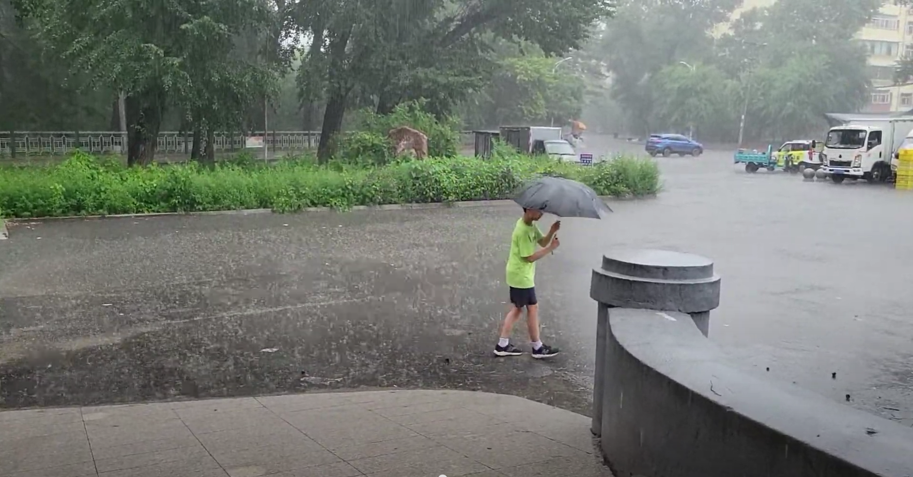

我在很多城市生活过，真正算做故乡的，应该还是齐齐哈尔：我的幼儿园、小学、中学阶段都是在齐齐哈尔度过的。上大学离开了齐齐哈尔，后来父母也搬离了齐齐哈尔，所以之前有快二十年没回去看看了。这次回国一个重要行程是带老婆儿子回去看看我小时候生活的地方，他们还从来没去过东北呢。不但老婆儿子，我把爸妈也带上了，一起去怀旧一下。

## 铁路南局宅

挨着齐齐哈尔火车站西南那一片是我的老巢，童年大部分时光都是在这里度过的。我上过的学校：铁路南幼儿园、铁路第一小学、铁路第五中学（初中）都是在这一小片里。小时候觉得这里好大，是我的整个世界。现在回来，又把这些地方全走了一遍，感觉这里好小，半个小时可以转好几圈了。

我当年上的幼儿园已经没了，变成了养老院了。小学还在，而且几乎没有变样。

初中也还在，但改名了，现在叫做齐齐哈尔市第四十五中学。初中的校园跟当年已经完全不同了，我上学时候，教学楼是一栋二层小黄楼，还是当年日占时期盖的。我上学那会它就已经是危楼了，学校在教室的墙面上加固了钢架，以防止楼体倒塌。初中另一处给我留下深刻印象的是葡萄园。那时候，每当秋天，学生们就要顶着寒风到处去收集树叶，用来给学校的葡萄保暖过冬。现在校园不让进去参观，但葡萄园肯定是没了，在原来葡萄园的地方矗立起了一座新的教学楼。

南局宅的中心是一片小树林，树林中心有一座英雄纪念碑，都还是原来的模样没太大变化。小树林周围的旧居民楼却全部被新住宅楼取代了，完全没了当年的痕迹。但树林南侧的图书馆和铁路南文化宫都还在，也是我当年常去的地方。可惜这两处都在大门上贴着“接上级通知，停止对外开放”的字样，无法进入。我们来的时机不太好，就只能在外面看看。印象里，南文化宫应该是一座相当宏伟高大的建筑，小时候就喜欢在它大门前的台阶和水泥围栏上跳来跳去。再次看到，很多已经模糊的记忆才被重新拾起。

走到文化宫的时候，恰好下起了暴雨，于是就在它的门廊下躲了一会。东北天气变得快，二十分钟后就雨过天晴了。走出文化宫大院时，发现路上积水有小腿那么深了，终于又有了当年的感觉！儿子兴奋的冲进了水坑里，正如当年的我。

## 齐齐哈尔市第一中学

我的高中是齐齐哈尔市第一中学。我上学的时候校址位于永安大街、新文路路口。当时它还是齐齐哈尔最好的高中。后来我离开齐齐哈尔，对母校的关注就少了，之后听说它搬去了一个鸟不拉屎的地方，升学率越来越差，现在在齐齐哈尔可能连前三都排不进去了。

一中的旧址，校园连同教学楼一起给了齐齐哈尔市第三十四中学。就在我回齐齐哈尔的前两天，第三十四中学的体育馆坍塌，压死了十来个学生，事件震动全国。为此，齐齐哈尔关闭了所有公共文化场所，这也是我们没能参观铁路图书馆、文化宫的原因。那个体育馆其实是原来一中建的，听别人讨论新闻的时候，我也觉得脸上无光，不敢插嘴。

回到齐齐哈尔，我领儿子去参观了我上高中的地方。刚到三十四中的附近就发现了一些异样，好多便衣警察在那里啊。果然，我们刚走到学校大门口就有人来拦住了我们，让我们离远一点。我们退后了一些，然后掏出手机准备拍几张照片，立刻又有人上来阻拦。我只好解释一下，我就是想带儿子参观母校，留个念。那人还算通情达理，他挡住了体育馆的方向，但允许我们朝着大门方向拍了几张照片。

一中的新校址我也去参观了，其实不算远。可能我已经习惯跑远路了吧，在上海上班时候，有阵子每天通勤的单程距离都超过20公里，现在每天上班单程也将近20公里。齐齐哈尔，只考虑城区的话，方圆还不到十公里，到哪去都不能算远。

新一中果然比旧校区气派多了，占地面积至少大了十几倍，新盖的大楼有七八栋，每一栋都比旧校区的楼大的多。学校还增加了初中部、宿舍、食堂等，都是原来没有的。现在的学校都不允许游客进入，不过我们到达一中北门的时候，正看到有几个中年人进进出出，于是决定碰碰运气。我也没吱声，领着老婆儿子就往里走，门卫居然没有阻拦，我们就这样顺利进入了校园。

进去之后就明白什么是“金玉其外败絮其中”了：从远处看上去辉煌壮丽的几栋大楼下面都拦了绳子，写着“高空坠物，请勿靠近”。抬头一看，外墙的贴砖已脱落了不少，东一块，西一块露出了里面灰白的墙体。这工程质量，难怪体育馆会塌。

我们从北门走到了南门，出去的时候，却被保安拦住了，问我们是干啥的。我说是游客啊。保安一听就急了，喊到：我们这里不允许参观，谁让你们进来的？我一笑：是吗，我哪知道呢，我就从大门这么走进来的，也没人阻拦啊。保安气急败坏却也无可奈何，只能对着我的背影一个劲喊：不许发抖音，记住了，不许发抖音。

## 老去的城市

在美国，无论去哪里都能看到许多小孩子，美国的小孩相对来说喜欢户外运动。回国后，看到的小孩的比例就少多了，除了中国出生率确实更低之外，中国孩子学习压力大，没时间在户外活动也是重要原因。等回到齐齐哈尔，发现不但是小孩子，青壮年人员的比例也少得可怜，周围到处都是老年人。

我从前生活的铁路地区（齐齐哈尔市铁锋区）曾经有过非常辉煌的时代，现在却成了齐齐哈尔最没落，最老龄化的区域。1983 年之前，这里有过一个齐齐哈尔铁路局，管理着周边黑龙江、内蒙、吉林等地区的铁路系统。那时候的铁路系统可不仅仅是火车和车站，而是一个完整的小社会，有自己的学校、医院、商店、法院等全部配套设施。铁路系统职工的收入和福利都相当不错，因此，铁锋区在齐齐哈尔算是相对富裕的。1983 年齐齐哈尔铁路局被撤销，但还保留了齐齐哈尔铁路分局，虽然管辖范围大大缩小，但依然可以得到铁道部的资金支持。90 年代，整个东北成了下岗大潮的重灾区，突然失去工作的家庭惨不忍睹。铁路部门却没有受到下岗大潮的冲击，优势更加明显。我高考的时候，铁路院校是最吃香的方向之一，铁路相关工作被戏称为铁饭碗。

然而，风水轮流转，2005 年，齐齐哈尔铁路分局也被撤销了。铁路系统就只保留了最核心的车站，车辆维护等几个部门，其它服务部门，比如学校、医院之类的全部被剥离出去了。没有了足够的投资和工作岗位，年轻人们也只好去外地谋生了。

我高中同学中，只有很少几个还留在齐齐哈尔生活。我亲戚中，跟我同辈的表兄弟们全都离开了，这次回齐齐哈尔一个也没见到。去二姨家做客的时候，她跟我说，他们这一栋楼几十户人家，几乎全是像她这样的留守老人：老人还在，子女们都移去更好的城市了。

二姨家对面就是一所小学，我小时候，这所学校每个年级能有三百来个学生。然而今年，它们总共就只招收到了 10 名一年级新生。学校把他们编成了两个班，每班 5 人。铁锋区的中小学已经经历过几轮合并，数量还不及当年一半了。估计二姨家对面这所小学也快要消失了。
