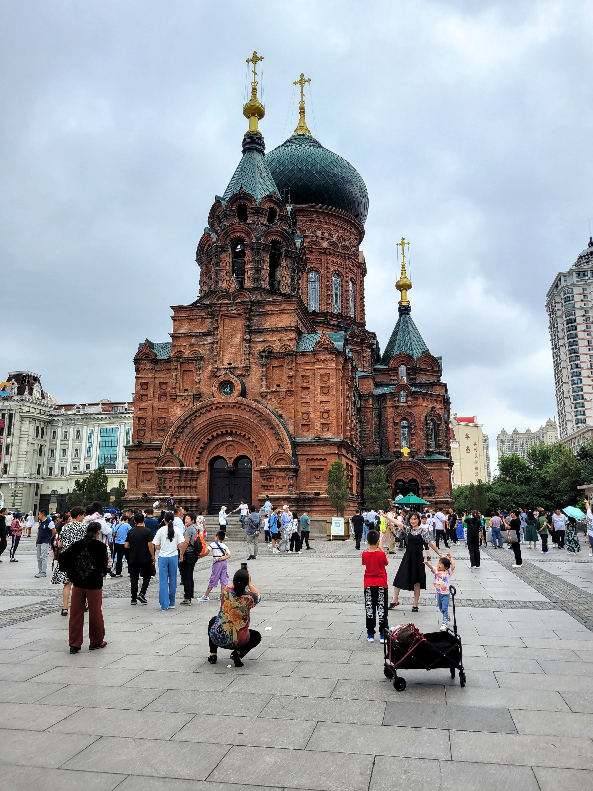
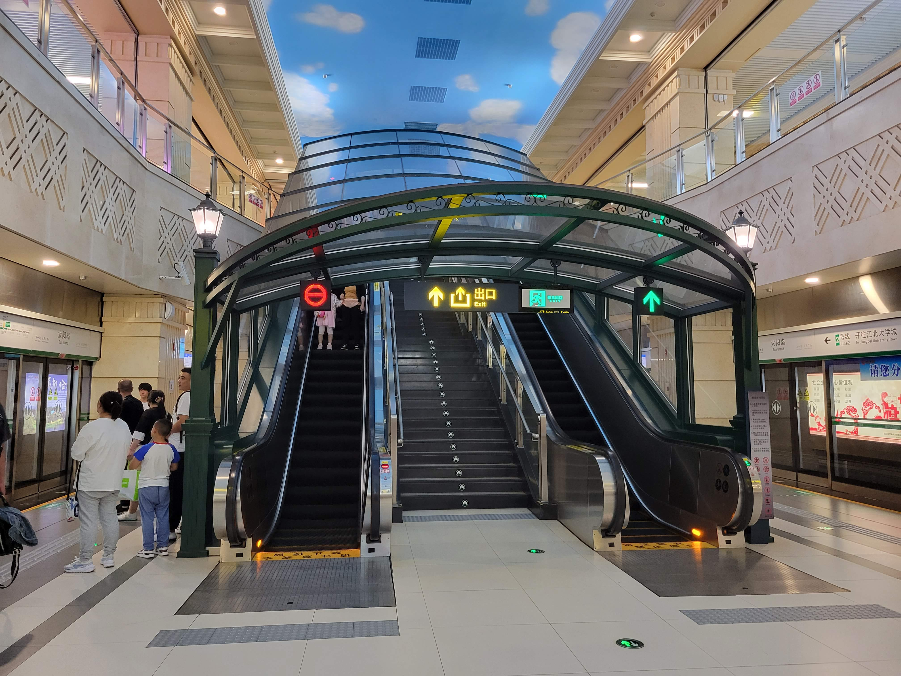

身为黑龙江人，我之前居然从来没有到过黑龙江的省会哈尔滨。这次回国，特意带儿子去哈尔滨玩儿了一圈。哈尔滨毕竟是省会，基础建设远非省里其他城市可比。齐齐哈尔已经是省里第二大城市了，但其规模和繁华程度比哈尔滨差了一大截。

## 机场

哈尔滨留给我的总体印象并不算特别好。我们是乘飞机到达哈尔滨的，刚看到机场的航站楼就有点失望，没想到这么小。由于登机口太少，我们的飞机都没有把我们直接送到航站楼，而是滑行到了距离航站楼最远的一端，然后让我们做摆渡车去航站楼。这样一折腾，多花费了个两小时的时间。要知道飞机从上海飞过来，在天上的飞行时间也才两个多小时。

进入航站楼，老婆先去了一趟厕所。回来跟我说，她很久没有遇到过这么脏的公厕了。我虽然没进去，但可以想象，毕竟我离着老远就闻到味了。相比起来上海浦东机场的厕所就非常干净，在里面也基本上没有什么味道。

等着取行李的同时，我在考虑如何去高铁站。本来想上网查一下，结果发现我的手机在这里无法漫游，机场虽然有免费 WiFi，但是需要国内手机号注册才可使用，对于我来说相当于没有网络了。这时候正好看到出口处坐着一位穿着制服的年轻帅哥，估计他在那里是为了防止外面旅客反方向进入取行李区吧。我上前跟他打听是否可以坐大巴到火车站。帅哥说了一句“有”，然后就开始不耐烦了，说：这些信息网上都有的，你不会自己查吗？可能是怕我继续追问，他直接站起身来走了。我当时一愣：他就这么离开自己岗位了？他到底是在这里干啥的？

还好航站楼够小，我一出门就看到了机场大巴的售票处。买好票，然后乘坐大巴去往高铁站。大巴司机开的好猛，一路上就一直在跟副驾驶坐上的另一个人骂骂咧咧抱怨前面的车太慢，挡了路。我也只好默默安慰自己：没事，我们车大，就算撞了也不会太危险。

## 太阳岛

在哈尔滨游玩的时候，我们从火车北站出发，先一路走去参观了索菲亚大教堂。然后转到中央大街，步行前往松花江。步行街上的行人比我预想的多，虽然不能和南方经济发达地区比，但比齐齐哈尔可是热闹多了。我东张西望眼睛都不够用了，儿子却对于逛街一点兴趣也没有，一路上专心致志，品尝着我给他买的两根冰棍。

到了松花江边，我们改乘缆车前往太阳岛。缆车就只是过江，线路很短，也没什么特别的风景。但这里游客却不少，我们排了半小时的队才上了车。儿子对比了我们在南京紫金山乘坐的观光缆车后，总结说坐松花江上的缆车太不划算了。

太阳岛上散落在各处的喇叭循环播放着郑绪兰的《太阳岛上》。我小时候的文艺活动极其贫乏，听收音机是最主要的娱乐方式了。那时候可听的歌曲也不多，可不像现在热门歌曲隔几天就换一茬，《太阳岛上》这首歌反反复复在家乡的电台里播放了十来年。它的旋律已经刻在了我脑子里，我甚至都怀疑会不会已经刻进基因了。离开东北就再也没有听过这首歌了。当熟悉的旋律再次响起，带回了我一连串的儿时记忆。

儿子与我的心境完全不同，他就只对吃感兴趣。拉着我找到江边一排长椅坐下，然后就开始享用我带来的零食。太阳岛上的游客比我预想的多，尽管那天是工作日，路上的游客依然还是络绎不绝。在岛上我们看到了很多荒废了的小楼，可以想见太阳岛早年还有过更辉煌的时期。

儿子吃到心满意足，就又出发了，我们围着太阳岛转了一大圈，然后去往地铁站。儿子一路跑在前面，我就在后面慢悠悠跟着。在一处僻静了小路上，儿子听到树林另一边传来流水的声音，他于是钻进树林去看河岸。没跑几步，他就滋溜一下又钻回来了，大惊失色跟我说：爸爸，那边有一堆光屁股的人。我一下子意识到那边可能是天体浴场，赶紧带儿子离开了。路上儿子还在抱怨这些人怎么这么不文明，公共场所光着屁股，我费了不少口舌来解释，就怕他留下阴影。国内在思想管控方面都是恨不得把人全装进瓶子封起来的，没想到在这一方面却这么开放。

进入地铁站，我眼前一亮，这也太漂亮了。太阳岛地铁站采用了中庭式设计，站在站台上，感觉视野特别开阔，在国内地铁站里是不常见的。下到站台的楼梯上有玻璃拱顶，浓浓的欧式风格。天花板是彩绘的蓝天白云，立柱也都有浮雕或刻画。尤其是几个清洁人员来来回回清理着站内的每个角落，把整个车站打扫得一尘不染。我在波士顿乘坐的绿线地铁是 1897 年（光绪年间）建成的，到现在已经破破烂烂了，开的比牛车还慢，而且每当转弯都会跟铁轨摩擦发出刺耳的嘶嘶声。太阳岛地铁站虽然规模很小，但是我个人觉得最漂亮的地铁站。

