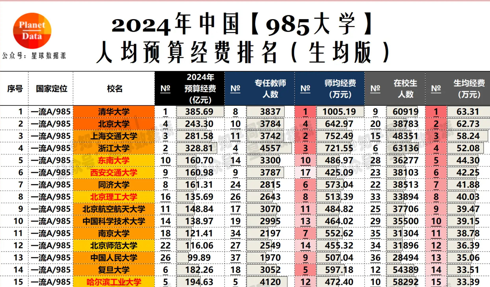

在关注今年的高考过程中，我比较了一下当前国内受欢迎的大学和专业与我当年的情况。出乎我预料的是，受欢迎的专业发生了巨大变化。这可能主要归因于社会的快速发展和热门行业的不断更迭，进而影响了学生们的选择取向。

回想我当年考大学时，学校是老爸给选的，而专业则由我自己决定。我完全根据个人兴趣选择的专业，并未考虑市场需求。我的第一志愿是建筑学，因为我当时热衷于绘图和建筑设计。当学校录取分数线公布后，我发现自己高出几十分，以为稳操胜券了，于是开始利用暑假苦练素描等基本功。然而，最终还是未能被建筑系录取。进入大学后才知道，建筑学是我们学校当时最受欢迎的专业，没有之一。只有考到前一两名的同学才有把握被录取。建筑师梦想破灭后，我只好转向去做了码农。

然而，三十年河东，三十年河西，近几年由于房地产行业低迷，建筑学竟成了我们学校的垫底专业。录取的多是其他专业落榜后被调剂来的学生。当年一些极其热门的专业，如金融等，的热度也有所下降。与此同时，也有一些专业的受欢迎度大大提升，比如计算机、软件等。

相较于专业热度的剧烈波动，学校的热度变化却相对稳定，毕竟，在大学中，先发优势是极其重要的。从这点来说，如果能去名牌大学，选学校比选专业对将来发展的潜在影响可能更大。当然，这仅限于牌子最响亮的那几所学校，其它的学校可能就不那么重要了。

学校的起伏，需要在几十年的尺度上来观察。对学校热度影响最大的可能还是其所在城市的发展状况。总体而言，如果所在城市蒸蒸日上，学校也会跟着进步；反之，学校也会随城市衰退。在我上中学的年代，周围的人都觉得南开、天大与复旦、上交是同一档次的，因为当时天津是全国排名第三的城市，与上海差距不大。但现在情况完全不同了，天津徒有直辖市之名，吸引力恐怕不及南京、杭州等城市。因此，南开、天大也失去了往日光环。类似例子还有很多，再比如兰州大学的衰落。反过来，深圳、苏州等城市本来是没有太好的学校的，因为经济发达，不但促进了原有的大学的快速进步，还可以进一步把其它一些顶尖学校吸引过来。

另一个影响学校发展的重要因素是国家政策。这些年来，国家实施了985、211、双一流等工程。这些工程不仅决定了学校能获得多少政府支持，也影响了学生毕业后的就业前景，因为许多企业或政府部门在招聘时都会设置 985、211 等学历门槛。随着时间推移，这些学校在公众心目中的地位也随之改变。一些原本差距不大的学校，因未能进入 985 或 211 行列，逐渐与入围学校拉开了差距。

可以预见，这种趋势在未来还会继续。虽然难以预料国家是否会推出新的教育工程，但城市的发展态势相对易于估计，经济发达地区的学校将会越来越好。对这一切最好的度量，说的庸俗一点是“钱”；说文雅点，在众多指标中，对学校未来发展影响最大，又容易量化的指标是学校的年度预算和人均预算。毕竟，国家支持也好，地方支持也好，最终都要落实在资金上。我找到了一张今年各高校预算的表格，预算每年都会调整，需要每年参考新的数据。那些长期资金充足的学校必然会越来越好；反之，资金匮乏的学校则可能逐渐落后。

[
