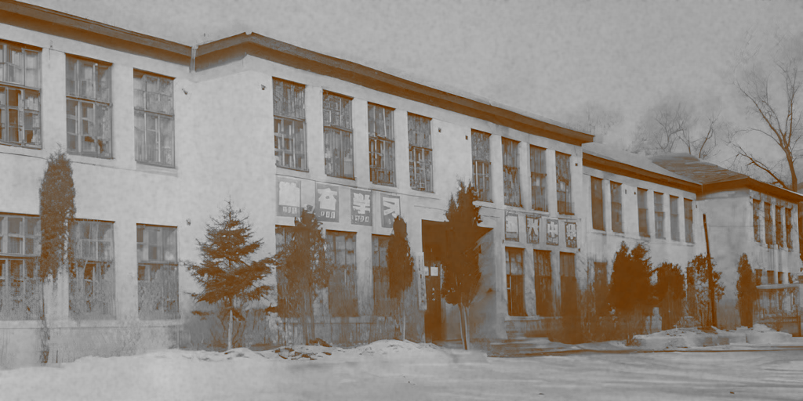
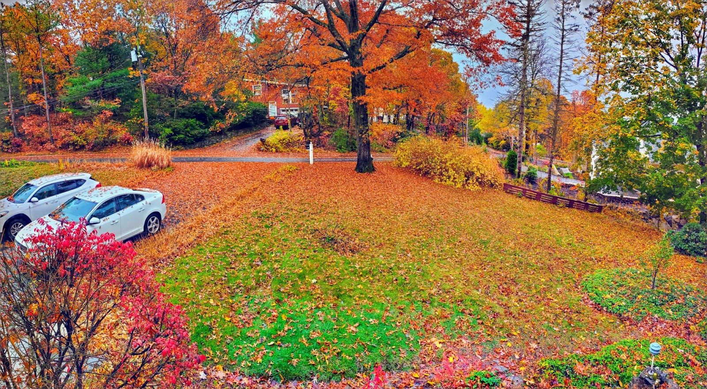

去年回国一趟，就考虑写一些回忆文章，记录一些还能想的起来的事情，可是一直没动笔，毕竟还有太多更重要的事了。最近跟老婆讨论起我初中因为淘气，腿上受过伤，就顺便把还记得的初中的几件事记录一下吧。

我初中就读于齐齐哈尔铁路第五中学。后来，随着铁路体制改革，和其他铁路系统的学校一样，这所学校也被划归地方管理，改名为齐齐哈尔第四十五中学。前几年回老家时，我特意去看了看曾经学习过的地方。然而，如今的学校已完全变了样子，尽管还是那个熟悉的位置，但我却找不到任何与记忆中的景象了。

### 大楼

我最遗憾的是当年的教学楼被拆除了。那是一栋建于伪满时期的二层砖楼，最早属于日本信永小学。几经变迁， 成了齐铁五中。大楼主楼朝向东方，左右连接两侧向西延伸的翼楼，俯瞰呈“凵”字形，像小舟承载了每位师生。外墙是经典的米黄色调，质朴庄重。办公室集中分布在主楼，教室则主要排布在两侧的翼楼。每间教室都有朝南的四扇高大窗户，让教室明亮且通透。窗框上的绿漆已经剥落，带着沧桑的美感。

教室里依然铺着七十年前的木地板，一楼地板下方是一个地下室。在寒冷的东北，有了地下室，一楼就更容易保持温暖干燥。地下室的另一个主要用途是铺设各种水电管道，贯穿了整栋大楼。除非需要检修，平时几乎没人会进入地下室。

随着时间的流逝，地板有些地方已腐烂开裂，有时铅笔掉在地上会直接从缝隙落入地下室。我所在的教室的后方角落，地板上有一个盖板，打开就可以通向地下室。盖板平时被桌椅压住了，老师都不一定知道它的存在，但学生们早就研究明白了如何利用这个入口取回掉落的文具。地下室的高度有限，成年人无法站直，当时我个子小，在某些地方也得弯腰才能通过。

记得有一次，我们帮生物实验室打扫卫生，老师让我们把一副已经破损的人体骨骼模型打包扔掉。我突然就来了坏主意，把模型拖到了地下室，然后在另一个班级地板上找了了处裂缝，把模型的手骨伸了出去。不一会上面就传来了一片吱哇乱叫。

每年元旦，学校都会组织新年聚会。同学们带着好吃的，在教室里围坐一圈，一边吃一边欣赏其他同学表演的节目。吃的只有瓜子、苹果、桔子等零食，但对当时的我们来说非常有吸引力。然而，零食虽好吃，之后的打扫卫生却是一项苦差事。每次聚会结束，教室都是一地狼籍。有一次恰好由我负责清理垃圾，看着堆积如山的果壳纸屑，我灵机一动，拉开地下室盖板，将垃圾一股脑推了进去。老师出去转了一圈的功夫，回来发现垃圾都没了，不得不带着疑惑投来赞许的目光。

### 花池

初中生活给我留下了一道难以磨灭的“印记”（物理上的）。

教学楼前，正门两侧有几处花池，花池外围着一圈铁质护栏，大约到我膝盖那么高。护栏比较简陋，只是被焊在一起的铁条，竖直方向的铁条每根之间大约间隔一尺左右，顶端略微尖锐，但算不上锋利。当时的我完全意识它的潜在危险，反而把护栏当成了“梅花桩”，踩在它的尖上走来走去，有时也会在护栏里外跳来跳去。

一天，我为了抄近路回教室，打算从护栏上跳过，直接穿过花池。但那天刚下了雨，地面湿滑，意外发生了——我摔倒在了护栏另一侧。尝试起身时，左侧大腿传来剧痛，我竟然完全无法站起来了。旁边的同学发现我的裤子已经被血水染红，吓得手忙脚乱地把我抬到医院。

当年的东北治安混乱，时常有小流氓斗殴。医生见惯了刀棍外伤的病人了，对我根本不当回事。把我安排进门诊手术室，然后就没人管了。当时几名同学都急的不得了，去催了医生好几次。而我则强装镇定，对同学说只是小伤，根本不要紧。医生过了一个多小时才来，结果麻药都没有，直接把消毒液喷在了我的伤口上，然后揪起腿上的皮肤就开始缝线。尽管每一个步骤都带来钻心的疼痛，但我不想在同学面前丢脸，咬紧牙关，才总算没哭出来。医生草草处理后就打发我回家了。

老爸多少了解一点医学常识，到家后得知我没有打过破伤风疫苗，赶紧再次把我送到医院打疫苗，又折腾了一趟，才算把伤口完全处理好。

事后，我发现左大腿内侧少了一块肉，肯定是被护栏的尖头刮掉了。回想起来，十分后怕：幸好没有扎到更重要的部位，否则也许就残疾，甚至没命了。

因为腿上少了一块肉，又被强行缝合在一起，我有好长一段时间左腿无法完全伸直，只能拄着拐杖走路。后来可以自己走路了，也还是一瘸一拐的。我当时相当沮丧，以为自己这辈子都要瘸了。幸运的是，随着时间推移，我逐渐回复了正常的行动能力。尽管腿上至今仍然留有一个大坑，但只要穿上裤子就看不出来曾经受过的伤了 :)

### 落叶

教学楼坐落于学校的最北端，正对着校园大门。教学楼南侧是操场，再南边是一处葡萄园。葡萄园面积不小，每年都能产出数量可观的葡萄。学校为此还专门在靠近大路一侧建了售货亭，销售自产的葡萄。然而，齐齐哈尔的冬天过于寒冷，气温动辄零下三十几度，学校的葡萄无法耐受这样的严寒。于是每年秋天，学校都会把葡萄藤埋入地下，再在上面盖上半米厚的树叶以保暖，这样葡萄才能安全过冬。

收树叶的工作就落在了我们学生身上。每年国庆节都是我们收树叶的日子。小时候的天气似乎比现在更冷，九月底，夜间气温就已降至零下了，经常扒开树叶，发现下面都是冰。

我算是比较勤快的，干活一点不偷懒。不过我当时既没有搬运设备，也没有趁手的工具，只能在学校附近徒手跟其他同学争夺为数不多的落叶，效率十分低下。有些同学家里有“倒骑驴”和耙子，他们可以去更远的落叶堆积丰富的地方收集，生产力完全不可同日而语。

学校给每个同学都定了指标，是多少麻袋的树叶，具体数字我已记不清了。如果不能完成任务，是会被批评的。作为劳动的奖赏，每个学生会分得半斤小葡萄。那个物资匮乏的年代，这已经是非常丰厚的回报了。

看见窗外的红叶，我又回想起了小时候劳动的情景。转眼间，已经几十年过去了。或许是对过往的怀念吧，我在自家院子里也种了几颗葡萄。是新培育出的耐寒品种，不需要任何照料就能安然越冬。然而，葡萄我却是吃不到的，因为松鼠总能抢先一步，只留给我一地的葡萄皮。收拾树叶依然是每年固定的工作，当我清理草坪的时候，儿子总要陪在一旁，要么在堆积的落叶上打滚，要么把我收集好的树叶再吹回到它们原来的地方去。

