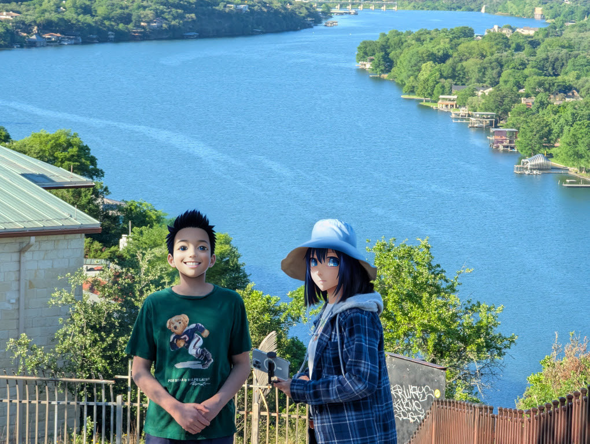
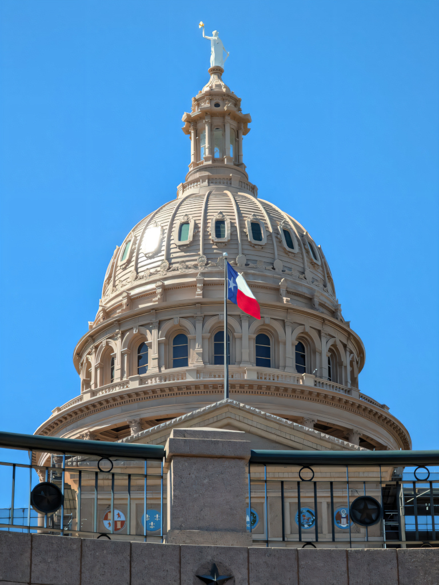
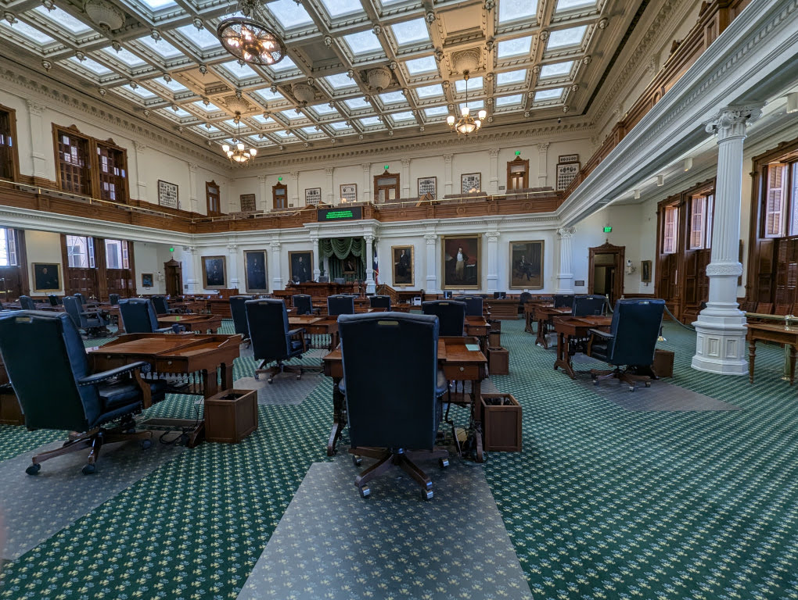
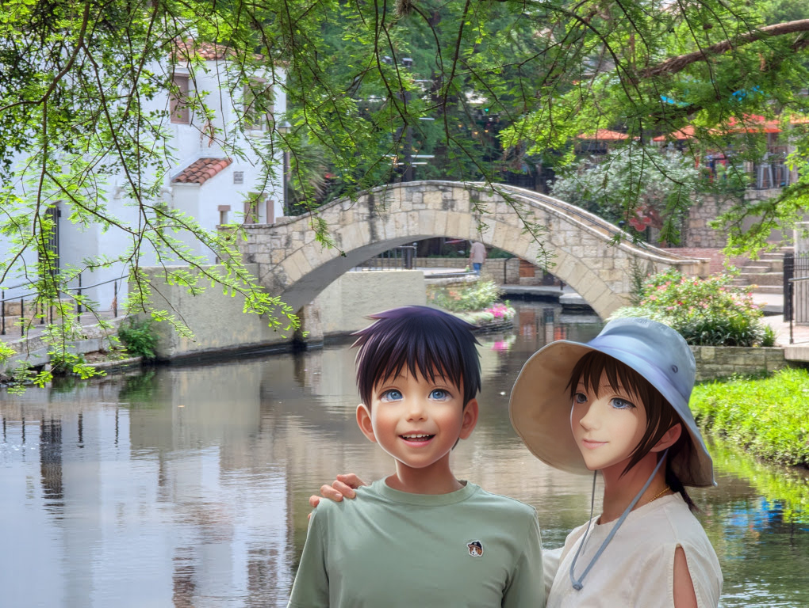
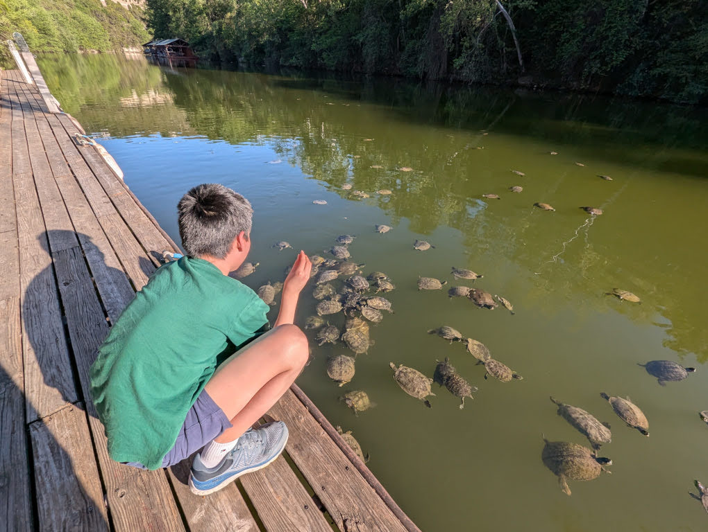
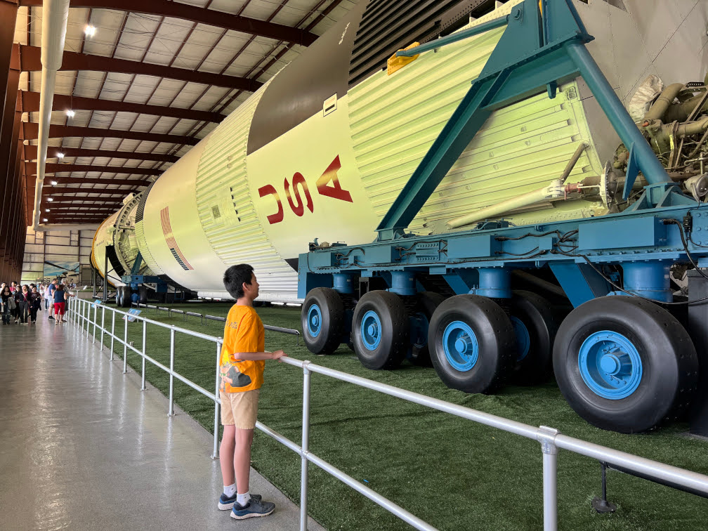

# 德州之旅

## 绿意和晚风

奥斯汀（Austin）位于德克萨斯州中部，是州政府所在地。这座城市秀美宜人，科罗拉多河穿城而过，滋养了两岸郁郁葱葱的绿地和绵延的公园步道。午后，暖阳洒落，清澈的 Lady Bird Lake 在阳光下闪烁着柔和的银光，远处缓坡起伏的山丘披着翠绿的植被，与高远湛蓝的天空交相辉映，仿佛整个世界都在微风中温柔了下来。

奥斯汀是我初到美国时居住的第一座城市，也正是这里，将自然与都市完美融合的气质，深深吸引了我。因为奥斯汀，我对美国有了极好的第一印象，也在心中悄悄埋下了移民的念头。想想如果当初落脚的是纽约那样拥挤喧嚣的大都市，或许我的想法就会截然不同了。

奥斯汀的美，在于那种不经意间流露的自然与优雅，但少了一些令人震撼的壮丽奇观。在我心里，那些拥有独特地貌的地方可能更适合作为短期旅行的目的地，比如大峡谷、黄石公园。因此，当老婆提议在儿子放假期间去奥斯汀旅行时，我最初是有些犹豫的。但她爱屋及乌，对我曾经生活过的地方充满了好奇和热情，坚持要亲眼去看看。

就这样，我们一家踏上了德州之旅。

奥斯汀的模样，和我记忆中的并没有太大变化，依旧保留着那份骨子里的干净与从容。我们漫步在科罗拉多河畔的绿荫之下，脚下是宽阔平整的步道，两旁高大的树木洒下斑驳的光影。微风吹过，带来青草和泥土的清香，耳边隐隐传来远处鸟儿的啁啾。河边，不时可以看到当地人跑步、骑车、遛狗，或只是静静地坐在河岸发呆，那种自在恬静的生活气息扑面而来。

傍晚时分，夕阳把金色光辉洒向湖面，水波粼粼，染成一片温暖的橘红。湖水倒映着城市天际线的剪影，原本硬朗的建筑轮廓在柔和的光线下也变得模糊而温柔，仿佛整个世界在这一刻屏住了呼吸。

老婆看着眼前这幅宁静美丽的画面，不禁感慨：“小城真美啊。要不我们将来搬到这里吧？在绿意和晚风里，不慌不忙地老去，多好。”

我笑着，只淡淡回了一句：“太热！”

## 车轮上的国家

由于波士顿与奥斯汀之间直飞航班很少，且时间不理想，我们于是选择先飞往休斯敦，再租车自驾前往奥斯汀。虽然休斯敦本身也在我们的行程安排中，但选择自驾还有一个更重要的原因：在德州，没有汽车，几乎寸步难行。

常听人说：“美国是一个车轮上的国家”。不过这句话并不适用于整个美国。在波士顿和其它一些美国东北部城市，私家车并非必不可少。这里的交通模式更像中国的一些大城市，高度依赖公共系统，比如地铁、公交，或是自行车。我在波士顿生活的头几年，在没搬到乡下之前，也没有买车。日常通勤主要靠骑车或搭乘地铁，只有周末偶尔出远门时才会临时租车。波士顿本身道路狭窄曲折，城市规划似乎也并不鼓励开车出行。近年来更是让人费解地将不少原本三车道的马路缩减为双车道，双车道改为单车道，导致通勤高峰期，市内道路常年堵得水泄不通。至于高速公路，我搬来波士顿十多年了，就没见过哪条新修或者扩建过，仿佛城市发展早已停滞在了上个世纪。

而在德州，“车轮上的国家”这句话才真正体现得淋漓尽致。这里没有大规模的地铁系统，取而代之的是无尽延伸的公路网络。主干道普遍宽阔得令人惊叹，五六条车道并行早已司空见惯，开车在上面，视野开阔得像在旷野中疾驰。更让人印象深刻的是，沿途几乎随处可见修路、扩路的施工现场。本就宽敞的高速路，还在不断地加宽、延伸，仿佛这片土地对于基础设施的野心永无止境，一直在向外生长、扩张。这种规模和速度，是波士顿那样的老城所难以想象的。

也许正因为道路宽敞、路况良好，这里的车速普遍也更快。在波士顿市区，高速公路限速通常只有 55 英里每小时，而在德州，即使是带红绿灯的路段，限速也往往超过 60 英里，高速路上更常见 75 英里甚至更高的限速。刚开始驾驶时，总让人有种神经紧绷的感觉，我过了一天时间，才又慢慢适应了这种奔放的节奏。

## 自豪的孤星

在奥斯汀，我们参观了德州州议会大厦（Texas Capitol）。这座宏伟建筑坐落于市中心一座小山丘之上，既威严又雅致。整座大厦使用了“日落红”花岗岩建成，这种带着温暖粉红色调的石材，在阳光照耀下熠熠生辉，仿佛给沉稳厚重的建筑平添了一抹温柔的光彩。

大厦的设计明显参考了华盛顿特区的美国国会大厦，两者在外观上颇为相似。但德州人显然不愿止步于“相似”，带着那种标志性的骄傲与不甘，他们特意将州议会大厦设计得比美国国会大厦还高出约 15 英尺（近4.6米）。这正是那句著名德州俗语：“Everything's Bigger in Texas”（德州什么都更大）的真实写照，也是德州人深厚州自豪感的象征。

在美国各州中，德州人的州认同感尤其鲜明。他们往往首先认同自己是德州人，其次才是美国人。这种情感在生活的许多细节中都能感受到：在德州的土地上，到处飘扬着州旗 - “孤星旗”（Lone Star Flag）；而在我所居住的麻州，极少见到有人悬挂州旗，麻州人更倾向于认同自己首先是美国公民。这种与众不同的州归属感，根植于德克萨斯独特的历史 - 从 1836 年到 1845 年，德州曾是一个完全的独立国家 - 德克萨斯共和国。作为美国唯一一个以独立国家身份加入联邦的州，这段波澜壮阔的独立历史，深深塑造了德州人引以为傲的州精神与独立气质。这份骄傲与精神，仿佛都凝结在州议会大厦的石墙之中。以总建筑面积计算，这里也是美国最大的州议会大厦，又一次完美诠释了德州人心中的信条：“Bigger is Better”（越大越好）。

德州议会大厦向公众开放，民众不仅可以自由进入参观，还可以旁听议员们的辩论。当我们走进大厦时，恰好遇上了一场免费的导览，于是便跟随讲解员，在她生动的解说中，逐步了解了这座建筑内部的细节与各大功能厅的用途。

德州州议会大厦的东西两翼，分别是参议院和众议院的会址。正中间，一座宏伟的圆形大厅连接着两翼，贯通数层空间，气势开阔。站在一楼水磨石地面仰望，穹顶一层层向上延伸，线条流畅而优雅，最高处镶嵌着一颗醒目的五角星，环绕着镌刻的单词：“TEXAS”。整个设计既庄重简洁，又充满了象征意味，仿佛在静默中诉说着这片土地独特的骄傲与归属感。

站在楼上俯瞰大厅，又是另一番景象。大厅中央铺设着一块华美的水磨石地面，巧妙地镶嵌着六个徽章，分别代表了历史上曾统治德克萨斯的六个主权国家。分别是：象征西班牙统治时期（1519–1821，除去短暂的法国间隙）的西班牙国徽；象征法国短暂统治时期（1685–1689）的百合花徽章；墨西哥统治时期（1821–1836）飞翔雄鹰徽章；德克萨斯共和国（1836–1845）标志性的孤星徽章；美国南北战争期间德州曾加入南方的美利坚联盟国（1861–1865），代表这段时期的是骑马士兵徽章；以及代表德州成为美国联邦一部分（1845年至今）的美国国徽。这六面徽章，不动声色地镶嵌在脚下，却以一种凝练直观的方式，讲述着德克萨斯百年风云变迁的故事。

我们还参观了参议院的会议厅。议员席位分布在一楼，而二楼则是一圈环绕式观众席。按规定，在议员开会期间，民众可以自由进入观众席旁听辩论，亲身体验民主政治的运作。当然，如今科技发达，许多会议早已可以通过网络视频直播观看，不必再亲临现场。我们参观那天，会议室内空空荡荡。讲解员介绍说，德州的州议员们都是兼职的，他们平日各自忙碌于生计，只有在议会定期召集时，才会齐聚一堂，共同讨论州政。

## 德州精神的起点

从奥斯汀驱车向南，大约一小时，我们抵达了德州的第二大城市 - 圣安东尼奥（San Antonio）。在这里最重要的一站是阿拉莫（The Alamo），德州精神的象征之地。

阿拉莫最初由西班牙殖民者建立，作为圣安东尼奥地区的一个传教站。随着墨西哥从西班牙独立，这片土地成为了墨西哥的一部分。但在 1836 年，当德克萨斯寻求独立时，阿拉莫成为了革命的前线。德克萨斯军将其改建为简陋的军事堡垒，试图在这里阻挡墨西哥军队的进攻。

步入阿拉莫的院落，尽管四周是圣安东尼奥市中心的喧嚣与高楼，遗址内部却像被时间隔离出的一块孤岛，弥漫着庄严肃穆的氛围。这里曾是那场震撼人心的战役发生地：1836 年 2 月 23 日，数千名墨西哥士兵包围了阿拉莫，而德克萨斯守军，只有约两百人。在绝对劣势面前，守军们没有退缩，而是选择了留下，孤注一掷地坚持战斗，最终全体阵亡。

整个遗址中最为标志性的，是那座米黄色石砌的阿拉莫教堂。它曾是守军最后据守的核心阵地。走近细看，厚重的石墙斑驳沧桑，下半部仍保留着原有的古老结构，而上半部则明显可见战后修复的痕迹 - 曾经的屋顶和墙体早已在战斗中损毁。站在教堂前那片空地上，阳光洒落在古老的石砖上，遥想当年，那些决然赴死的战士们曾在这里浴血奋战，一种跨越近两个世纪的悲壮与不屈，在无声中扑面而来。

沿着教堂走去，是广场和旁侧的长营房，如今改建为博物馆。馆内展出了大量文物和展品：泛黄的图片、残存的武器、当年的信件与日记片段。这些细节串联起阿拉莫从一座安静传教站，卷入革命洪流的全过程。从志愿者、定居者到冒险家，从老旧的火枪、加农炮到围困中的绝境与突围，每一件展品都努力还原着那段历史。穿梭其中，凝视着那些粗糙而真实的遗物，读着那些写满勇气与忧虑的手迹，仿佛能触摸到当年士兵们的惶恐、坚守与荣耀。那句在战后迅速响彻德州的口号 - “记住阿拉莫！”（Remember the Alamo!），不仅仅是复仇的呼声，更成为了激励德克萨斯人坚持到底、争取独立的精神号角。这场军事上的失败，却在精神层面塑造了德州日后的灵魂。

遗址后方，是一片静谧的花园。这里散落着未经修复的残墙、基础遗迹，以及数座低调肃穆的纪念碑和雕塑。与前方教堂和博物馆中熙熙攘攘的游客不同，花园里多了一份沉静与敬意。古老的石墙在绿荫与阳光的映照下静默伫立，仿佛在无声诉说着那段血与火交织的往昔。这里，成为了一个可以静心凭吊、深思历史的角落，也让人真正体会到，英勇和牺牲，从未随着岁月流逝而被遗忘。

## 柔情水乡

离开阿拉莫遗址，向西南步行五分钟，眼前的景色便骤然一变。我们仿佛直接从尘土飞扬的历史战场穿越了到了世界的另一头 - 这里完全没有传统德州的西部粗犷，反而展现出一种柔美、温润、江南水乡般的独特韵味，这就是圣安东尼奥最负盛名的河滨步道（San Antonio River Walk）。

圣安东尼奥河在市中心悄然蜿蜒，步道则沿着天然河道而建，且巧妙地低于地面街道约一层楼的高度。这种独特设计，最初源于 20 世纪初的防洪工程 - 建筑师罗伯特·休格曼（Robert H. H. Hugman）在防灾基础上融入了商业开发与景观美化理念，意外地创造了这一隔绝于城市喧嚣之外的静谧绿洲。

沿着步道缓缓行走，脚下是微凉的石砖路面，空气中弥漫着清新的植物气息、湿润的泥土芬芳，以及不时飘来的饭馆香气。两岸绿树成荫，许多树枝低垂至水面，在微风中轻轻摇曳。河面上，色彩鲜艳的游船缓缓穿梭，船夫用温和而风趣的语调讲述着沿岸的故事，为这片静谧平添了一份生活气息。潺潺的水声、莎莎的风声、远处传来的音乐和人们悠然的笑语交织在一起，谱成一首只属于这条水岸的慢节奏旋律。

横跨河面的，是一座座玲珑别致的石拱桥。多由青石砌成，造型古朴自然，桥身与石缝间布满了斑驳的青苔，湿润中透着一种古意。桥孔倒映在水中，形成一个个近乎完美的圆，随着微波轻轻晃动，如梦似幻，更添了几分烟雨江南的诗情画意。步道曲折婉转，每个转角都藏着新的风景，或是小巧的庭院，或是藏匿于绿荫后的精致小店，一步一景，仿佛行走在流动的画卷中。

当夜幕悄然降临，河滨步道便换上了另一副模样。柔和的灯光次第点亮，映照在水面上，如撒落人间的繁星，波光粼粼，梦幻迷离。白天的悠闲与恬静，转为夜晚的璀璨与热闹。餐馆和酒吧里传来悠扬的音乐和欢快的笑声，人们在灯影水声中，尽情享受美食、美酒与夜色。整个步道仿佛成了一条流动的光带，将白日的诗意与夜晚的繁华，完美地串联在一起。

## 时光的涟漪

这次德州之旅，对我们一家人而言，各自有着不同的意义。老婆更多是欣赏美景与这片土地独特的文化气息，儿子则沉浸在旅途中各种新奇的体验和玩乐带来的兴奋之中。而我，像一个时空穿越者，心思系在了“怀旧”上 - 那些曾经生活、工作、留下无数足迹的地方，如今变成了什么模样？它们还保留着记忆中的影子吗？

在奥斯汀，我特意绕道去了曾经工作过的公司。前几年，它被一家大型企业收购了，但仍保持着相对独立的运营。驱车驶入公司大院，跨过那个熟悉的小池塘，路旁标着“警告有狐狸穿越”和“限速 19 英里”的提示牌，仍旧静静地矗立着，仿佛守护着岁月不动声色。园区内部，办公楼的轮廓、停车场的划分、蜿蜒的车道，一切都与记忆中无异，仿佛时间在这里悄然凝固了。

> 闲云潭影日悠悠，物换星移几度秋。

并非所有地方都这样“冻结”在记忆里。当驱车前往城西，那片曾经经常流连的 Mansfield Dam 区域时，沿途的变化便格外显眼。曾经那片连绵的绿野，如今被一栋栋崭新的办公楼和居民区取代，城市的边界像被悄悄推远了，繁华气息扑面而来。时间的脚步，在这里不容忽视。

最让我心生涟漪的，是 Mansfield Dam 下游那片曾经水流缓慢的小河滩。那是我当年的“秘境”，几乎无人问津。岸边杂草丛生，我常带着简陋的工具，一个人挽起裤腿，在浅水中翻石找小龙虾。若运气好，半小时就能收获满满一大锅，那种独处的静谧与满载收获的小幸运，是那段时光里最简单、也最真实的快乐。

儿子听我讲起小龙虾，眼睛里闪着光，兴奋地嚷着要亲自体验一番。然而，当我们再次来到这里时，眼前的景象却彻底变了 - 曾经荒芜的角落，如今已修整成一个精致的小公园。修剪整齐的草坪、排列有致的野餐桌椅，还有烧烤的烟火气，充满了生活的喧嚣与热闹。河边浅水区里，嘻嘻哈哈追逐嬉闹的孩子们取代了以往寂静的水声。我们翻了好几块石头，却连一只小龙虾的影子也找不到。儿子的失望溢于言表，最终只好悻悻地空手而归。

在德州旅行，怎能不体验最具代表性的美食 - 德州烧烤（BBQ）？让我欣喜的是，当年常去的几家老牌烧烤店竟然都还在营业。最终，我们选了一家熟悉的老地方 - County Line on the Lake。推开门，室内粗犷的木质桌椅、墙上泛黄的老照片，甚至空气中那股浓烈的烟熏肉香，一切都仿佛未曾改变，熟悉感扑面而来，把我瞬间拉回了多年以前。

菜品依旧水准不减，尤其是烟熏牛胸肉和香肠，肉质鲜嫩，烟熏味浓郁，令人一试难忘。老婆尝过后也连连称赞，直呼不虚此行。我之所以坚持带家人来这里，不仅因为这份坚持了多年的地道口味，更因为这家店独特的位置 - 餐厅临湖而建，露台上可以直接喂食湖中的乌龟和鲶鱼。

儿子一来到湖边，就立刻被水中密密麻麻探头探脑的乌龟们吸引了，早把没捉到小龙虾的“伤心事”抛到了脑后。他兴致勃勃地把面包掰成小块，专注地投向湖面，看着乌龟们争抢食物，乐得咯咯直笑。看着他沉浸在这份简单快乐中，我心中那点关于秘境消逝的遗憾也慢慢散去，取而代之的，是一家人在一起的温暖与满足。

不仅在奥斯汀，在此次德州之行的最后一站 - 休斯敦，我也重访了记忆中的地方：NASA 航天中心。

这里整体变化不大，主展区依然以人类首次登月的“阿波罗计划”（Apollo Program）为核心。漫步在巨大的火箭模型、泛黄的历史照片、宇航员使用过的设备和登月舱复制品之间，抬头仰望那些承载着人类探索精神的展品，心中依旧涌起澎湃的敬意，仿佛能触摸到那个时代对未知的无畏与浪漫。

然而，在这份敬仰之下，更多的却是复杂的感慨。当年，美苏冷战的竞争体现在宏大的太空竞赛上，较量的是科技极限、探索的是宇宙深处，人类曾经以整整一个时代的力量，去追逐那超越极限的梦想。而今日，中美之间的摩擦，却更多局限于贸易逆差、关税壁垒等琐碎领域。那种举国之力、面向未来的豪情，似乎正在被现实的算计与防备慢慢稀释。

站在象征着过去辉煌的火箭旁，我不禁想，我们这个时代，是否还能再一次以梦想为引领，而不仅仅是以利益为驱动？是否还有可能，在喧嚣与纷争之外，重拾那种纯粹而远大的理想？

